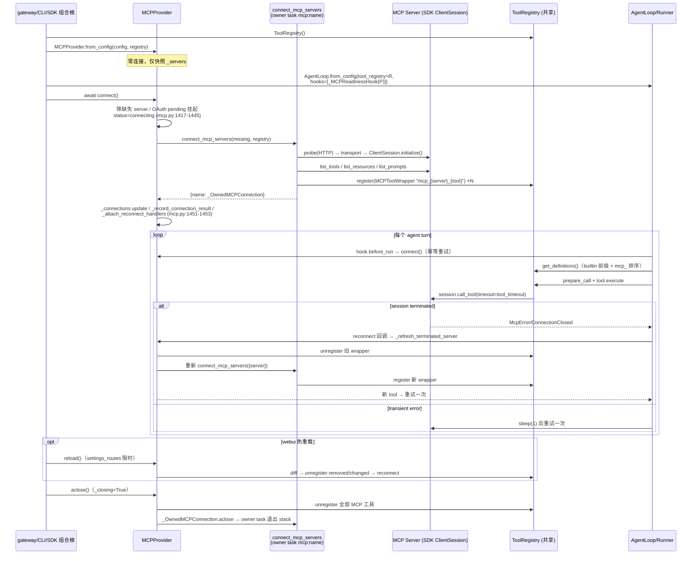

# R3 上游近读：tools / MCP / cron

- 票：xiechimon/pacman#17「研究：上游近读 — tools / MCP / cron」，供「设计：tools + MCP + cron TS 化」票使用。
- 上游钉版：HKUDS/nanobot @ `2fb16593988b9e85131e02f395bb9a5108e220e7`（2026-09-16，pyproject version 0.3.5）。本地克隆 `/Users/xmon/Code/AgentProjects/nanobot`，全程只读。
- 引用规则：所有 `path:line` 相对 nanobot 仓库根；行号来自本次近读的 Read 输出；推断一律显式标注【推断】。
- 方法：4 路并行近读（registry/契约/沙箱、全量 tool 清单、MCP、cron/heartbeat），主线对每节做了引用抽检（loader.py:74/92、base.py:144-156、registry.py:30-33、mcp.py:609/1412-1421、cron/types.py:148-159、cron/service.py:54-65、gateway_runtime.py:834-847、web.py:47-60、image_generation.py:51-53 等，逐字一致）。
- 四个交付物 → 章节映射：tool 接口契约 → S1；tool 清单表 → S2（含汇总表）；MCP 生命周期时序 → S3；cron 数据模型与触发路径 → S4。

## 目录

- S1 ToolRegistry 发现机制与接口契约（含 shell 沙箱：bwrap / seatbelt / Windows Job Object / exec_session / docker-compose.bwrap.yml）
- S2 完整 Tool 清单（24 静态 + 3 MCP 动态包装器，逐个记录 + 汇总表）
- S3 MCP 子系统（配置形态、MCPProvider 与共享 ToolRegistry、命名冲突、生命周期时序 + mermaid、重连与错误语义、OAuth/webui presets）
- S4 cron 子系统与 heartbeat（数据模型与持久化、调度服务、触发路径、cron/automation/goal turns、cron tool）

---

## S1 ToolRegistry 发现机制与接口契约

### 发现机制（内建注册 / 目录扫描 / entry points）

发现逻辑不在 `ToolRegistry` 本身，而在 `nanobot/agent/tools/loader.py` 的 `ToolLoader`；`ToolRegistry` 只是一个 name→Tool 的运行时容器。

**ToolRegistry 容器 API**（nanobot/agent/tools/registry.py）：
- 内部状态：`self._tools: dict[str, Tool]` + 定义缓存 `_cached_definitions`（registry.py:26-28）。
- `register(tool: Tool) -> None`：以 `tool.name` 为 key 写入并清空缓存（registry.py:30-33）；`unregister(name)` 用 `pop(name, None)`（registry.py:35-38）；`get(name) -> Tool | None`（registry.py:40-42）；`has` / `__contains__` / `__len__` / `tool_names`（registry.py:71-73, 203-212）。
- `get_definitions() -> list[dict]`：缓存友好排序——名字以 `mcp_` 开头的归为 MCP 组，其余为 builtin 组；builtin 先按名字排序作为稳定前缀，MCP 排序后追加；结果缓存直到下次 register/unregister（registry.py:86-108，mcp_ 判断在 registry.py:99）。
- `get_runtime_context_providers()`：按 tool 名排序收集各 tool 的 `runtime_context_provider()`（registry.py:44-51）。
- 名字容错仅用于提示不用于执行：`_lookup_key` 把名字规范化为小写字母数字串，注释明确 "Normalize names for suggestions only; never for execution"（registry.py:53-56）；`_suggest_name` 仅在唯一匹配时给出 "Did you mean" 建议（registry.py:58-69, 118-119）。

**内建 tool 目录扫描**（pkgutil，非 entry point）：
- `ToolLoader.__init__` 默认 package 为 `nanobot.agent.tools`（loader.py:27-31）。
- `discover()` 用 `pkgutil.iter_modules(self._package.__path__)` 遍历包内模块（loader.py:43），跳过以 `_` 开头的模块和 `_SKIP_MODULES = {"base", "schema", "registry", "context", "loader", "config", "file_state", "sandbox", "mcp", "__init__", "runtime_control"}`（loader.py:20-23, 44）；`importlib.import_module` 导入失败仅记 log 不中断（loader.py:46-50）。
- 收集条件（loader.py:51-63）：是 `type` 且 `issubclass(attr, Tool)`、不是 `Tool` 本身、属性名不以 `_` 开头、`__abstractmethods__` 为空（即非抽象）、`_plugin_discoverable` 为 True（默认 True）、按 `id(attr)` 去重。结果按 `cls.__name__` 排序并缓存（loader.py:64-66）。
- pyproject.toml 注释确认："Built-in tools are discovered automatically via pkgutil scanning in ToolLoader.discover()"（pyproject.toml:114-115）。

**外部 plugin entry points**：
- entry point group 名为 **`nanobot.tools`**：`eps = entry_points(group="nanobot.tools")`（loader.py:74），来自 `importlib.metadata`（loader.py:9）。
- 每个 entry point `ep.load()` 后须满足：是 type、`Tool` 子类、无抽象方法、`_plugin_discoverable` 为 True，按 `ep.name` 存入 dict 缓存（loader.py:77-90）。
- pyproject.toml 给出第三方声明示例（注释状态）：

```toml
# [project.entry-points."nanobot.tools"]
# my_plugin = "my_package.plugins:MyTool"
```
（pyproject.toml:116-117；nanobot 自身 build backend 是 hatchling，pyproject.toml:119-121，entry point 机制对 setuptools/hatch 均通用——【推断】依据是 loader 只用标准 `importlib.metadata.entry_points`，不关心分发后端。）

**注册流程与启用/禁用/去重**：`ToolLoader.load(ctx, registry, *, scope="core") -> list[str]`（loader.py:92）：
- 来源顺序固定：先 `discover()`（builtin），后 `_discover_plugins().values()`（loader.py:95）。
- 逐类过滤：`scope not in tool_cls._scopes`（类属性默认 `{"core"}`）则跳过（loader.py:100-101，_scopes 定义在 base.py:208）；`tool_cls.enabled(ctx)` 为 False 则跳过（loader.py:102-103，基类默认返回 True，base.py:214-216）；实例化走 `tool_cls.create(ctx)`（loader.py:104，基类默认 `cls()`，base.py:218-220）。
- plugin 实例统一包一层 `_LegacyErrorPrefixTool`（loader.py:105-106）。
- 名字冲突去重策略：plugin 与 builtin 同名 → 跳过 plugin 并 warning "Plugin %s skipped: conflicts with built-in tool"（loader.py:108-113）；其他同名 → 后注册者覆盖并 warning "Tool name collision: %s from %s overwrites existing"（loader.py:114-117）。单个 tool 注册抛异常只记 log，不影响其他 tool（loader.py:122-123）。
- 调用方：主 agent 在 `loop.py` 的 `_register_default_tools` 中构造 `ToolContext` 后 `ToolLoader().load(ctx, self.tools)`（loop.py:615-641）；subagent 用独立 registry 且 `scope="subagent"`（subagent.py:224，其上下文构造在 subagent.py:211-224）；`ExecTool._scopes = {"core", "subagent"}` 即两 scope 均可用（shell.py:164）。
- MCP tool 不走 ToolLoader：由 mcp.py 直接 `registry.register(wrapper)`，wrapper 名为 `_sanitize_mcp_tool_name(f"mcp_{name}_{tool_def.name}")`（mcp.py:1148, 1160-1161），下线时 `registry.unregister(tool_name)`（mcp.py:1705）——这正是 `get_definitions` 里 `mcp_` 前缀分组的来源。

**注意：nanobot/agent/plugins.py 与 entry points 无关**。它实现的是 "Agent Plugins v1" 本地包格式：扫描 `<workspace>/plugins/*/plugin.json`，要求 `$schema == "https://agent-plugins.org/schemas/1.0.0/plugin.schema.json"`（plugins.py:20, 61-79, 186-187）；plugin 提供 skills（`skills/*/SKILL.md`，plugins.py:462-483）与 stdio MCP servers（`mcp.json`，plugins.py:304-328），启用状态用 sha256 全包内容指纹绑定到 `plugin-data/<workspace_id>/<name>/enabled` 标记文件（plugins.py:159-179, 249-264, 416-459），包内容一变指纹失配即自动失效。Python tool 插件（entry point）与 Agent Plugin（manifest 包）是两套并行机制。

### tool 接口契约（签名、schema、返回、错误语义）

**Tool 抽象基类**（nanobot/agent/tools/base.py:159-315），核心契约：

```python
@property @abstractmethod def name(self) -> str            # base.py:171-175
@property @abstractmethod def description(self) -> str     # base.py:177-181
@property @abstractmethod def parameters(self) -> dict[str, Any]  # JSON Schema, base.py:183-187
@abstractmethod async def execute(self, **kwargs: Any) -> Any     # base.py:226-229
```

- 并发语义属性：`read_only -> bool` 默认 False（base.py:189-192）；`concurrency_safe = read_only and not exclusive`（base.py:194-197）；`exclusive` 默认 False（base.py:199-202）。
- 插件元数据类属性：`config_key: str = ""`、`_plugin_discoverable: bool = True`、`_scopes: set[str] = {"core"}`（base.py:206-208）。
- 生命周期 classmethod：`config_cls() -> type[BaseModel] | None`（默认 None，base.py:210-212）、`enabled(cls, ctx: ToolContext) -> bool`（默认 True，base.py:214-216）、`create(cls, ctx: ToolContext) -> Tool`（默认 `cls()`，base.py:218-220）；实例钩子 `runtime_context_provider() -> RuntimeContextProvider | None`（默认 None，base.py:222-224）。
- 参数预处理：`cast_params(params: dict) -> dict` 按 schema 做安全类型转换（base.py:251-256），`_cast_value` 支持 str→int/float（base.py:270-274）、任意→str（base.py:276-277）、str→bool（`_BOOL_TRUE = {"true","1","yes"}` / `_BOOL_FALSE = {"false","0","no"}`，base.py:163-164, 279-285）、array/object 递归（base.py:287-293）。
- `validate_params(params) -> list[str]`：非 dict 返回错误消息；schema 顶层非 object 抛 `ValueError`；其余委托 `Schema.validate_json_schema_value`（base.py:297-304）。
- `to_schema() -> dict`：输出 OpenAI function 格式 `{"type": "function", "function": {"name", "description", "parameters"}}`（base.py:306-315）。
- 类装饰器 `@tool_parameters(schema)`：deepcopy 冻结 schema，注入 `parameters` property（每次访问返回新 deepcopy），并把 `parameters` 从 `__abstractmethods__` 移除（base.py:318-350）。

**返回值与错误语义**——字符串返回，不抛异常：
- `ToolResult(str)` 是 str 子类，附 `is_error: bool`；`ToolResult.error(content)` 置 is_error=True（base.py:144-156）。`execute` docstring："return content, or `ToolResult.error(...)` for failures"（base.py:228）。
- 判定函数 `is_tool_error_result(result)`：`isinstance(result, ToolResult) and result.is_error`（registry.py:15-16）。
- 即使 tool 内部抛异常也不会外泄：`ToolRegistry.execute` 捕获 `Exception` 转 `ToolResult.error(f"Error executing {name}: {str(e)}")`（registry.py:200-201）；execution.py 层同样捕获（execution.py:175-194），`asyncio.CancelledError` 例外、原样上抛（execution.py:175-176）。
- 所有错误路径统一追加提示 `"\n\n[Analyze the error above and try a different approach.]"`（registry.py:189, execution.py:22, 49-53）。
- 外部 plugin 的旧错误契约兼容：`_LegacyErrorPrefixTool.execute` 把以 `"Error:"` 开头的普通 str 结果转成 `ToolResult.error`（loader.py:127-128, 180-188），并用 `__getattr__` 透传其余属性（loader.py:190-191）。

**JSON Schema 生成**——两层：
1. `Schema` ABC（base.py:30-141）：`to_json_schema()` 抽象（base.py:134-137）；类方法 `validate_json_schema_value(val, schema, path)` 实现类型/enum/min-max/minLength-maxLength/required/additionalProperties/minItems-maxItems/items 递归校验（base.py:51-121），类型映射 `_JSON_TYPE_MAP = {string:str, integer:int, number:(int,float), boolean:bool, array:list, object:dict}`，integer/number 显式排除 bool（base.py:20-27, 63-68）；nullable 支持 `["string","null"]` 联合类型或 `nullable` 键（base.py:57-62）；`fragment(value)` 把 Schema 实例或现成 dict 归一为 fragment（base.py:123-132）。
2. 具体类型（nanobot/agent/tools/schema.py）：`StringSchema`（min/max_length、enum、nullable，schema.py:20-51）、`IntegerSchema`（schema.py:54-85）、`NumberSchema`（schema.py:88-119）、`BooleanSchema`（独立类，因 Python 不允许子类化 bool，schema.py:9, 122-145）、`ArraySchema`（items 默认 `StringSchema("")`，schema.py:148-180）、`ObjectSchema`（schema.py:183-214）。根 schema 工厂 `tool_parameters_schema(*, required=None, description="", additional_properties=False, **properties)` —— **默认 `additionalProperties: false`**，注释说明这是为了让拼错的 tool-call 参数在执行前被报出而非静默忽略（schema.py:217-235）。

**ToolContext / RequestContext**（nanobot/agent/tools/context.py）：
- `ToolContext`（构造期依赖注入，dataclass）：`config: ToolsConfig`、`workspace: str`、`bus: MessageBus|None`、`subagent_manager`、`cron_service`、`exec_session_manager`、`sessions: SessionManager`、`file_state_store: FileStates`、`provider_snapshot_loader`、`image_generation_provider_configs`、`timezone="UTC"`、`workspace_sandbox: WorkspaceSandboxStatus`、`runtime_control`（context.py:78-92）。
- `RequestContext`（每请求不可变快照，frozen dataclass）：`channel`、`chat_id`、`message_id`、`session_key`、`original_user_text`、`runtime: LLMRuntime`、`metadata`、`sender_id`、`turn_id`、`workspace: Path`、`attributes`（context.py:29-42）。
- 请求上下文经 `ContextVar "nanobot_tool_request_context"` 传播（context.py:23-26），API：`bind_request_context` / `reset_request_context` / `request_context()` contextmanager / `current_request_context()` / `current_request_session_key()`（context.py:51-75）。
- `ContextAware` 是 `@runtime_checkable Protocol`，仅一个方法 `set_context(ctx: RequestContext) -> None`（context.py:45-48）；registry 注释说明这是给仍实现旧 setter 协议的外部 tool 的兼容层，"Built-ins read the authoritative ContextVar directly and never copy routing state"（registry.py:125-129）。

### tool 执行路径（谁调用 registry、参数如何绑定）

调用链：`runner.py` → `execution.execute_tool_calls` → `registry.prepare_call` → `tool.execute(**params)`。

1. **agent loop 装配**：`loop.py` 构造 `ToolRegistry`（loop.py:383），把 `self.tools.get_definitions` 作为 `get_tool_definitions` 传给 turn 执行侧（loop.py:437），tool 定义最终进入模型请求。
2. **runner 触发批量执行**：模型响应 `should_execute_tools` 时调用 `execute_tool_calls(spec.tools, response.tool_calls, concurrent=spec.concurrent_tools, external_lookup_counts=..., workspace_violation_counts=..., hook=..., context=..., model_messages=..., compacted_tool_results=...)`（runner.py:512-522，import 在 runner.py:27）。
3. **并发分批**：`_partition_tool_batches`——`concurrent=False` 时每个 call 单独一批（execution.py:298-299）；否则把连续的 `tool.concurrency_safe` 的 call 聚成一批 `asyncio.gather` 并发执行，非并发安全的单独成批（execution.py:81-95, 292-316）。结果顺序保持稳定（execution.py:68, 109-111）。
4. **单个 call 的执行**（`_execute_tool_call`，execution.py:114-223）：
   - 前置节流：`repeated_external_lookup_error` 拦截重复外部查询（execution.py:123-134）。
   - 通过 duck-typing 取 `tools.prepare_call`（execution.py:136-146），得到 `(tool, params, prep_error)`。
   - `prepare_call` 内的参数绑定（registry.py:110-147）：未知 tool → 错误 + Did-you-mean + 可用列表（registry.py:117-124）；`ContextAware` tool 注入当前 RequestContext（registry.py:128-129）；`_coerce_params`：整体 params 若是 None/空串 → `{}`，若是以 `{`/`[` 开头的字符串则 `json.loads`（registry.py:149-173）；`_unwrap_arguments_payload`：若 params 恰为 `{"arguments": ...}` 且 tool schema 本身没有 `arguments` 属性，则解包内层（registry.py:175-185）；非 dict → 报错并示范命名参数写法（registry.py:131-139）；随后 `tool.cast_params` → `tool.validate_params`，校验错误用 "; " 拼接返回（registry.py:141-147）。
   - hook：`before_execute_tool` → 执行 → `after_execute_tool` / `on_execute_tool_error`（execution.py:165, 178, 197, 215）。
   - 实际执行：`result = await tool.execute(**params)`（params dict 直接展开为 kwargs，execution.py:171-172）；tool 为 None 时回退 `tools.execute(name, params)`（execution.py:173-174）。`read_file` 特殊包一层 `file_read_context`（execution.py:167-170）。
   - 错误分级（execution.py:226-289）：SSRF 标记（如 "internal/private url detected"）→ 返回不可绕过的安全边界说明并劝阻重试（execution.py:25-37, 252-259, 283-285）；workspace 越界标记（"outside the configured workspace"、"path traversal detected" 等）→ 计数升级（execution.py:39-46, 261-278）。
   - 每个 call 产出事件 `{name, status: ok|error, detail}`，detail 截断 120 字符（execution.py:199-203, 217-223）。
5. **超时语义**：registry/execution 层没有全局超时（execution.py:171-174 直接 await）；超时由各 tool 自管，如 ExecTool 的 timeout 参数（见下节）。

### shell 沙箱机制（bwrap / docker / 平台差异 / exec_session / windows job）

#### shell tool（ExecTool，nanobot/agent/tools/shell.py）

- tool 名 `exec`，`config_key = "exec"`，`exclusive = True`（永远单独执行，不并入并发批）（shell.py:246-248, 166, 270-272）；`enabled` 由 `ctx.config.exec.enable` 控制（shell.py:172-174）；`create` 从 `ToolContext` 读取 workspace、restrict_to_workspace、sandbox、binds、env 白名单、allow/deny patterns、exec_session_manager（shell.py:176-193）。
- 配置模型 `ExecToolConfig`：`enable=True`、`timeout=60`（0=无限制，不受单次调用上限约束）、`path_prepend/append`、`sandbox=""`、`sandbox_ro_binds/rw_binds`、`allowed_env_keys`、`allow_patterns/deny_patterns`（shell.py:94-105）。
- 参数 schema：`command`/`cmd` 别名、`working_dir`/`workdir` 别名、`timeout`（1–600）、`shell`（可空覆盖）、`login`（bash/zsh 登录 shell）、`yield_time_ms`（0–30000，给出即走 session 模式）、`max_output_chars`/`max_output_tokens`（1000–50000）（shell.py:118-160）。
- **超时**：模型传入的 per-call timeout 被 `_MAX_TIMEOUT=600` 封顶（"so the LLM cannot request unbounded execution"），配置级默认可以更大，0/None 表示无限制（shell.py:250, 386-398）；超时后杀进程树并返回 `ToolResult.error("Error: Command timed out after N seconds")`（shell.py:313-315）。
- **默认 deny patterns**（在配置之外硬编码追加，shell.py:215-233）：`rm -rf`、`del /f|/q`、`rmdir /s`、独立 `format`、`mkfs|diskpart`、`dd if=`、`> /dev/sd`、`shutdown|reboot|poweroff`、fork bomb `:(){...};:`，以及针对内部状态文件 `history.jsonl`/`.dream_cursor` 的 5 种写入形态（重定向、tee、cp/mv、dd of=、sed -i，#2989）。
- **命令守卫** `_guard_command`（仅当 restrict_to_workspace 生效时执行，shell.py:446-454, 807-909）：allow_patterns 优先于 deny——命令按顶层 shell 段切分（`_split_shell_segments` 处理引号/转义/括号/换行，shell.py:911-989），**每一段**都 fullmatch 才算显式放行（shell.py:822-831）；SSRF 检查 `contains_internal_url`，命中返回 "internal/private URL detected" 标记交由 runner 转为不可重试提示（shell.py:836-844）；`../`、`..\` 直接判 path traversal（shell.py:848-852）；提取命令中所有绝对路径（Windows 盘符/UNC 正则 + shlex 分词 + POSIX/home 路径边界扫描 + `file://` 解码 + 内嵌 `-c` 脚本递归，shell.py:998-1133），放行白名单：良性设备文件（/dev/null 等 + /dev/fd/ 前缀，shell.py:253-264, 991-996）、cwd 内、media 目录内、workspace 根内、活动 sandbox bind 根内（shell.py:854-907），否则报 "path outside working dir"。
- **环境变量**：Unix 默认只传 `HOME/LANG/TERM/PYTHONUNBUFFERED`，Windows 传一组精选系统变量（含 PATH），两者都追加 `allowed_env_keys` 命中的变量，API key 等被排除（shell.py:758-805）。
- **进程 spawn**（`_spawn`，shell.py:518-604）：Unix 默认 `shutil.which("bash") or "/bin/bash"`，login 且为 bash/zsh 时加 `-l`，`-c command`；`process_tree=True` 时 `start_new_session=True`（新进程组，供 killpg）（shell.py:581-596）。Windows 默认 PowerShell（pwsh→powershell 探测），命令前注入 UTF-8 编码设置和 `exit $LASTEXITCODE`，以 `-NoProfile -NonInteractive -Command` 运行；`shell="cmd"` 时走 `create_subprocess_shell` + COMSPEC（shell.py:528-570）；`_resolve_shell` 限定可选 shell 白名单（Unix: sh/bash/zsh；Windows: powershell/pwsh/cmd）并拒绝含 `\0\n\r` 的值（shell.py:629-675）。
- **输出整形**：stdout + `STDERR:` 段 + `Exit code: N`；超过 max_output_chars（默认 10000，clamp 1000–50000）时保头尾各半、中间标注截断字符数（shell.py:325-346）。
- **僵尸回收**：`_reap_pid` 在正常结束/被杀后做 best-effort `waitpid(WNOHANG)`，注释说明容器内 asyncio child-watcher 有时会漏收（shell.py:60-81, 320-323）。

#### sandbox 后端（nanobot/agent/tools/sandbox.py）

- 架构：模块 docstring 约定新增后端实现 `_wrap_<name>(command, workspace, cwd) -> str` 并注册进 `_BACKENDS = {"bwrap": _bwrap, "seatbelt": _seatbelt}`（sandbox.py:1-6, 309）；`wrap_command(sandbox, ...)` 未知名抛 `ValueError`（sandbox.py:312-330）。本质是**命令字符串包装器**：把用户命令包进沙箱命令行，再交给普通 subprocess 执行（shell.py:456-472 调用点）。WebUI 设置层校验取值 `{"", "bwrap", "seatbelt"}`（webui/settings_runtime.py:144-145）。
- 公共 bind 归一化 `_normalize_bind_paths`：expandvars/expanduser、仅绝对路径、resolve(strict=False)、去重；**等于或包含 workspace 的 bind 被丢弃**，防止后加的 bind 掀开用于遮蔽配置目录的 tmpfs（sandbox.py:16-45，注释 37-39）。

**Linux：bubblewrap**（`_bwrap`，sandbox.py:48-101）。生成的参数序列：

```
bwrap --new-session --die-with-parent --setenv HOME <ws>
  --ro-bind /usr /usr                       # required（sandbox.py:70, 85-86）
  --ro-bind-try {/bin,/lib,/lib64,/etc/alternatives,/etc/ssl/certs,
                 /etc/pki/tls/certs,/etc/pki/ca-trust,/etc/crypto-policies,
                 /etc/resolv.conf,/etc/ld.so.cache}   # optional（sandbox.py:71-82）
  --proc /proc --dev /dev --tmpfs /tmp
  --tmpfs <ws.parent>        # 遮蔽 config 目录（sandbox.py:91 注释 "mask config dir"）
  --dir <ws> --bind <ws> <ws>               # workspace 唯一可写挂载
  --ro-bind-try <media> <media>             # 附件只读
  [--ro-bind-try <ro binds>...] [--bind-try <rw binds>...]
  --chdir <cwd> -- sh -c <command>
```
（sandbox.py:84-101；cwd 若不在 ws 内则回退 ws，sandbox.py:65-68。）要点：**没有 `--unshare-net`，网络不受限**（seatbelt docstring 明确 "matching bwrap (which does not pass --unshare-net)"，sandbox.py:205-206；docs/configuration.md:2113 "Neither backend restricts network access"）；**没有传任何 seccomp 参数**（sandbox.py:84-100 参数列表中无 `--seccomp`）；HOME 指向 workspace（sandbox.py:84）；/tmp 是沙箱内 tmpfs（sandbox.py:90）。

**macOS：Seatbelt**（`_seatbelt`，sandbox.py:184-306）。用 `/usr/bin/sandbox-exec -p <SBPL>` 包装（sandbox.py:294-306）。SBPL 规则结构：`(version 1)` + `(deny default)`，放行 `process*`/`sysctl-read`/`mach*`/`ipc*`/`network*`（网络同样不受限）（sandbox.py:222-229）；系统只读子路径白名单 `/usr /bin /sbin /dev /System /Library/Developer/CommandLineTools /private/etc/ssl /private/var/db/{dyld,timezone}`（sandbox.py:107-117）+ 字面量白名单（hosts/services/protocols/gitconfig/resolv.conf/xcode select 等，sandbox.py:119-131）+ 根目录 `/` 可读（sh 启动需要，sandbox.py:230-233）+ `/dev/null`、`/dev/zero` 可写（sandbox.py:238）。因 Seatbelt 无 mount namespace，遮蔽 workspace 父目录用 **deny 规则放在 workspace allow 之前**（last-match-wins 重新暴露 workspace 子树）（sandbox.py:199-206 docstring, 243-245）；所有被允许路径的祖先目录授予 `file-read-metadata` 保持可遍历（否则 ENOTDIR）（sandbox.py:139-156, 249-262）；media 只读（read allow + write deny，sandbox.py:265-266）；ro binds 同时显式 deny write（"A read allow does not revoke a broader write grant"，sandbox.py:268-271）；对受保护只读根的祖先追加 `deny file-write-unlink`，防止改名/删除祖先目录绕过（sandbox.py:276-290）；SBPL 字符串用 `_sbpl_quote` 做 C 风格转义（sandbox.py:173-181）。`sandbox-exec` 无 `--chdir`，故在命令前拼 `cd <cwd> || exit`，注释强调失败必须先退出否则 `cd x && a; b` 仍会执行 b（sandbox.py:292-293, 304）；`HOME` 与 `TMPDIR` 都指到 workspace（sandbox.py:300-301），即 macOS 沙箱不共享宿主 /tmp、/var/folders（SECURITY.md:99 同述）。

**Windows**：无沙箱后端——`_prepare_command` 中 `_IS_WINDOWS` 时仅 warning "Sandbox '{}' is not supported on Windows; running unsandboxed" 后直接裸跑（shell.py:456-461）；`_active_sandbox_bind_roots` 在 Windows 恒返回空（shell.py:1155-1160）。docs/configuration.md:2113 同述 "Windows logs a warning and runs commands without OS sandboxing"。

**平台差异总结**：Linux=bwrap（mount namespace + tmpfs 遮蔽），macOS=seatbelt（SBPL 路径规则，无 namespace），Windows=无 OS 级沙箱、但用 Job Object 管进程树；三平台 shell 默认值分别为 `sh -c`（沙箱内）/bash、`sh -c`+sandbox-exec、PowerShell（shell.py:538, 581；sandbox.py:100, 302-304）。

#### docker-compose.bwrap.yml 与容器配置

- 官方镜像已预装 bubblewrap：`apt-get install -y --no-install-recommends ca-certificates git bubblewrap openssh-client libmagic1`（Dockerfile:14；SECURITY.md:92 "Pre-installed in the official Docker image"）。
- 基础 `docker-compose.yml`：`cap_drop: ALL`，仅 `cap_add: CHOWN/SETGID/SETUID`（entrypoint 修 bind-mount 属主后降权到 UID 1000），`security_opt: no-new-privileges:true`（docker-compose.yml:9-19）。
- `docker-compose.bwrap.yml` 是**叠加 override**（不独立使用），全文 17 行：

```yaml
x-bwrap-security: &bwrap-security
  cap_add:
    - SYS_ADMIN
  security_opt:
    - apparmor=unconfined
    - seccomp=unconfined
```
（docker-compose.bwrap.yml:1-6）应用到 `nanobot-gateway`、`nanobot-api`、`nanobot-cli` 三个服务（docker-compose.bwrap.yml:8-16）。作用：给容器 `SYS_ADMIN` capability 并放开 Docker 的 AppArmor/seccomp 默认 profile，让容器内 bwrap 能创建嵌套 user/mount namespace；docs/configuration.md:2124 说明启用 `"tools.exec.sandbox": "bwrap"` 时必须加此 override，且宿主必须允许 unprivileged user namespaces（override 无法绕过宿主级限制）。注意这里 `seccomp=unconfined` 是**放宽容器层 seccomp 以便 bwrap 运行**，不是给沙箱加 seccomp 过滤——bwrap 命令行本身未启用 seccomp（见上）。

#### exec_session（长任务会话，nanobot/agent/tools/exec_session.py）

语义：**不是跨命令的持久 shell（REPL）**，而是"一次 spawn 的长运行进程 + 可交互 stdin + 增量输出轮询"。【推断】依据：`ExecSessionManager.start` 每次都新 spawn 一个进程执行传入 command（exec_session.py:299），会话的 cwd 在 spawn 时固定（exec_session.py:47-49, 301-309）；后续交互只是向该进程 stdin 写字节（exec_session.py:162-172, 337-340），不存在跨 exec 调用保留 shell 状态的机制。

- `exec` 带 `yield_time_ms` 时转入 session 模式：`_execute_session` 调 `manager.start(...)`，owner_session_key 取 `current_request_session_key()`（shell.py:294-295, 358-384，owner 绑定在 shell.py:373）；返回 `format_session_poll` 文本，进程未完成时含 `Process running. session_id: <id>`（exec_session.py:481-496）。
- `ExecSessionManager`：`max_sessions=8`、`idle_timeout=1800s`（exec_session.py:273）；session_id 为 `uuid4().hex[:12]`（exec_session.py:300）；超限抛 RuntimeError（exec_session.py:297-298）；空闲超时在每次操作前惰性清理并 kill（exec_session.py:434-444）；进程以 `stdin=PIPE, process_tree=True` spawn（复用 `ExecTool._spawn`，exec_session.py:446-460）。
- 输出缓冲 `_BoundedOutputBuffer`：预算内保留"头部一半 + 最近一半"，超出部分计入 truncated_chars（exec_session.py:57-114）；流读取用 4096 字节块 + UTF-8 增量解码（exec_session.py:146-160）。
- 会话硬 deadline：`start` 时按 timeout 计算，None/0 → `float("inf")`；poll 时发现超期即 `_timed_out=True` 并 kill（exec_session.py:136-137, 204-206）；进程退出后释放 process tree owner、reap pid（exec_session.py:208-220）。
- **owner 隔离**：session 记录 owner_session_key；`write`/`list` 时 owner 不匹配按不存在处理（抛 KeyError → "exec session not found"）（exec_session.py:334-335, 360-377, 632-633）。
- 关停：`close_all` 置 closed 并 kill 全部，失败聚合为 `BaseExceptionGroup`（exec_session.py:379-404）；`terminate_by_owner` 按会话键批量终止（exec_session.py:406-432）。
- 模块级单例 `DEFAULT_EXEC_SESSION_MANAGER`（exec_session.py:463），ExecTool 优先用 ToolContext 注入的 manager（shell.py:244；ToolContext 字段 context.py:85）。
- **`exec_session` tool**（exec_session.py:499-689）：参数 `session_id`（必填）、`input`（写 stdin）、`close_stdin`、`terminate`（必须单独使用，与其他参数互斥，exec_session.py:589-599）、`wait_for`（等待输出中出现指定文本，与 `until_exit` 互斥，exec_session.py:583-588）、`until_exit`、`timeout_ms`（0–600000；默认普通 1s、wait_for 10s、until_exit 10min，exec_session.py:23-27, 612-618）。`_wait` 循环：普通模式每步最多 500ms，有新输出即返回（has_activity），until_exit 每步最多 30s；`wait_for` 用 overlap 尾巴处理跨 chunk 匹配（exec_session.py:637-689，重叠逻辑 670-674）；聚合输出再截断到 DEFAULT_MAX_OUTPUT_CHARS（exec_session.py:648, 679-680）。
- **`list_exec_sessions` tool**：`read_only=True`（exec_session.py:728-730），列出当前 owner 的会话（id/状态/elapsed/idle/remaining/cwd/命令前 120 字符）（exec_session.py:692-752）。
- 三个 exec 系 tool 均 `exclusive=True` 或 read_only，`_scopes = {"core", "subagent"}`，共用 `config_key="exec"`（exec_session.py:535-536, 559-561, 696-697；shell.py:164-166, 270-272）。

#### Windows Job Object（nanobot/agent/tools/_windows_job.py）

目的（类 docstring）："Own a process tree even after its root process exits"（_windows_job.py:150-151）——解决 Windows 上根进程退出后子孙进程失控的问题，等价于 Unix 的 `start_new_session` + `killpg`。

- 全部经 `ctypes.WinDLL("kernel32")` 直调 Win32 API（_windows_job.py:66-95）。
- `create()`：`CreateJobObjectW` + `SetInformationJobObject(JobObjectExtendedLimitInformation=9)` 设置 `JOB_OBJECT_LIMIT_KILL_ON_JOB_CLOSE`，即句柄关闭时整个 job 内进程被杀（_windows_job.py:108-118, 158-168, 常量 13-14）。
- 竞态防护：子进程以 `CREATE_SUSPENDED`（0x4）创建（_windows_job.py:8, 153；shell.py:531-534），`assign_and_resume(pid)` 先 `OpenProcess(PROCESS_SET_QUOTA|PROCESS_TERMINATE)` → `AssignProcessToJobObject` → 再用 `CreateToolhelp32Snapshot`/`Thread32First/Next` 找到该 pid 的挂起主线程 `ResumeThread`——docstring："Atomically establish tree ownership before the root can spawn"（_windows_job.py:170-197, 121-147）。assign 失败则 `TerminateProcess` 兜底（_windows_job.py:184-189）。
- `release()`：输出收集成功后关闭 kill-on-close 再关句柄，让已退出进程树自然清理（_windows_job.py:199-204；调用点 shell.py:348, 750-756）；`terminate()`：`TerminateJobObject(handle, 1)` 杀掉 job 内所有进程（_windows_job.py:206-213；调用点 shell.py:699-702）。
- job 对象存放在 process 对象私有属性 `_nanobot_process_tree_owner` 上（shell.py:47, 571-573, 732-748）。无 job 时 Windows 杀树回退 `taskkill /PID <pid> /T /F`（线程池执行，5s 超时）（shell.py:703-715）。`_ProcessTreeOwner` Protocol 定义了 creation_flags/assign_and_resume/release/terminate 四件套（shell.py:50-57）。

#### tool 契约模板（nanobot/templates/agent/tool_contract.md，共 77 行）

注入给 agent 的 tool 使用守则，要点：
- 总则：用与任务直接匹配的最窄结构化 tool；不确定状态先只读探查；**不得把 `exec` 当文件/搜索/网页/消息/日程的万能绕道**；失败后读错误、刷新状态、换方法重试而非重复同一调用；改动后用最小可靠检查验证；tool 结果返回前不要把最终答案与 tool call 混在一起；把安全/workspace 边界错误当真实限制而非待绕过的障碍（tool_contract.md:3-17）。
- 发现与阅读：路径不确定用 `find_files`/`list_dir`，内容用 `grep`（默认 5 行上下文，`files_with_matches`/`count`/`fixed_strings`/`head_limit`/`offset` 分页），已知路径 `read_file`（tool_contract.md:19-25）。
- 文件与编码工作流：locate→inspect→edit→verify 循环；`apply_patch` 是默认编辑 tool（含 `dry_run=true` 预检），`edit_file` 仅用于单文件小段精确替换，`write_file` 用于新文件/整体重写；失败时 `force=true` 重读并缩小补丁，而不是转投 shell `sed`/`echo`；图像等视觉产物渲染成 PNG 后 `read_file` 让视觉证据进入模型（tool_contract.md:27-45）。
- 进程执行：`exec` 只用于进程；交互或提前拿输出用 `yield_time_ms` + `exec_session`（不再输入时 `until_exit=true`）；`list_exec_sessions` 找回 session ID（tool_contract.md:47-51）。
- 其他：CLI App Attachment 用 `run_cli_app` 而非 shell 代跑（tool_contract.md:53-58）；时效信息用 `web_search`/`web_fetch`（tool_contract.md:60-64）；当前对话直接文本回复、`message` 仅用于主动/跨频道/带 media 发送（tool_contract.md:66-71）；定时任务用 `cron` tool 而不是 `exec` 跑 `nanobot cron`，心跳写 `HEARTBEAT.md`（tool_contract.md:73-77）。

#### 关键结论速览

1. 发现 = 三层：pkgutil 包扫描（builtin）→ `nanobot.tools` entry point group（外部 Python 插件，包 `_LegacyErrorPrefixTool` 兼容层）→ MCP 动态 register（`mcp_` 前缀）；plugins.py 的 Agent Plugin 是第四套独立机制（manifest 包，供 skills/MCP，不直接注册 Tool 类）。
2. 接口契约 = 3 个抽象 property + 1 个 `async execute(**kwargs)`；schema 用自研 Schema 类树生成 JSON Schema，根级默认 `additionalProperties: false`；错误语义 = 返回 `ToolResult.error`（str 子类带 is_error），异常在 registry/execution 两层被兜底转为错误字符串并统一追加重试提示。
3. 执行 = runner 批量调 `execute_tool_calls`，`concurrency_safe`（read_only 且非 exclusive）的连续 call 并发 gather，`prepare_call` 负责名字解析、JSON 字符串/`{"arguments":...}` 解包、cast、validate，最后 `tool.execute(**params)`。
4. 沙箱 = 命令字符串包装：Linux bwrap（--new-session --die-with-parent，tmpfs 遮蔽 ws.parent，ws 唯一 rw，media ro，无 --unshare-net、无 seccomp），macOS seatbelt（deny default + last-match-wins 重暴露 ws，HOME/TMPDIR 指 ws），Windows 无沙箱仅 Job Object 管进程树；Docker 内跑 bwrap 需 docker-compose.bwrap.yml 叠加 SYS_ADMIN + apparmor/seccomp unconfined。

---

## S2 完整 Tool 清单

> 目标仓库：`/Users/xmon/Code/AgentProjects/nanobot`（严格只读）。所有 `path:line` 相对该仓库根，行号来自本次 Read 输出。
> 覆盖 `nanobot/agent/tools/` 下每一个含 `Tool` 子类的模块，外加 `nanobot/agent/subagent.py`、`nanobot/agent/skills.py`。

### 注册与启用机制（读清单前必看）

- **发现/注册**：`ToolLoader.load()` 遍历包内模块，跳过 `_SKIP_MODULES = {base, schema, registry, context, loader, config, file_state, sandbox, mcp, __init__, runtime_control}`（`nanobot/agent/tools/loader.py:20-23`）和以 `_` 开头的模块（`loader.py:44`）。对每个 `Tool` 子类：先查 `_scopes`（默认 `{"core"}`，`base.py:208`）是否含当前 scope，再调 `enabled(ctx)`，通过后 `create(ctx)` 并 `registry.register()`（`loader.py:100-121`）。`create()` 抛异常会被 catch 并跳过注册（`loader.py:122-123`）。
- **注册名**：`ToolRegistry.register()` 用 `tool.name` 作 key（`registry.py:32`）；定义列表里 `mcp_` 前缀的排到内置工具之后（`registry.py:99-106`）。
- **scope 语义**：`core`=主 AgentLoop，`subagent`=子 agent，`memory`=记忆/dream 隔离 runner。`SubagentManager._build_tools()` 用 `scope="subagent"` 加载（`subagent.py:224`）。
- **config 开关**：带 `config_key` 的工具通过 `config_cls()` 声明配置类（如 `_FsTool` 的 `file`，`filesystem.py:37-45`），`enabled()` 读对应 `ctx.config.<key>.enable`。
- **参数 schema**：统一走 `@tool_parameters(tool_parameters_schema(...))`（`base.py:318-350`、`schema.py:217-235`），根对象默认 `additionalProperties=False`（`schema.py:221`）——未声明参数会被校验拒绝。
- **ToolContext 装配**：主循环在 `_register_default_tools()` 构造 ctx，注入 bus / subagent_manager / cron_service / exec_session_manager / sessions / runtime_control 等（`nanobot/agent/loop.py:624-637`）。

---

### 1. 文件系统组（`filesystem.py`，config_key=`file`）

共享基类 `_FsTool`：`config_key="file"`（`filesystem.py:37`），`enabled` 读 `ctx.config.file.enable`（`filesystem.py:44-45`），`FileToolsConfig.enable` 默认 `True`（`filesystem.py:31`）。`create()` 解析 workspace、`restrict_to_workspace`、sandbox 限制，并把内置 skills 目录、`memory/history.jsonl` 加进只读白名单（`filesystem.py:83-105`）。toggle 行为由 `tests/test_file_tool_toggle.py:26-44` 印证：`file.enable=False` 时 `read_file/write_file/edit_file/list_dir/find_files/grep/apply_patch` 全部不注册（`test_file_tool_toggle.py:10-18`）。

- **read_file** — `nanobot/agent/tools/filesystem.py:280`
  - 用途：按路径读文本/图片/PDF/Office 文档，文本带行号、支持 offset/limit 或 PDF pages 分页（`filesystem.py:284-288`）。
  - 关键参数：`path` string 必填（`filesystem.py:253,267`）；`offset` int≥1 默认 1（`filesystem.py:254-257`）；`limit` int≥1 默认 2000（`filesystem.py:258-261`）；`pages` string PDF 页范围，最多 20 页（`filesystem.py:262,277`）；`force` bool 默认 false，强制重读未变区间（`filesystem.py:263-266`）。
  - 返回与错误语义：文本返回 `N| 行` 格式并尾附分页提示（`filesystem.py:390,404-407`）；空文件返回 `(Empty file: ...)`（`filesystem.py:340`）；图片返回 content blocks（`filesystem.py:343-344`）；未变更且非 force 时返回去重提示 `[File unchanged since last read]`（`filesystem.py:347-350`）。失败返回 `ToolResult.error`：设备路径黑名单（`filesystem.py:202-231,308-315`）、超 `_MAX_FILE_SIZE_BYTES=100MiB`（`filesystem.py:275,321-328`）、文件不存在/非文件（`filesystem.py:316-319`）、offset 越界（`filesystem.py:385-386`）、二进制不可读（`filesystem.py:369-372`）。截断上限 `_MAX_CHARS=128_000`（`filesystem.py:274,393-402`）。
  - 外部服务依赖：无（PDF/Office 解析走 `nanobot.utils.document`）。
  - 启用条件：默认开（`file.enable=True`）；`_scopes={core,subagent,memory}`（`filesystem.py:272`）；`read_only=True`（`filesystem.py:291-292`）。

- **write_file** — `nanobot/agent/tools/filesystem.py:545`
  - 用途：新建或整体覆盖文件，自动建父目录（`filesystem.py:549-555,564`）。
  - 关键参数：`path` string 必填、`content` string 必填（`filesystem.py:535-537`）。
  - 返回与错误语义：成功返回 `Successfully wrote N characters to ...`（`filesystem.py:567`）；缺 path/content 抛 ValueError→`ToolResult.error`（`filesystem.py:559-562,570-571`）；PermissionError 单独处理（`filesystem.py:568-569`）。
  - 外部服务依赖：无。
  - 启用条件：默认开；`_scopes={core,subagent,memory}`（`filesystem.py:542`）；非只读。

- **edit_file** — `nanobot/agent/tools/filesystem.py:868`
  - 用途：单文件小范围精确替换；描述建议多文件/结构性编辑改用 apply_patch（`filesystem.py:872-877`）。
  - 关键参数：`path`/`old_text`/`new_text` 必填（`filesystem.py:857`）；`replace_all` bool 默认 false（`filesystem.py:838`）；`occurrence` int≥1 nullable（`filesystem.py:839-843`）；`line_hint` int≥1 nullable（`filesystem.py:844-851`）；`expected_replacements` int≥1 nullable（`filesystem.py:852-856`）。三者 `occurrence/line_hint/replace_all` 互斥（`filesystem.py:957-962`）。
  - 返回与错误语义：成功返回带 diff 的 `FileEditResult`（`filesystem.py:884-894,1036`）。匹配用渐进宽松策略：精确→去尾空白→去空白+引号归一→引号归一（`filesystem.py:776-787`）。`old_text=''` 且文件不存在=创建（`filesystem.py:922-928`）；命中多处且未指定选择器→返回 Warning 而非 error（`filesystem.py:968-978`）；未命中时给最相似窗口 diff 提示（`filesystem.py:1055-1080`）。文件超 `_MAX_EDIT_FILE_SIZE=1GiB` 报错（`filesystem.py:864,935-936`）。markdown 保留尾空白（`filesystem.py:865,982-984`）。
  - 外部服务依赖：无。
  - 启用条件：默认开；`_scopes={core,subagent,memory}`（`filesystem.py:862`）。

- **list_dir** — `nanobot/agent/tools/filesystem.py:1110`
  - 用途：列目录，可递归，自动忽略噪声目录（`filesystem.py:1114-1119`）。
  - 关键参数：`path` string 必填（`filesystem.py:1089,1095`）；`recursive` bool 默认 false（`filesystem.py:1090`）；`max_entries` int≥1 默认 200（`filesystem.py:1091-1094,1102`）。
  - 返回与错误语义：返回条目列表（目录带 📁/文件带 📄 前缀，`filesystem.py:1156`），超 cap 附截断提示（`filesystem.py:1163-1164`）；空目录返回提示（`filesystem.py:1159-1160`）；不存在/非目录→`ToolResult.error`（`filesystem.py:1133-1136`）。忽略集 `_IGNORE_DIRS`（`.git/node_modules/__pycache__/.venv/...`，`filesystem.py:1103-1107`）。
  - 外部服务依赖：无。
  - 启用条件：默认开；`_scopes={core,subagent}`（`filesystem.py:1100`）；`read_only=True`（`filesystem.py:1121-1123`）。

### 2. 搜索组（`search.py`，继承 `_SearchTool(_FsTool)` → 同 `file` 开关）

`_SearchTool` 继承 `_FsTool`（`search.py:185`），因此复用 `file.enable` 开关（与 `tests/test_file_tool_toggle.py:10-18` 一致）。

- **find_files** — `nanobot/agent/tools/search.py:214`
  - 用途：按名称/glob/类型查工作区路径，跳过依赖与构建目录（`search.py:218-222`）。
  - 关键参数：`path` string 默认 `.`（`search.py:233-236`）；`query` 全部词须命中（`search.py:237-240`）；`glob`（`search.py:241-244`）；`type`（`search.py:245-248`）；`include_dirs` bool 默认 false（`search.py:249-252`）；`sort` enum path/modified 默认 path（`search.py:253-257`）；`head_limit` int 0-1000 默认 200，0=全部（`search.py:258-263,29`）；`offset` int 0-100000（`search.py:264-269`）。
  - 返回与错误语义：返回相对路径列表 + 分页提示（`search.py:491-500`）；无命中返回 `No files found`（`search.py:493-494`）。扫描预算超限 `_MAX_SCAN_PATHS=500_000` / `_MAX_SCAN_SECONDS=30.0`→`ToolResult.error`（`search.py:210-211,481-489`）；在线程中执行，取消时 set 事件（`search.py:381-397`）；sort 非法值报错（`search.py:425-426`）。
  - 外部服务依赖：无。
  - 启用条件：默认开；`_scopes={core,subagent}`（`search.py:209`）；`read_only=True`（`search.py:224-226`）。

- **grep** — `nanobot/agent/tools/search.py:513`
  - 用途：在文本与 PDF/DOCX/XLSX/PPTX 内容里按 regex 搜索，默认带 5 行上下文与源定位符（`search.py:517-521`）。
  - 关键参数：`pattern` string 必填 minLength 1（`search.py:532-536,594`）；`path` 默认 `.`（`search.py:537-540`）；`glob`/`type`/`pages`（`search.py:541-552`）；`case_insensitive`/`fixed_strings` bool（`search.py:553-560`）；`output_mode` enum content/files_with_matches/count（`search.py:561-568`）；`context_before`/`context_after` int 0-20 默认 5（`search.py:569-580,700-701`）；`head_limit` int 0-1000 默认 250（`search.py:581-586,28`）；`offset` 0-100000（`search.py:587-592`）。
  - 返回与错误语义：按 output_mode 返回内容块/文件列表/计数（`search.py:865-890`），尾附分页与跳过统计（`search.py:892-923`）；无命中返回 `No matches found...`（`search.py:867,888`）。截断限制：结果总字符 `_MAX_RESULT_CHARS=128_000`、单渲染行 `_MAX_RENDERED_LINE_CHARS=2_000`、目录扫描单文件 `_MAX_FILE_BYTES=2_000_000`、显式单文件 `_MAX_EXPLICIT_FILE_BYTES=100_000_000`（`search.py:507-510`）。非法 regex→`ToolResult.error`（`search.py:719-720`）；二进制/超大文件跳过并计数（`search.py:130-137,760-762,911-914`）。
  - 外部服务依赖：无。
  - 启用条件：默认开；`_scopes={core,subagent}`（`search.py:505`）；`read_only=True`（`search.py:523-525`）。

### 3. apply_patch（`apply_patch.py`，继承 `_FsTool` → 同 `file` 开关）【设计票重点】

- **apply_patch** — `nanobot/agent/tools/apply_patch.py:83`
  - 用途：代码编辑默认工具，单次调用支持多文件结构化编辑（replace/add），路径受工作区访问策略约束（`apply_patch.py:87-95`）。
  - 关键参数：`edits` array 必填，`min_items=1`/`max_items=20`（`apply_patch.py:47,68-69,75`）；每个 edit 是 object，必填 `path` string + `action` enum `replace`/`add`（`apply_patch.py:49-56,65`）；`old_text` nullable（replace 必填，`apply_patch.py:57-60,161-162`）；`new_text` nullable（replace/add 必填，`apply_patch.py:61-64,126-127`）；`dry_run` bool 默认 false（`apply_patch.py:71-74`）。
  - 返回与错误语义：成功返回 `FileEditResult`（`Patch applied:` + 每文件 `+added/-deleted`，`apply_patch.py:213-223,248`）；`dry_run=true` 只校验+预览不写盘（`apply_patch.py:225-226`）。replace 要求 `old_text` 唯一：未找到（`apply_patch.py:188-190`）或出现多次（`apply_patch.py:191-192`）都报错。add 对已存在文件做追加并保留 CRLF（`apply_patch.py:33-42,146-150`）。**原子性**：写盘前对每个目标做字节级 backup，任一写入失败则全部回滚（`apply_patch.py:228-244`）。非 UTF-8 文件拒绝（`apply_patch.py:137-139,175-177`）。路径含 null byte 拒绝（`apply_patch.py:28-29`）。错误统一 `ToolResult.error`：PermissionError（`apply_patch.py:249-250`）、`_PatchError`（`apply_patch.py:251-252`）、其他（`apply_patch.py:253-254`）。
  - 外部服务依赖：无。
  - 启用条件：默认开（`file.enable`）；`_scopes={core,subagent}`（`apply_patch.py:80`）。

### 4. Shell 执行组（`shell.py` + `exec_session.py`，config_key=`exec`）

`ExecToolConfig.enable` 默认 `True`、`timeout` 默认 60（`shell.py:96-97`）。三个工具 `enabled` 都读 `ctx.config.exec.enable`（`shell.py:173-174`、`exec_session.py:545-546,706-707`）。

- **exec** — `nanobot/agent/tools/shell.py:247`
  - 用途：执行 shell 命令（`shell.py:266-268`）。
  - 关键参数：`command`（别名 `cmd`）string（`shell.py:120-121`）；`working_dir`（别名 `workdir`）（`shell.py:122-123`）；`timeout` int 1-600 默认 60（`shell.py:124-128`）；`shell` string nullable（Windows 默认 PowerShell，可传 `cmd`；Unix 默认 bash，可传 sh/zsh，`shell.py:129-136,635-675`）；`login` bool 默认 false（`shell.py:137-141`）；`yield_time_ms` int 0-`MAX_YIELD_MS`(30000) nullable，设置后转 session 模式（`shell.py:142-147,294-295`）；`max_output_chars`（别名 `max_output_tokens`）int 1000-50000 默认 10000（`shell.py:148-159,251`）。
  - 返回与错误语义：返回 stdout(+STDERR+`Exit code:`)（`shell.py:325-337`），超 `max_output_chars` 中间截断保留首尾（`shell.py:339-346`）。超时 kill 进程树并报错（`shell.py:313-315`）；session 模式超时返回 `ToolResult.error`（`shell.py:381-382`）。per-call timeout 被钳到 `_MAX_TIMEOUT=600`（`shell.py:250,394-395`），config 级 timeout 可超此且 0=无限（`shell.py:396-398`）。**安全护栏**：内置 deny patterns（`rm -rf`/`mkfs`/`dd if=`/`shutdown`/fork bomb/写 `history.jsonl`|`.dream_cursor` 等，`shell.py:215-233`）；`allow_patterns` 优先于 deny（须每个 shell 段都匹配，`shell.py:822-834`）；内网/私有 URL 拦截（`shell.py:836-844`）；`restrict_to_workspace` 时拦截 `../` 路径穿越与工作区外绝对路径（`shell.py:846-908`）。命令可被 bwrap/seatbelt 包裹（`shell.py:456-472`，见 sandbox.py）。
  - 外部服务依赖：无（本地子进程）。
  - 启用条件：默认开；`_scopes={core,subagent}`（`shell.py:164`）；`exclusive=True`（独占运行，`shell.py:270-272`）。

- **exec_session** — `nanobot/agent/tools/exec_session.py:564`
  - 用途：与 `exec`（yield 模式）返回的长运行 session 交互/等待（`exec_session.py:567-569`）。
  - 关键参数：`session_id` string 必填（`exec_session.py:501,529`）；`input` string nullable（`exec_session.py:502-505`）；`close_stdin` bool 默认 false（`exec_session.py:506-509`）；`terminate` bool 默认 false，须单独使用（`exec_session.py:510-513,589-599`）；`wait_for` string minLength1 nullable（`exec_session.py:514-518`）；`until_exit` bool 默认 false（`exec_session.py:519-522`）；`timeout_ms` int 0-`MAX_WAIT_FOR_MS`(600000) nullable（`exec_session.py:523-528`）。`wait_for` 与 `until_exit` 互斥（`exec_session.py:585-588`）。
  - 返回与错误语义：返回 `format_session_poll`（输出+截断提示+状态行，`exec_session.py:481-496`）；超时返回 `ToolResult.error`（`exec_session.py:610,689`）。默认超时随模式：until_exit=`DEFAULT_UNTIL_EXIT_MS`(600000)、wait_for=`DEFAULT_WAIT_FOR_MS`(10000)、普通=`DEFAULT_YIELD_MS`(1000)（`exec_session.py:25-27,612-618`）。输出 buffer 上限 `MAX_OUTPUT_CHARS=50_000`、默认 `DEFAULT_MAX_OUTPUT_CHARS=10_000`（`exec_session.py:28-29`）。session 不存在→KeyError→`ToolResult.error`（`exec_session.py:632-633`）。
  - 外部服务依赖：无。
  - 启用条件：默认开（`exec.enable`）；`_scopes={core,subagent}`（`exec_session.py:535`）；`exclusive=True`（`exec_session.py:559-561`）。session 上限 `max_sessions=8`、`idle_timeout=1800`s（`exec_session.py:273`）。

- **list_exec_sessions** — `nanobot/agent/tools/exec_session.py:721`
  - 用途：列出当前 session_key 拥有的活跃 exec session（`exec_session.py:725-726`）。
  - 关键参数：无（`tool_parameters_schema()` 空，`exec_session.py:692`）。
  - 返回与错误语义：无 session 返回 `No active exec sessions.`（`exec_session.py:737-738`）；有则每行 `id | running/exited | elapsed/idle/remaining | cwd | command(>120 截断)`（`exec_session.py:739-750`）；异常→`ToolResult.error`（`exec_session.py:751-752`）。按 owner_session_key 过滤（`exec_session.py:734-735`，`exec_session.py:376`）。
  - 外部服务依赖：无。
  - 启用条件：默认开；`_scopes={core,subagent}`（`exec_session.py:696`）；`read_only=True`（`exec_session.py:728-730`）。

### 5. Web 组（`web.py`，config_key=`web`）【设计票重点】

`WebToolsConfig.enable` 默认 `True`（`web.py:79`）；两工具 `enabled` 读 `ctx.config.web.enable`（`web.py:382-383,1128-1129`）。

- **web_search** — `nanobot/agent/tools/web.py:367`
  - 用途：用配置的 provider 搜索网页，返回标题/URL/摘要（`web.py:368-373`）。
  - 关键参数：`query` string 必填（`web.py:346,360`）；`count` int 1-10（`web.py:347`），实际 `n=min(max(count or config.max_results,1),10)`（`web.py:486`）；`timeRange` string（`web.py:348-351`）；`authLevel` int 0-1（`web.py:352-356`）；`queryRewrite` bool（`web.py:357-359`）。
  - 返回与错误语义：返回 `_format_results` 纯文本（`Results for:` + 编号列表，`web.py:304-315`）；无结果返回 `No results for:`（`web.py:306-307`）。未知 provider→`ToolResult.error`（`web.py:524-525`）；各 provider HTTP/网络异常→`ToolResult.error`，429 有专门限流文案（如 `web.py:621-627,680-685,809-814,849-854`）。
  - 外部服务依赖：**网络搜索 API**。默认 provider `duckduckgo`（`WebSearchConfig.provider`，`web.py:65`；空字符串时 execute 用 `brave`，`web.py:485`）。支持 13 家：duckduckgo / brave / tavily / searxng / jina / kagi / exa / olostep / bocha / volcengine / keenable / anysearch / serper（`web.py:47-60` SEARCH_PROVIDER_OPTIONS + `web.py:488-525` 分派）。缺 API key 的 provider 普遍回退 DuckDuckGo（`web.py:427-463,542-543,592-593,633-634,690-691,711-713,740-741,763-764,818-821,915-916,1044-1047`）。DuckDuckGo 走 `ddgs` 库、同步请求放线程、内部 timeout 10s、外层 `config.timeout`(默认30)（`web.py:1019-1041`，`web.py:69`）。Brave 429 重试一次（间隔 1.0s，`web.py:602-613`）。
  - 启用条件：默认开；`_scopes={core,subagent}`（`web.py:365`）；`read_only=True`（`web.py:466-468`）；`exclusive` 仅当有效 provider 为 duckduckgo（ddgs 非并发安全，`web.py:470-473`）。

- **web_fetch** — `nanobot/agent/tools/web.py:1114`
  - 用途：抓 URL 并抽取可读内容（HTML→markdown/text），输出按 maxChars 截断（`web.py:1115-1119`）。
  - 关键参数：`url` string 必填（`web.py:1100,1107`）；`extractMode` enum markdown/text 默认 markdown（`web.py:1101-1105`）；`maxChars` int≥100，默认 50000（`web.py:1106,1139`，描述 `web.py:1117`）。
  - 返回与错误语义：成功返回 JSON dict `{url, finalUrl, status, extractor, truncated, length, untrusted, text}`（`web.py:1247-1251,1302-1306`），文本前缀不可信横幅 `_UNTRUSTED_BANNER`（`web.py:34,1245,1300`）；图片 URL 返回 content blocks（`web.py:1185-1189,1277-1279`）。**注意**：失败返回的是 JSON dict（`{error,url}`）字符串而非 `ToolResult.error`（`web.py:1161,1179-1181,1272-1274,1307-1320`）——SSRF 校验失败、重定向被拦、代理错误、通用异常都走此路径。截断：`maxChars` 默认 50000（`web.py:1139,1242-1244,1297-1299`）；重定向上限 `MAX_REDIRECTS=5`（`web.py:33,242`）。
  - 外部服务依赖：**网页抓取**。主路径 Jina Reader（`use_jina_reader=True`，`web.py:74,1204,1228` `https://r.jina.ai/`，timeout 20s，`web.py:1227`），可选 `JINA_API_KEY`（`web.py:1224-1226`）；回退本地 `readability-lxml`（timeout 30s，`web.py:1260-1328`）。带 SSRF 防护 `_validate_url_safe`/`_resolve_url_safe` + DNS pinning（`web.py:113-131,1159,1266`）；携带凭据的 URL 不发给 Jina（`web.py:158-184,1204,1212-1217`）。
  - 启用条件：默认开；`_scopes={core,subagent}`（`web.py:1112`）；`read_only=True`（`web.py:1145-1147`）。

### 6. MCP 组（`mcp.py`，动态注册，非 loader 自动发现）【设计票重点】

`mcp` 在 `_SKIP_MODULES` 中（`loader.py:22`），不被 `ToolLoader` 自动发现；改由 `MCPProvider.from_config()` 按 `config.tools.mcp_servers`（默认空 dict，`config/schema.py:418`）逐个连接并 `registry.register()` 包装器（`mcp.py:1346-1376,1160-1161,1198,1216`）。三个包装器 `_plugin_discoverable=False`（`mcp.py:507,598,760,864`）。名称统一 `_sanitize_mcp_tool_name`（截断+sha1 后缀，`mcp.py:190-197`）。每个 server 有 `tool_timeout` 默认 30s（`config/schema.py:373`，注入到三类 wrapper 的 `*_timeout`，`mcp.py:1160,1196,1214`）。

- **mcp_<server>_<tool>** — `nanobot/agent/tools/mcp.py:616`（class `MCPToolWrapper`，`mcp.py:595`）
  - 用途：把一个 MCP server 的单个 tool 包成 nanobot Tool（`mcp.py:596`）。
  - 关键参数：来自远端 `tool_def.inputSchema`，经 `_normalize_schema_for_openai` 规范化（nullable/oneOf/$ref 处理，`mcp.py:611-612,445-501`）——参数面由 MCP server 决定，非固定。
  - 返回与错误语义：`execute` 调 `session.call_tool`，超时 `tool_timeout`(默认30s)→`ToolResult.error`（`mcp.py:627-642`）；瞬态连接错误重试一次（间隔 1s，`mcp.py:658-676`）；session 终止触发重连后重试（`mcp.py:651-657,520-545`）；远端 `isError`→`ToolResult.error`（`mcp.py:690-691`）；渲染异常→`ToolResult.error`（`mcp.py:693-702`）。文本块拼接返回（`mcp.py:716-732`）；图片块存为本地 artifact 并返回 JSON（含 `next_step` 指引走 message 工具投递，base64 不入上下文，`mcp.py:573-592,704-754`）。
  - 外部服务依赖：**MCP server**（stdio/sse/streamableHttp，`config/schema.py:365`）。
  - 启用条件：仅当 `mcp_servers` 配置了该 server；默认 `enabled_tools=["*"]` 注册全部 tool（`config/schema.py:374`，`mcp.py:1141-1168`）。无 `_scopes` 覆盖→默认 `{core}`（`base.py:208`）。

- **mcp_<server>_resource_<name>** — `nanobot/agent/tools/mcp.py:782`（class `MCPResourceWrapper`，`mcp.py:757`）
  - 用途：把 MCP resource URI 包成只读 Tool（`mcp.py:758`）。
  - 关键参数：无参数（`properties={}`, `required=[]`，`mcp.py:774-778`）。
  - 返回与错误语义：调 `session.read_resource`，超时(默认30s)/取消/瞬态/终止重连逻辑同 tool wrapper（`mcp.py:797-848`）；返回文本块拼接，二进制块显示 `[Binary resource: N bytes]`（`mcp.py:849-858`）。注意：错误路径返回**普通字符串**（如 `(MCP resource read failed: ...)`）而非 `ToolResult.error`（`mcp.py:812,817,841,848`）。
  - 外部服务依赖：MCP server。
  - 启用条件：仅当该 server 的 `enabled_tools` 含 `"*"`（`register_extras=allow_all_tools`，`mcp.py:1190-1204`）；`read_only=True`（`mcp.py:793-795`）；默认 scope `{core}`。

- **mcp_<server>_prompt_<name>** — `nanobot/agent/tools/mcp.py:900`（class `MCPPromptWrapper`，`mcp.py:861`）
  - 用途：把 MCP prompt 包成只读 Tool，返回填充后的提示模板（`mcp.py:862,877-880`）。
  - 关键参数：由 `prompt_def.arguments` 动态生成，每个 string，required 取决于 `arg.required`（`mcp.py:883-897`）。
  - 返回与错误语义：调 `session.get_prompt`，超时(默认30s)/瞬态/重连逻辑同上（`mcp.py:915-982`）；`McpError` 返回带 code/message 的字符串（`mcp.py:937-951`）；返回 messages 文本拼接（`mcp.py:983-997`）。错误同样是普通字符串而非 `ToolResult.error`（`mcp.py:931,936,951,975,982`）。
  - 外部服务依赖：MCP server。
  - 启用条件：仅当 `enabled_tools` 含 `"*"`（`mcp.py:1210-1222`）；`read_only=True`（`mcp.py:911-913`）；默认 scope `{core}`。

### 7. cron（`cron.py`）【设计票重点】

- **cron** — `nanobot/agent/tools/cron.py:117`
  - 用途：调度提醒与周期任务，action=add/list/remove（`cron.py:120-125`）。
  - 关键参数：`action` string 必填 enum add/list/remove（`cron.py:23,44`）；`name` string 可选，默认取 message 前 30 字符（`cron.py:24-27,210`）；`message` string，add 时必填（`cron.py:28-32,130-131,166-171`）；`every_seconds` int（周期，`cron.py:33,185-186`）；`cron_expr` string（`cron.py:34,187-191`）；`tz` string IANA，仅与 cron_expr 同用（`cron.py:35-38,177-178`）；`at` string ISO 一次性（`cron.py:39-42,192-205`）；`job_id` string，remove 时必填（`cron.py:43,132-133,277-278`）。add 须恰好给一种调度（every_seconds/cron_expr/at，`cron.py:206-207`）。
  - 返回与错误语义：add 成功返回 `Created job '...' (id: ...)`（`cron.py:219`）；list 返回任务清单（含 last/next run，`cron.py:261-274`）；remove 返回 `Removed job ...`（`cron.py:281`）。校验：`validate_params` 强制 add→message、remove→job_id（`cron.py:127-134`）；不能在 cron 任务执行上下文内新建任务（`cron.py:147-149,87-93`）；add 必须来自聊天 session（有 channel+chat_id，`cron.py:172-176`）；未知 tz 报错（`cron.py:95-103,179-181`）；无效 ISO 报错（`cron.py:196-198`）。一次性 `at` 任务 `delete_after_run=True`（`cron.py:205,213`）。`dream` 系统任务受保护不可删（`cron.py:256-259,283-289`）。未知 action 返回字符串（`cron.py:155`）。
  - 外部服务依赖：无（内部 `CronService`，`cron.py:18,59-60`）。
  - 启用条件：`enabled` 仅当 `ctx.cron_service is not None`（`cron.py:64-66`）；`create` 缺 service 抛 RuntimeError（`cron.py:68-73`）。AgentLoop 的 `cron_service` 默认 `None`（`loop.py:275,363`）→ **默认不注册**，需运行时注入。无 `_scopes` 覆盖→默认 `{core}`。

### 8. generate_image（`image_generation.py`）【设计票重点】

- **generate_image** — `nanobot/agent/tools/image_generation.py:120`
  - 用途：经配置的图像 provider 生成/编辑图片并存为持久 artifact，返回 artifact id 与本地路径（`image_generation.py:123-129`）。
  - 关键参数：`prompt` string 必填 minLength1（`image_generation.py:62-65,81`）；`reference_images` array of string（本地图片路径，用于编辑，`image_generation.py:66-69`）；`aspect_ratio` string 可选（`image_generation.py:70-72`）；`image_size` string 可选（`image_generation.py:73-75`）；`count` int 1-8（`image_generation.py:76-80`）。
  - 返回与错误语义：成功返回 `generated_image_tool_result` JSON（`{artifacts:[...], next_step:...}`，`image_generation.py:222`，`nanobot/utils/artifacts.py:109-122`）；artifact 落盘到 `save_dir/生成日期/img_<uuid12>.<ext>` + sidecar JSON（`artifacts.py:85-94`）。不支持的 provider→`ToolResult.error`（`image_generation.py:188-190`）；`count > max_images_per_turn`(默认4)→`ToolResult.error`（`image_generation.py:192-197`）；reference_images 越界/非文件/非图片→抛 `ImageGenerationError`→`ToolResult.error`（`image_generation.py:150-177,223-224`）。生成不足 requested 时循环补（`image_generation.py:202-221`）。
  - 外部服务依赖：**图像生成 provider**。默认 `provider="openrouter"`（`image_generation.py:52`），`model="openai/gpt-5.4-image-2"`（`image_generation.py:53`）。已注册 11 家：aihubmix / openai_codex / custom / gemini / ollama / minimax / openai / openrouter / stepfun / zhipu / modelscope（`nanobot/providers/image_generation.py:2119-2129`）。client 用 provider config 的 api_key/api_base/extra_headers/extra_body/proxy 构造（`image_generation.py:134-148`）。
  - 启用条件：**默认关**（`ImageGenerationToolConfig.enabled=False`，`image_generation.py:51,94-95`）。其他默认值：`default_aspect_ratio="1:1"`、`default_image_size="1K"`、`max_images_per_turn=4`(1-8)、`save_dir="generated"`（`image_generation.py:54-57`）。支持热重载（`reload_image_generation_tool`，运行时 register/unregister `generate_image`，`image_generation.py:227-274`）。无 `_scopes` 覆盖→默认 `{core}`。

### 9. spawn（`spawn.py` + `subagent.py`）【设计票重点】

- **spawn** — `nanobot/agent/tools/spawn.py:62`
  - 用途：派生 subagent 后台处理任务；`wait=true` 时改为阻塞式咨询并直接返回结果（`spawn.py:65-74,96`）。
  - 关键参数：`task` string 必填（`spawn.py:26,45`）；`label` string 可选（`spawn.py:27`）；`temperature` number 0.0-2.0 可选（`spawn.py:28-36`）；`wait` bool 默认 false（`spawn.py:37-44`）。
  - 返回与错误语义：无活跃 runtime→`ToolResult.error`（`spawn.py:90-92`）。`wait=true` 走 `manager.run_inline`（同步返回结果，错误时 `ToolResult.error`，`subagent.py:291-352,342-345`）；否则走 `manager.spawn`（后台，立即返回 `Subagent [label] started (id: ...)`，`subagent.py:227-289,289`）。透传 origin channel/chat/session_key/message_id/temperature/workspace_scope（`spawn.py:93-107`）。
  - 外部服务依赖：无（用当前 `request_ctx.runtime` 的 LLM provider，`spawn.py:98-99`）。
  - 启用条件：无 `enabled()` 覆盖→base 默认 True（`base.py:214-216`），但 `create()` 要求 `ctx.subagent_manager` 否则抛 RuntimeError 被 loader 跳过（`spawn.py:54-59`，`loader.py:122-123`）。主 AgentLoop 构造了 `SubagentManager`（`loop.py:386,628`）→ 主循环默认开。无 `_scopes` 覆盖→默认 `{core}`（subagent 自身不能再 spawn）。`concurrency_safe=True`（`spawn.py:76-79`）。

- **subagent 机制（`subagent.py`，非 Tool）与 spawn 的关系**：
  - `SubagentManager` 是 spawn 背后的执行体（`spawn.py:51-52`）。并发上限 `max_concurrent_subagents` 默认取 `AgentDefaults.max_concurrent_subagents=4`（`subagent.py:107,145-150`，`config/schema.py:130`），用 `asyncio.Semaphore` 做准入（`subagent.py:150,369`）。
  - subagent 跑在隔离的工具注册表上：`_build_tools` 用 `ToolLoader().load(ctx, registry, scope="subagent")`（`subagent.py:205-225`），因此只有 `_scopes` 含 `subagent` 的工具可用（file 组、search 组、apply_patch、exec/exec_session/list_exec_sessions、web 组、cli_apps）；cron/my/message/spawn/goals/sessions 等 core-only 工具对 subagent 不可见。
  - subagent 的 ToolsConfig 仅继承 exec/web/file 三项 + `restrict_to_workspace`（`subagent.py:196-203`）。`max_iterations` 默认 `AgentDefaults.max_tool_iterations=200`（`subagent.py:140-144`，`config/schema.py:129`）。
  - 后台模式完成后经 message bus 注入 `subagent_result` 系统消息回主 agent（`_announce_result`，`subagent.py:488-531`），用 `session_key_override` 对齐主 agent session 以做 mid-turn 注入（`subagent.py:509-528`）。inline 模式 `announce=False` 直接返回（`subagent.py:335,342-345`）。可按 session 取消（`cancel_by_session`，`subagent.py:556-565`）。

### 10. self-inspection：my（`self.py`）【设计票重点】

- **my** — `nanobot/agent/tools/self.py:148`
  - 用途：检查/设置 agent loop 自身运行时状态（`self.py:151-182`）。action=check/set。
  - 关键参数：`action` string 必填 enum check/set（`self.py:189-192,202`）；`key` string dot-path（`self.py:193-199`）；`value` any（set 用，`self.py:200`）。
  - 返回与错误语义：check 无 key→全量概览（`self.py:393-394,432-455`）；check 有 key→drill 到值，支持 dot-path（`self.py:218-238,393-430`）；`request.channel/chat_id/sender_id` 只读路由元数据（`self.py:106,396-410`）。set：`allow_set=False`(默认)→`ToolResult.error "set is disabled"`（`self.py:33,373-374`）；BLOCKED/READ_ONLY/denied dunder/sensitive 名→拒绝（`self.py:80-120,459-493`）；`model_preset` 走 `set_model_preset`（session 级，`self.py:484,495-521`）；`max_iterations`/`context_window_tokens`/`model` 受 RESTRICTED 边界（`max_iterations` 1-100、`context_window_tokens` 4096-1_000_000、`model` min_len1，`self.py:122-126,523-552`）；活跃 session 内禁直接改 model/context_window（`self.py:540-544`）；其余 key 落 scratchpad（JSON-safe、最多 `_MAX_RUNTIME_KEYS=64`、嵌套≤10 层，`self.py:128,493,585-623`）。所有 modify 走 `_audit` 日志（`self.py:205-212`）。
  - 外部服务依赖：无（内部 `RuntimeControl` 协议 → `AgentRuntimeControl`，`runtime_control.py:86-111,151-214`）。
  - 启用条件：`MyToolConfig.enable=True`（`self.py:32`）、`allow_set=False`（`self.py:33`）。`enabled` 须 `ctx.runtime_control is not None and config.my.enable`（`self.py:67-69`）；`create` 缺 runtime_control 抛错（`self.py:71-78`）。主循环注入 `AgentRuntimeControl(self)`（`loop.py:636`）→ 主循环默认开（但 set 默认禁用）。无 `_scopes`→默认 `{core}`。
  - 注：`runtime_control.py` 本身无 `Tool` 类，是 my 的能力边界（`RuntimeSnapshot`/`RuntimeControl`/`AgentRuntimeControl`），且在 `_SKIP_MODULES`（`loader.py:22`）。

### 11. message（`message.py`）

- **message** — `nanobot/agent/tools/message.py:116`
  - 用途：主动/跨 channel 给用户发消息，可带附件与 inline 按钮；明确不用于当前对话的正常回复（`message.py:120-131`）。
  - 关键参数：`content` string 必填（`message.py:40-43,65`）；`channel` string 可选（`message.py:44-47`）；`chat_id` string 可选（`message.py:48-53`）；`media` array of string 文件路径（`message.py:54-60`）；`buttons` array of array of string（`message.py:61-64`）。execute 还接受 `message_id`（`message.py:151-159`）。
  - 返回与错误语义：成功返回 `Message sent to channel:chat_id ...`（`message.py:261`）；suppress 模式返回 `(not delivered)`（`message.py:246-248`）。错误：buttons 结构非法（`message.py:167-173`）、websocket chat_id 不匹配当前会话（`message.py:194-206`）、无目标 channel/chat（`message.py:219-220`）、未配置发送回调（`message.py:222-223`）、media 路径越界（`message.py:225-229`）、发送异常（`message.py:262-263`）均 `ToolResult.error`。默认 channel/chat/message_id 取自 `current_request_context`（`message.py:175-191`）；仅同目标才继承 message_id（`message.py:208-217`）。`content` 经 `strip_think`（`message.py:161-163`）。media 受 `restrict_to_workspace` 约束（`message.py:133-149`）。
  - 外部服务依赖：无（经 message bus `publish_outbound` 投递到 channel，`message.py:95-96,251`）。
  - 启用条件：无 `enabled()` 覆盖→默认 True；`create` 用 `ctx.bus.publish_outbound`，无 bus 时 `send_callback=None`（仍注册，运行时才报未配置，`message.py:94-101,222-223`）。主循环注入 bus（`loop.py:627`）。无 `_scopes`→默认 `{core}`。

### 12. 会话检索/通信组（`sessions.py` + `session_messages.py`）

均 `enabled` 依赖 `ctx.sessions`（主循环默认构造 `SessionManager`，`loop.py:375,631`）→ 默认开；无 `_scopes` 覆盖→默认 `{core}`。

- **search_sessions** — `nanobot/agent/tools/sessions.py:87`
  - 用途：按标题/近期可见消息文本搜索其他持久会话，排除当前会话（`sessions.py:90-98`）。
  - 关键参数：`query` string 必填，minLength1/maxLength500（`sessions.py:75-80`）。
  - 返回与错误语义：返回 JSON `{notice, query, results:[{session_key, session_ref, title, updated_at, excerpts}]}`（`sessions.py:115-138`），excerpts 限 `_SEARCH_EXCERPT_CHARS=360`（`sessions.py:25,128-130`）；结果数限 `_SEARCH_LIMIT=5`（`sessions.py:23,111`）；空 query→`ToolResult.error`（`sessions.py:106-107`）；含不可信数据提示（`sessions.py:27,116`）。搜索在线程中执行（`sessions.py:108-113`）。
  - 外部服务依赖：无。
  - 启用条件：`ctx.sessions is not None`（`sessions.py:64-66`）；`read_only=True`（`sessions.py:68-70`）。

- **read_session** — `nanobot/agent/tools/sessions.py:164`
  - 用途：读单个持久会话的有界可见历史（`sessions.py:167-172`）。
  - 关键参数：`session_key` string 必填 maxLength512，支持 `@handle`（`sessions.py:143-147,184-196`）；`query` string 可选字面子串过滤 maxLength500（`sessions.py:148-152`）。
  - 返回与错误语义：返回 JSON `{notice, updated_at, query, messages:[...content 限 4000 字], session_key/ref/title 或 handle}`（`sessions.py:215-232`），`_READ_LIMIT=8`（`sessions.py:24,207`）、`_READ_MESSAGE_CHARS=4_000`（`sessions.py:26,220`）。空 key→error（`sessions.py:181-182`）；`@handle` 未找到→error（`sessions.py:193-194`）；`*`/`.*` 这类 match-all query→error（`sessions.py:28,198-202`）；session 不存在→error（`sessions.py:210-213`）。
  - 外部服务依赖：无。
  - 启用条件：`ctx.sessions is not None`；`read_only=True`（继承 `_SessionTool`，`sessions.py:68-70`）。

- **list_sessions** — `nanobot/agent/tools/session_messages.py:80`
  - 用途：按 `@handle` 列出其他持久会话（`session_messages.py:83-85`）。
  - 关键参数：无（`tool_parameters_schema()` 空，`session_messages.py:62`）。
  - 返回与错误语义：无 session 上下文→`ToolResult.error`（`session_messages.py:88-90`）；返回排除当前会话的 `@handle` JSON 数组（`session_messages.py:91-99`）。
  - 外部服务依赖：无。
  - 启用条件：`enabled` 须 `ctx.sessions is not None`（`session_messages.py:75-77`），`create` 缺则抛错（`session_messages.py:69-73`）。无 `read_only` 覆盖→默认 False（`base.py:189-192`）【推断：实际只读，但代码未声明】。

- **send_session_message** — `nanobot/agent/tools/session_messages.py:152`
  - 用途：按 `@handle` 给另一持久会话发消息，可选期待回复+超时通知（`session_messages.py:155-157`）。
  - 关键参数：`to` string 必填（目标 @handle，`session_messages.py:104,112`）；`content` string 必填（`session_messages.py:105,112`）；`expect_reply` bool 必填（`session_messages.py:106,112`）；`reply_timeout_seconds` int 5-60，expect_reply=true 时必填（`session_messages.py:42-43,107-111,296-306`）。
  - 返回与错误语义：成功返回 `Sent to @name.` 或带超时提示（`session_messages.py:201-206`）；`SessionMessageError`→`ToolResult.error`（`session_messages.py:199-200`）。**速率限制** `max_messages_per_minute` 默认 6（`session_messages.py:123,144`，`config/schema.py:400`），窗口 `_RATE_LIMIT_WINDOW_SECONDS=60`（`session_messages.py:41,243-255`）。target/source @handle 解析失败→error（`session_messages.py:222-231`）。经 bus 注入 `system/session` InboundMessage（`session_messages.py:257-265`）；期待回复超时则注入 `session_timeout` 通知（`session_messages.py:344-364`）。提供 runtime_context（收到消息时提示来源 @handle，`session_messages.py:159-176`）。
  - 外部服务依赖：无（内部 message bus）。
  - 启用条件：`enabled` 须 `ctx.sessions is not None and ctx.bus is not None`（`session_messages.py:147-149`），`create` 缺则抛错（`session_messages.py:137-145`）。默认 scope `{core}`。

### 13. 长任务目标组（`long_task.py`）

均 `enabled` 依赖 `ctx.sessions`（`long_task.py:153-155,284-286`）→ 默认开；无 `_scopes`→默认 `{core}`。

- **create_goal** — `nanobot/agent/tools/long_task.py:158`
  - 用途：为当前会话创建一个显式的持续目标（`long_task.py:161-168`）。
  - 关键参数：`objective` string 必填 minLength1/maxLength `MAX_GOAL_OBJECTIVE_CHARS=4000`（`long_task.py:117-124,130`，`session/goal_state.py:15`）；`ui_summary` string 可选 maxLength120（`long_task.py:125-129`）。
  - 返回与错误语义：成功返回 `Goal recorded...`（`long_task.py:232-236`）。无活跃会话→error（`long_task.py:201-205`）；未获 goal 变更许可→error（`_CREATE_UNAVAILABLE_ERROR`，`long_task.py:39-42,206-207,73-74`）；已有 active 目标→error（`long_task.py:208-213`）；objective 空或超 4000→error（`long_task.py:215-221`）。写 session metadata 的 goal state（`long_task.py:223-229`），发 `GoalStateChanged` 事件（`long_task.py:230,95-113`），并提供 goal runtime context（`long_task.py:170-193`）。
  - 外部服务依赖：无。
  - 启用条件：`ctx.sessions is not None`；`create` 缺则抛错（`long_task.py:143-151`）。

- **update_goal** — `nanobot/agent/tools/long_task.py:289`
  - 用途：完成/取消/阻塞/替换活跃持续目标（`long_task.py:292-299`）。
  - 关键参数：`action` string 必填 enum complete/cancel/block/replace（`_GOAL_ACTIONS`，`long_task.py:38,240-243,261`）；`recap` string 可选 maxLength8000（`long_task.py:244-249`）；`objective` string 可选 maxLength4000，replace 时必填（`long_task.py:250-255,325-329`）；`ui_summary` string 可选 maxLength120（`long_task.py:256-260`）。
  - 返回与错误语义：无活跃目标→返回字符串 `No active goal to update.`（`long_task.py:312-314`）；非法 action→error（`long_task.py:316-320`）；replace 未获许可→error（`_REPLACE_UNAVAILABLE_ERROR`，`long_task.py:43-46,322-324`）；replace 缺 objective 或超 4000→error（`long_task.py:325-333`）。complete/cancel/block 写 ended 状态并 `revoke_goal_mutation_permission`（`long_task.py:349-365`），返回 `Goal marked ...`（`long_task.py:367-375`）。
  - 外部服务依赖：无。
  - 启用条件：`ctx.sessions is not None`；`create` 缺则抛错（`long_task.py:274-282`）。

### 14. cli_apps（`cli_apps.py`，config_key=`cli_apps`）

- **run_cli_app** — `nanobot/agent/tools/cli_apps.py:98`
  - 用途：运行用户在 Settings 显式安装或以 @app 附加的 CLI App；用 argv 而非 shell；拒绝未知名称（`cli_apps.py:101-117`）。
  - 关键参数：`name` string 必填（`cli_apps.py:38-39`）；`args` array of string nullable（`cli_apps.py:40-44`）；`json` bool 默认 false（`cli_apps.py:45-49`）；`working_dir` string nullable（`cli_apps.py:50`）；`timeout` int 1-600 nullable（`cli_apps.py:51-56`）。
  - 返回与错误语义：返回 `CliAppManager.run(...)` 输出（`cli_apps.py:150-158`）；`CliAppError`→`ToolResult.error`（`cli_apps.py:159-160`）。description 动态拼接已安装 app 列表（`cli_apps.py:102-117`）。受 `restrict_to_workspace` 约束（`cli_apps.py:144-148,157`）。提供 runtime_context（`cli_apps.py:119-134`）。
  - 外部服务依赖：本地已安装 CLI App 子进程（`nanobot.apps.cli`，`cli_apps.py:20`）。
  - 启用条件：`CliAppsToolConfig.enable=True`（`cli_apps.py:30`），`enabled` 读 `config.cli_apps.enable`（`cli_apps.py:69-71`）。其他默认值：`install_timeout=300`(1-3600)、`run_timeout=60`(1-600)、`catalog_ttl_seconds=3600`(60-86400)（`cli_apps.py:31-33`）。`_scopes={core,subagent}`（`cli_apps.py:63`）。

### 非 Tool 模块说明（在 tools/ 下但不注册工具）

- `file_state.py`：`FileStates`/`FileStateStore` 文件读取去重状态，在 `_SKIP_MODULES`（`loader.py:22`），无 Tool 类。
- `sandbox.py`：bwrap/seatbelt 命令包裹（`sandbox.py:48-101,184-306,312-330`），被 `exec` 调用，在 `_SKIP_MODULES`（`loader.py:22`），无 Tool 类。
- `context.py`：`RequestContext`/`ToolContext`（`context.py:29-93`），在 `_SKIP_MODULES`（`loader.py:21`），无 Tool 类。
- `runtime_control.py`：my 工具的能力边界，在 `_SKIP_MODULES`（`loader.py:22`），无 Tool 类。
- `_windows_job.py`：Windows Job Object 进程树管理（`_windows_job.py:150-218`），被 `exec` 用于 kill 进程树（`shell.py:739-743`）；以 `_` 开头被 loader 跳过（`loader.py:44`），无 Tool 类。
- `schema.py`/`base.py`/`registry.py`/`loader.py`/`path_utils.py`/`execution.py`/`mcp_oauth.py`：基础设施（Schema 类型、Tool ABC、注册表、加载器、路径解析、工具调用执行、MCP OAuth），无对外注册的 Tool（`execution.py` 只有 `execute_tool_calls` 等函数，`path_utils.py` 只有 `resolve_workspace_path`）。
- `nanobot/agent/skills.py`：`SkillsLoader`（`skills.py:51`），**无 skill Tool 类**；skill 通过 `build_skills_summary` 进 system prompt、由 agent 用 `read_file` 渐进加载（`skills.py:204-263`），`$skill-name` 显式调用走 runtime context 注入（`skills.py:165-202`）。
- `nanobot/agent/subagent.py`：`SubagentManager`（`subagent.py:93`），**无 Tool 类**，是 spawn 工具的执行体（见 §9）。

---

### 汇总表

> “默认启用”指主 AgentLoop（scope=core）在默认 config 且各依赖 service 已注入时是否注册。带 † 者依赖运行时 service 注入（cron_service / subagent_manager / runtime_control / sessions / bus），主循环默认满足除 cron_service 外的注入。

| tool name | 模块 | 外部依赖 | 默认启用 |
|---|---|---|---|
| read_file | filesystem.py:280 | 无 | 是（file.enable，filesystem.py:31,44-45） |
| write_file | filesystem.py:545 | 无 | 是 |
| edit_file | filesystem.py:868 | 无 | 是 |
| list_dir | filesystem.py:1110 | 无 | 是 |
| find_files | search.py:214 | 无 | 是（继承 file 开关，search.py:185） |
| grep | search.py:513 | 无 | 是 |
| apply_patch | apply_patch.py:83 | 无 | 是（继承 file 开关，apply_patch.py:78） |
| exec | shell.py:247 | 无（本地子进程） | 是（exec.enable，shell.py:96,173-174） |
| exec_session | exec_session.py:564 | 无 | 是（exec.enable，exec_session.py:545-546） |
| list_exec_sessions | exec_session.py:721 | 无 | 是（exec.enable，exec_session.py:706-707） |
| web_search | web.py:367 | 网络搜索 API（默认 DuckDuckGo，13 家可选，web.py:47-60,65） | 是（web.enable，web.py:79,382-383） |
| web_fetch | web.py:1114 | 网页抓取（Jina Reader + readability-lxml，web.py:1204,1260） | 是（web.enable，web.py:1128-1129） |
| mcp_<server>_<tool> | mcp.py:616 | MCP server | 否（需 mcp_servers 配置，schema.py:418） |
| mcp_<server>_resource_<name> | mcp.py:782 | MCP server | 否（且需 enabled_tools 含 `*`，mcp.py:1190） |
| mcp_<server>_prompt_<name> | mcp.py:900 | MCP server | 否（且需 enabled_tools 含 `*`，mcp.py:1210） |
| cron | cron.py:117 | 无（内部 CronService） | 否（需 cron_service 注入，默认 None，cron.py:64-66 / loop.py:275） |
| generate_image | image_generation.py:120 | 图像生成 provider（默认 openrouter，11 家，image_generation.py:52 / providers/image_generation.py:2119-2129） | 否（enabled=False，image_generation.py:51,94-95） |
| spawn | spawn.py:62 | 无（复用当前 LLM runtime） | 是†（需 subagent_manager，主循环已注入，spawn.py:54-59 / loop.py:386,628） |
| my | self.py:148 | 无（内部 RuntimeControl） | 是†（需 runtime_control + my.enable；set 默认禁用 allow_set=False，self.py:33,67-69 / loop.py:636） |
| message | message.py:116 | 无（message bus） | 是†（无 config 开关；需 bus 才能实际发送，message.py:94-101 / loop.py:627） |
| search_sessions | sessions.py:87 | 无 | 是†（需 sessions，sessions.py:64-66 / loop.py:375） |
| read_session | sessions.py:164 | 无 | 是†（需 sessions） |
| list_sessions | session_messages.py:80 | 无 | 是†（需 sessions，session_messages.py:75-77） |
| send_session_message | session_messages.py:152 | 无（message bus） | 是†（需 sessions + bus，session_messages.py:147-149） |
| create_goal | long_task.py:158 | 无 | 是†（需 sessions，long_task.py:153-155） |
| update_goal | long_task.py:289 | 无 | 是†（需 sessions，long_task.py:284-286） |
| run_cli_app | cli_apps.py:98 | 本地已安装 CLI App 子进程 | 是（cli_apps.enable，cli_apps.py:30,69-71） |

**计数**：24 个静态注册工具（loader 自动发现）+ 3 个 MCP 动态包装器模式（每个配置的 server 可注册多个）= 27 个可注册 tool name 形态。其中默认关：`generate_image`、`cron`、全部 `mcp_*`。

---

## S3 MCP 子系统

> 研究对象：`/Users/xmon/Code/AgentProjects/nanobot`（只读）。核心文件 `nanobot/agent/tools/mcp.py`（1707 行），配套 `nanobot/agent/tools/mcp_oauth.py`（876 行）、`nanobot/webui/mcp_presets_api.py`（1697 行）、`nanobot/webui/mcp_oauth_api.py`（426 行）。所有行号来自本次 Read 输出，路径相对仓库根。

### 配置形态与客户端库

**客户端库**：官方 `mcp` Python SDK，版本钉在 `mcp>=1.26.0,<2.0.0`（pyproject.toml:44）。传输客户端在 `connect_mcp_servers` 内延迟导入：`ClientSession`、`StdioServerParameters`、`sse_client`、`stdio_client`、`streamable_http_client`（nanobot/agent/tools/mcp.py:1012-1015）；类型标注走 `TYPE_CHECKING`（nanobot/agent/tools/mcp.py:30-33）。

**配置形态**：`MCPServerConfig`（nanobot/config/schema.py:362-374），挂在 `tools.mcp_servers`（JSON 键 `mcpServers`，nanobot/config/schema.py:418）：

```python
type: Literal["stdio", "sse", "streamableHttp"] | None = None  # auto-detected if omitted
auth: Literal["oauth"] | None = None  # Remote MCP OAuth; tokens are stored outside config
command: str = ""   # Stdio: command to run (e.g. "npx")
args / env / cwd    # Stdio 专属（schema.py:368-370）
url: str = ""       # HTTP/SSE endpoint
headers: dict       # HTTP/SSE 自定义头（schema.py:372）
tool_timeout: int = 30
enabled_tools: list[str] = ["*"]  # 允许 raw MCP 名或 wrapped mcp_<server>_<tool> 名
```

- 三种 transport：stdio / sse / streamableHttp；`type` 缺省时自动推断——有 `command` → stdio，有 `url` → URL 以 `/sse` 结尾选 sse，否则 streamableHttp（nanobot/agent/tools/mcp.py:1021-1028）；两者都没有则跳过该 server（mcp.py:1029-1031）。
- 用户可见配置样例（`~/.nanobot/config.json` 的 `tools.mcpServers.filesystem` + `enabledTools`）见 docs/guides/configure-mcp-tools.md:45-57；生产建议 `enabledTools` 收窄、`toolTimeout`、SSRF 白名单见 docs/guides/configure-mcp-tools.md:61-78。
- **server 来源合并**：`_configured_servers` = agent plugin 提供的 MCP servers 与用户配置合并（nanobot/agent/tools/mcp.py:1331-1337 → nanobot/agent/plugins.py:213-234）；plugin 多 server 时命名空间为 `{plugin}--{name}`（plugins.py:227-230），同名冲突时**用户配置覆盖 plugin**并 warning（plugins.py:232-234）。
- Windows 下 stdio 命令做 shell launcher 包装（npx/npm/pnpm/yarn/bunx、.cmd/.bat 用 `COMSPEC /d /c` 包裹，nanobot/agent/tools/mcp.py:309-342）。
- HTTP/SSE 安全：连接前 `validate_url_target` SSRF 校验（mcp.py:1033-1042），每个出站请求（含 redirect 目标）经 event hook `_validate_mcp_request_url` 复验（mcp.py:299-306, 1097, 1119），httpx 使用 `PinnedDNSAsyncTransport` 钉住 DNS（mcp.py:291-296）。

### MCPProvider 与共享 ToolRegistry

`MCPProvider`（nanobot/agent/tools/mcp.py:1346-1681）是**应用层持有的 MCP 连接 owner**："Own configured MCP connections and their dynamic tool registrations"（mcp.py:1347）。职责：

1. 持有配置快照 `_servers`、连接表 `_connections`、运行时状态 `_runtime_statuses`（connecting/connected/failed，mcp.py:59, 1356-1360）、`asyncio.Lock` 与 `_closing` 标志（mcp.py:1361-1362）。
2. `from_config` 工厂（mcp.py:1364-1376）；构造时**不连接**，连接是显式的 `await connect()`（mcp.py:1412-1474）。
3. `connect()` 幂等：只连 `name not in self._connections` 的缺失 server（mcp.py:1417-1421）；OAuth server 无凭据时挂起为 `authorization_pending`，不标记 failed（mcp.py:1422-1442；tests/agent/test_mcp_connection.py:163-183 佐证）；失败时状态置 failed 并"will retry on the next readiness check"（mcp.py:1457-1474；tests/agent/test_mcp_connection.py:143-159 佐证重复 connect 会重试）。
4. `reload()` 热重载：用 `server_loader`（默认 `_load_current_servers` 重读 config，mcp.py:1340-1343, 1358）diff 出 removed/added/changed（按 `_server_signature` = pydantic `model_dump(mode="json")`，mcp.py:1502-1509, 1684-1687），对 removed+changed 先 `_unregister_server_tools` + `_close_server`（mcp.py:1511-1514），再对 added∪changed∪retry_missing 重新 `connect_mcp_servers`（mcp.py:1527-1545），返回结构化结果 dict（mcp.py:1573-1585）。
5. `aclose()`：置 `_closing=True`（阻断并发 reconnect/reload），清空连接与状态，对每个配置 server 反注册工具，再关连接（mcp.py:1672-1681）。
6. `runtime_status()` 供 webui 投影显示（mcp.py:1386-1392；nanobot/webui/mcp_presets_api.py:983-1017）。

**与 ToolRegistry 的关系**：registry 是 caller-owned 共享实例——`AgentLoop.from_config` 文档明说 "The tool registry is caller-owned so application composition can share it with infrastructure such as an ``MCPProvider``"（nanobot/agent/loop.py:467-469）。各入口都是 `tools = ToolRegistry(); mcp_provider = MCPProvider.from_config(config, tools)` 再把同一个 `tools` 传给 AgentLoop：

- gateway：nanobot/cli/gateway_runtime.py:472-473, 497
- CLI agent：nanobot/cli/agent.py:165-166, 178
- API server：nanobot/cli/commands.py:388-389, 396
- SDK facade `Nanobot.from_config`：nanobot/nanobot.py:134-141

MCP tool 注册即 `registry.register(wrapper)`（mcp.py:1161, 1198, 1216），与内建工具同一 dict；`get_definitions()` 把 `mcp_` 前缀的 schema 排在 builtin 之后、各自按名排序以稳定 prompt 缓存（nanobot/agent/tools/registry.py:86-108）。反注册按归属判定：wrapper 比对 `_server_name`，非 wrapper 回退到 `mcp_{server}_` 前缀匹配（mcp.py:1690-1707；tests/agent/test_mcp_connection.py:608 佐证 sanitized 前缀路径）。

**注册的三类能力**（`connect_mcp_servers` → `open_single_server`，mcp.py:1000-1322）：

- tools：`session.list_tools()` 后逐个包 `MCPToolWrapper`（mcp.py:1140-1163），受 `enabled_tools` 白名单过滤，raw 名与 wrapped 名均可匹配（mcp.py:1147-1153）；白名单里不存在的条目会 warning 并列出可用名（mcp.py:1170-1180）。
- resources / prompts：仅当 `enabled_tools` 含 `"*"` 时注册 `MCPResourceWrapper` / `MCPPromptWrapper`（mcp.py:1182-1232，注释解释了限制意图：白名单是 per-tool 的，任何收窄都意味着不暴露 resource/prompt，mcp.py:1182-1189）。list_resources/list_prompts 抛异常仅 debug 降级（mcp.py:1205-1208, 1223-1226）。

**连接所有权模型**：每个 server 由专属 asyncio task `mcp:{name}` 持有 `AsyncExitStack`（mcp.py:1266-1279），`_OwnedMCPConnection.aclose` 只 set `close_requested` 事件并 `asyncio.shield` 等 owner task 退出（mcp.py:88-101），保证 anyio cancel scope 由打开它的 task 关闭（tests/agent/test_mcp_connection.py:120, 187-219 佐证"从 owner task 关闭"与"独立于 agent loop 关闭"）。批量连接被外部取消时整批回滚：反注册工具 + 关已连 server 再 re-raise（mcp.py:1310-1320）。

### 命名冲突处理

- **前缀命名**：wrapped 名 = `_sanitize_mcp_tool_name(f"mcp_{server_name}_{tool_def.name}")`（nanobot/agent/tools/mcp.py:609）；resource 为 `mcp_{server}_resource_{name}`（mcp.py:771），prompt 为 `mcp_{server}_prompt_{name}`（mcp.py:875）。server 名前缀天然隔离了不同 server 的同名 tool，也隔离了与 builtin 的冲突。
- **sanitize + 限长**：非 `[a-zA-Z0-9_-]` 字符替换为 `_` 并折叠连续下划线（mcp.py:176-178）；超过 64 字符（`_MAX_TOOL_NAME_LENGTH`，mcp.py:181）截断为 `{prefix}_{sha1[:8]}`（mcp.py:185-197）。
- **registry 层无语义冲突检测**：`ToolRegistry.register` 就是 `self._tools[tool.name] = tool`（nanobot/agent/tools/registry.py:30-33）——同名**静默覆盖（last-wins）**，不报错、不加后缀。即 sanitize 后仍撞名（如同一 server 内两个 tool 名 sanitize 到同一字符串，或 hash 截断碰撞）时后注册者赢。【推断】这是有意简化：`mcp_{server}_` 前缀 + server 名唯一（config dict 键）已覆盖绝大多数冲突场景，registry 保持 dumb map。
- **plugin vs 用户配置**：server 名冲突时用户配置覆盖 plugin server 并 log warning（nanobot/agent/plugins.py:232-234）——这是 server 级别的显式覆盖策略，与 tool 级别的静默覆盖不同。
- `enabled_tools` 匹配失败不抛错，只 warning 并列出 raw/wrapped 可用名（mcp.py:1170-1180）。

### 生命周期时序

以 gateway（常驻进程，最完整路径）为主线；CLI/SDK 变体在步骤后注明。

1. **进程启动 / 组合根**：`tools = ToolRegistry()`，`mcp_provider = MCPProvider.from_config(config, tools)`（nanobot/cli/gateway_runtime.py:472-473）；config 中 `tools.mcp_servers` 与 plugin servers 合并成 `_servers` 快照（nanobot/agent/tools/mcp.py:1331-1337, 1372-1376）。此时**零连接**。
2. **注入 agent loop**：`AgentLoop.from_config(..., hooks=[_MCPReadinessHook(mcp_provider)], tool_registry=tools)`（nanobot/cli/gateway_runtime.py:482-499）；hook 存入 `_extra_hooks`（nanobot/agent/loop.py:371），经 `build_agent_turn_hook` 进入每 turn 的 CompositeHook 链（nanobot/agent/turn_hooks.py:76, 88；nanobot/agent/hook.py:188-189）。
3. **首次 connect**：`_run_agent` task 中 `await mcp_provider.connect()` 然后 `agent.run()`（nanobot/cli/gateway_runtime.py:917-920）。（CLI 变体：单消息模式 nanobot/cli/agent.py:240，交互模式 agent.py:302；API server on_startup + `prepare_agent=mcp_provider.connect` nanobot/cli/commands.py:418-422；SDK 每次 `run()`/`run_streamed()` 前 nanobot/nanobot.py:195-196, 278-279；cron dream/heartbeat job 执行前 gateway_runtime.py:579, 648。）
4. **connect() 内部**：取锁，筛出未连接的配置 server（mcp.py:1414-1421）；OAuth 无凭据者挂起不计失败（mcp.py:1422-1442）；状态置 `connecting`（mcp.py:1445）；调 `connect_mcp_servers(missing, registry)`（mcp.py:1447 → 1000-1322）。
5. **单 server 建连**（`connect_single_server` → owner task → `open_single_server`）：transport 推断（mcp.py:1021-1031）→ URL SSRF 校验（mcp.py:1033-1042）→ OAuth auth 构造（mcp.py:1044-1065）→ 建 transport：stdio 起子进程（mcp.py:1067-1079）/ sse、streamableHttp 先 TCP probe（mcp.py:1081, 1113 → `_probe_http_url` 239-269）再建 httpx client（mcp.py:1085-1131）→ 过滤畸形 progress notification（mcp.py:1136, 131-173）→ `ClientSession(read, write)` + `session.initialize()`（mcp.py:1137-1138）。
6. **tool 注册**：`list_tools` → enabled_tools 过滤 → `MCPToolWrapper` 逐个 `registry.register`（mcp.py:1140-1163）；`"*"` 时追加 resources/prompts（mcp.py:1190-1226）；log "connected, N capabilities registered"（mcp.py:1234-1236）。
7. **provider 收尾**：`_connections.update` + `_record_connection_result`（connected/failed 状态）+ `_attach_reconnect_handlers`（给每个归属该 server 的 wrapper 注入 reconnect 回调）（mcp.py:1451-1453 → 1595-1613）。
8. **agent turn 前的 readiness 重试**：每 turn `runner.run` 先 `await hook.before_run(context)`（nanobot/agent/runner.py:316-318）→ `_MCPReadinessHook.before_run` → `provider.connect()`（gateway_runtime.py:58-59），幂等地把上轮失败的 server 再试一遍（mcp.py:1412-1421）。
9. **turn 中调用**：LLM 请求带 `spec.tools.get_definitions()`（runner.py:876）；模型发 tool call → `execute_tool_calls` → `_execute_tool_call` → `registry.prepare_call` + `tool.execute(**params)`（nanobot/agent/tools/execution.py:56, 114, 136-174）→ `MCPToolWrapper.execute`：`asyncio.wait_for(session.call_tool(original_name, arguments=kwargs), timeout=tool_timeout)`（mcp.py:627-635），结果渲染（text 拼接 / image 存 artifact，mcp.py:704-754）。
10. **错误 / 重连**（详见下节）：session terminated → provider 级 `_refresh_terminated_server` 重连并**替换 registry 中的 wrapper**（mcp.py:1615-1664）；transient → wrapper 内 1s 退避单次重试（mcp.py:658-667）。
11. **热重载**（webui 触发）：`mcp_presets_settings_action` → `reload_mcp` = `mcp_provider.reload`（gateway_runtime.py:728-729 → nanobot/webui/settings_routes.py:520-521, 537-562 带超时）→ diff/关闭/重连（mcp.py:1476-1585）。
12. **aclose**：gateway 关停走 `_close_gateway_runtime`——先 `channels.stop_all()`、cancel 并限时等待 runtime tasks，再依次限时（15s）`agent.aclose`、`mcp_provider.aclose`（gateway_runtime.py:288-337，顺序注释在 298-305，MCP 项在 325-332）；`_run_agent` 的 finally 也会 `aclose`（gateway_runtime.py:921-922）。`aclose` 置 `_closing`、反注册全部 MCP 工具、经 `_OwnedMCPConnection` 由 owner task 关闭 transport（mcp.py:1672-1681, 88-101, 66-85）。CLI 变体：`_close_runtime` 先 `agent_loop.aclose` 再 `mcp_provider.aclose`（nanobot/cli/agent.py:190-194，调用于 265, 441）；API server on_cleanup（commands.py:424-428）；SDK `Nanobot.aclose`（nanobot.py:347-353）。



### 重连与错误语义

**调用级（wrapper 内）**——`MCPToolWrapper.execute` 的 while-True 分派（mcp.py:627-702），resource/prompt wrapper 同构（mcp.py:797-858, 915-997）：

- **超时**：`asyncio.wait_for(..., timeout=cfg.tool_timeout)`（默认 30s，schema.py:373）→ 返回 `ToolResult.error("(MCP tool call timed out after Ns)")`，**不重试**（mcp.py:632-642；tests/agent/test_mcp_transient_retry.py:157）。
- **CancelledError**：anyio cancel scope 可能泄漏 CancelledError；仅当本 task 确被外部取消（`task_is_cancelling()`，如 /stop）才 re-raise，否则按服务端取消返回 error（mcp.py:643-649；tests/agent/test_mcp_transient_retry.py:184）。
- **session terminated**：`_is_session_terminated` = transient 名匹配，或异常文本/`exc.error.message` 含 "session terminated"/"connection closed"（mcp.py:224-236）。命中则经 `_refresh_session_after_termination`（mcp.py:520-545）调 provider 注入的 reconnect 回调（mcp.py:517-518, 534），拿到刷新后的 wrapper 就把新 `_session` 换入自身并重试一次（每次 execute 至多刷新一次，`already_refreshed` 守卫，mcp.py:526）。
- **transient**：`_TRANSIENT_EXC_NAMES` = {ClosedResourceError, BrokenResourceError, EndOfStream, BrokenPipeError, ConnectionResetError, ConnectionRefusedError, ConnectionAbortedError, ConnectionError}（按**异常类名**匹配，mcp.py:41-50, 200-202）→ sleep(1) 后单次重试，二次失败返回 "failed after retry"（mcp.py:658-676；tests/agent/test_mcp_transient_retry.py:48-76, 107-141, 208-240）。
- **非 transient**：直接 `ToolResult.error("(MCP tool call failed: ExcName)")`（mcp.py:677-685）；prompt 的 `McpError` 单独带 code/message（mcp.py:937-951）。error 结果经 registry/execution 层追加 "[Analyze the error above and try a different approach.]" 提示回给模型（registry.py:187-201, execution.py:172-197）。
- **成功但 isError**：渲染 content 后按 `result.isError` 转 error（mcp.py:686-692）；渲染异常返回 "malformed content"（mcp.py:693-702）。图片 content block 存为本地 artifact、返回紧凑 JSON 而非 base64（mcp.py:548-592, 704-754）。

**provider 级重连**——`_refresh_terminated_server`（mcp.py:1615-1664）：持 `_lock`；`_closing` 或 server 已不在配置 → 返回 None；若 registry 中该 tool 已被并发重连换成新实例且连接健在 → 直接复用它（mcp.py:1632-1638；tests/agent/test_mcp_connection.py:659 佐证并发重连共享新 session）；否则 unregister 该 server 全部工具（mcp.py:1644）→ `_close_server`（mcp.py:1645, 1666-1670）→ 单 server `connect_mcp_servers`（mcp.py:1647-1651）→ 更新连接/状态/reconnect handler，返回新 wrapper（mcp.py:1655-1664）。reconnect 回调在每次成功连接后重新附着（mcp.py:1595-1613）。

**连接级 probe**——`_probe_http_url`（mcp.py:239-269）：对 sse/streamableHttp 在进 SDK transport 前做 3s TCP 连通探测；动机注释明确：端口关闭时进入 anyio task group 的清理异常可能逃逸 try/except 打崩 event loop（mcp.py:240-246）。探测走 SSRF 解析后的 IP 列表逐个尝试（mcp.py:252-268），有全局代理 env 时跳过直连探测（mcp.py:255-256）。不可达 → warning + skip 该 server，不影响其他 server（mcp.py:1081-1083, 1113-1115；tests/tools/test_mcp_probe.py:35, 53, 79, 88, 104, 154, 168, 182, 234 全套佐证：open/closed 端口、默认端口、公网名解析到 loopback 被拒、代理跳过、多 IP 顺试、connect 跳过不可达 server、状态隔离、stdio 不 probe）。

**建连失败语义**：单 server 失败仅 log 并跳过（`open_single_server` 兜底 except，mcp.py:1239-1257；stdio 协议污染——JSON 解析类错误——附专门 hint，mcp.py:1242-1255）；transient 连接失败降为 warning（mcp.py:214-221）；全部失败时 provider warning "will retry on the next readiness check"（mcp.py:1456-1460）。连接期异常若中断批量流程，整批回滚（mcp.py:1310-1320）。

**崩溃回归佐证**：tests/agent/test_mcp_reconnect_crash.py 用真实 FastMCP streamable-http 子进程 + 1s idle timeout（tests/agent/test_mcp_reconnect_crash.py:30, 53-66）复现 HKUDS/nanobot#4302（文件头 1-12）：idle 杀死 session 后下一次 `tool.execute` 透明重连成功且 registry 中 wrapper 被替换（:168-194，断言 :192）；重连进行中并发 `provider.aclose()` 不泄漏 unhandled exception、连接表清空（:198-252，断言 :251-252）。关闭路径对 server 侧抛出的 CancelledError 做吞并/续关处理（mcp.py:66-85；tests/agent/test_mcp_connection.py:223-295）。

### OAuth 与 webui presets

**OAuth（nanobot/agent/tools/mcp_oauth.py）**——面向任意配置了 `auth: "oauth"` 的远程 MCP server（sse/streamableHttp，mcp.py:1044-1051），基于 MCP SDK 的 `OAuthClientProvider`（mcp_oauth.py:27）：

- **token 存储**：`get_data_dir()/auth/mcp.json`（mcp_oauth.py:101-102），目录 0700 / 文件 0600（mcp_oauth.py:199-205），FileLock 保护（mcp_oauth.py:194-196）；条目按 config server 名 + URL sha256 fingerprint 双重绑定（mcp_oauth.py:105-106, 208-233），另有 `generations` 机制使删除后的旧流程无法复活凭据（mcp_oauth.py:63-66, 864-875）。存储 tokens/client_info/oauth_metadata/redirect_uri（mcp_oauth.py:51-60）。docs 明确 "OAuth credentials live in the nanobot data directory, not in config.json"（docs/guides/configure-mcp-tools.md:75）。
- **两种入口**：`create_mcp_oauth_auth` 带 `MCPOAuthHandlers`（用户点击 Connect 的浏览器流程）→ `prepare_redirect_uri`（可 reset 凭据）（mcp_oauth.py:812-826, 73-80）；不带 handlers（后台启动）→ 无现成凭据直接抛 `MCPAuthorizationRequiredError`，**不做 discovery/动态注册**（mcp_oauth.py:827-839）。客户端元数据 `token_endpoint_auth_method="none"`、client_name "nanobot"（mcp_oauth.py:841-848），动态注册由 SDK 完成【推断：SDK 行为，本仓库仅提供 metadata】。
- **`_RefreshingOAuthClientProvider`**（mcp_oauth.py:570-805）：针对 python-sdk#3328 的兼容层（mcp_oauth.py:571-576）；跨进程 refresh 文件锁 `mcp-refresh-{identity}.lock`（mcp_oauth.py:466-475）；`async_auth_flow` 最多 3 轮：401 + 可刷新 → 标记 discovery 后重启流程，用发现到的 token endpoint 刷新（mcp_oauth.py:764-805）；refresh 响应区分 invalid_grant/invalid_client/unauthorized_client（清 token/清 client）与 transient（保留凭据稍后重试）（mcp_oauth.py:644-676）。
- `mcp_oauth_has_credentials`（mcp_oauth.py:859-861）被 provider 的 connect/reload 用于 authorization_pending 判定（mcp.py:1429-1435, 1495-1501）。

**webui presets（概要）**：

- `nanobot/webui/mcp_presets_api.py`：`MCP_PRESETS` 是内置的已知 MCP server 目录（`McpPreset` dataclass：name/category/transport(stdio|streamableHttp|sse|oauth)/brand/预置 `MCPServerConfig`/凭据字段 `McpPresetField`（target 为 env/url_param/arg/header））（presets_api.py:77-109），现有 browserbase、playwright、context7、brave-search、exa、figma、firecrawl、github、linear、microsoft-learn、notion、parallel-search、postman、supabase、xmind、aws-docs 等（presets_api.py:109-471 内 `name=` 枚举）。动作：`enable` 把 preset 物化进 `config.tools.mcp_servers` 并 `save_config`（presets_api.py:1557-1567）、`remove` 连带清理托管 stdio cwd 与 OAuth 凭据（presets_api.py:1569-1603）、`test` 用**临时 ToolRegistry** + `connect_mcp_servers`（enabled_tools 强制 `["*"]`）实测握手并报告完整 tool 面（presets_api.py:1103-1230，连接调用 :1166-1173，finally 关闭 :1221-1222）。错误文本经 secret 正则脱敏（presets_api.py:41-48, 1082）。
- **runtime 接线**：`nanobot/webui/mcp_presets_runtime.py` 仅是 `session_extra` 的兼容再导出（runtime.py:1-5）；`session_extra` 把消息 metadata 中的 `mcp_presets`（webui `@` 提及的 preset 附件，nanobot/webui/inbound_commands.py:627-632）持久化进 session kwargs（mcp.py:1325-1328），由 agent context 聚合注入（nanobot/agent/context.py:35-40；nanobot/agent/loop.py:698）。webui 配置改动经 `mcp_presets_settings_action` → `reload_mcp`（= `MCPProvider.reload`）热生效，无需重启（presets_api.py:1632-1646；gateway_runtime.py:728-729；settings_routes.py:520-521, 537-562 带 `_MCP_RELOAD_TIMEOUT_SECONDS` 超时兜底 "Restart nanobot" 消息）；`attach_mcp_runtime_status` 把 connecting/connected/failed 投影到已安装 preset 行（presets_api.py:983-1017）。
- `nanobot/webui/mcp_oauth_api.py`：`McpOAuthManager` 持有短生命周期浏览器授权 flow（TTL 300s，oauth_api.py:23, 100-154）；`start()` 创建 `_connect_and_reload` task，向 `connect_mcp_servers` 传入 `MCPOAuthHandlers`（oauth_api.py:132-141, 296-318）；authorization URL 强校验 https + SSRF + state 唯一（oauth_api.py:247-277）；回调可经 state 提交（oauth_api.py:161-189）或从远程 plain-HTTP webui 粘贴完整 callback URL（严格同 origin/path 校验，oauth_api.py:191-239；对应 docs/guides/configure-mcp-tools.md:36-38）；连接成功后调 `reload_mcp()`（即 provider.reload）激活工具并关闭探测连接（oauth_api.py:320-347）；flow 状态机 starting → authorization_required → connecting → authorized → connected / failed / cancelled（oauth_api.py:355-397）。

---

## S4 cron 子系统与 heartbeat

> 仓库根：`/Users/xmon/Code/AgentProjects/nanobot`，以下所有 `path:line` 均相对该根。
> 核心文件：`nanobot/cron/`（types/service/bound_runner/session_delivery/session_turns/webui_metadata）、`nanobot/agent/cron_turns.py`、`nanobot/agent/automation_turns.py`、`nanobot/cli/gateway_runtime.py`（wiring + heartbeat）、`nanobot/agent/tools/cron.py`（agent 侧工具）。

nanobot 的 cron 是一个**进程内 asyncio 调度器 + JSON 文件存储**：`CronService` 负责计时与到期判定，到期后通过 `on_job` 回调进入 gateway 的执行分支——用户 job 走 `run_bound_cron_job` 变成一条注入原 session 的普通 agent turn；heartbeat / dream 是两个 `payload.kind="system_event"` 的受保护系统 job，在回调里直接执行，不走 session 绑定链路。

### 数据模型与持久化

数据模型全部是 dataclass，定义在 `nanobot/cron/types.py`。

**CronJob**（`nanobot/cron/types.py:148-192`）：

| 字段 | 类型 | 含义 | 位置 |
|---|---|---|---|
| `id` | `str` | job 唯一 id；用户 job 由 `str(uuid.uuid4())[:8]` 生成，系统 job 用固定 id（"heartbeat"/"dream"） | types.py:151；service.py:709；gateway_runtime.py:822,837 |
| `name` | `str` | 人类可读名；默认取 message 前 30 字符 | types.py:152；tools/cron.py:210 |
| `enabled` | `bool` | 是否启用，默认 `True` | types.py:153 |
| `schedule` | `CronSchedule` | 调度定义（见下） | types.py:154 |
| `payload` | `CronPayload` | 到期做什么（见下） | types.py:155 |
| `state` | `CronJobState` | 运行时状态（next/last run、history） | types.py:156 |
| `created_at_ms` / `updated_at_ms` | `int` | 创建/更新毫秒时间戳 | types.py:157-158 |
| `delete_after_run` | `bool` | one-shot job 跑完是否从 store 删除（否则仅 disable） | types.py:159；service.py:644-651 |

**CronSchedule**（`nanobot/cron/types.py:26-47`）：

| 字段 | 类型 | 含义 | 位置 |
|---|---|---|---|
| `kind` | `Literal["at","every","cron"]` | 调度类型：一次性时间点 / 固定间隔 / cron 表达式 | types.py:29 |
| `at_ms` | `int \| None` | `at`：触发的 epoch 毫秒 | types.py:30-31 |
| `every_ms` | `int \| None` | `every`：间隔毫秒 | types.py:32-33 |
| `expr` | `str \| None` | `cron`：cron 表达式（如 `"0 9 * * *"`），由 croniter 解析 | types.py:34-35 |
| `tz` | `str \| None` | cron 表达式的 IANA 时区；add 校验限制只能配合 `kind="cron"` | types.py:36-37；service.py:74-75 |

**CronPayload**（`nanobot/cron/types.py:50-82`）：

| 字段 | 类型 | 含义 | 位置 |
|---|---|---|---|
| `kind` | `Literal["system_event","agent_turn"]`（默认 `"agent_turn"`） | 用户 job 是 `agent_turn`；heartbeat/dream 是 `system_event`（受保护，不可 remove/update） | types.py:53；service.py:775-777,836-837 |
| `message` | `str` | 到期注入给 agent 的指令文本 | types.py:54 |
| `deliver` / `channel` / `to` / `channel_meta` | `bool` / `str\|None` / `str\|None` / `dict` | **legacy** 投递字段（pre-session-bound），加载时会被迁移清空 | types.py:55-59；service.py:133-165 |
| `session_key` | `str \| None` | 绑定的 session key（cron turn 注入到哪个 session） | types.py:60 |
| `origin_channel` | `str \| None` | 回复投递的 channel（如 "whatsapp"/"websocket"） | types.py:61 |
| `origin_chat_id` | `str \| None` | 回复投递的 chat id | types.py:62 |
| `origin_metadata` | `dict` | 可 JSON 序列化的路由元数据快照（thread id 等） | types.py:63；service.py:120-130 |

**CronJobState**（`nanobot/cron/types.py:114-145`）：`next_run_at_ms: int|None`（117）、`last_run_at_ms: int|None`（118）、`last_status: Literal["ok","error","skipped"]|None`（119）、`last_error: str|None`（120）、`run_history: list[CronRunRecord]`（121，保存时截到最近 `_MAX_RUN_HISTORY = 20` 条，service.py:171,642）。

**CronRunRecord**（`nanobot/cron/types.py:93-111`）：`run_at_ms: int`（96）、`status: Literal["ok","error","skipped"]`（97）、`duration_ms: int = 0`（98）、`error: str|None`（99）、`run_id: str|None`（100，关联 runs/ 审计记录）。

**CronRunResult**（`nanobot/cron/types.py:85-90`）：executor 返回的 `run_id: str`（89）+ `response: str`（90）。**CronStore**（`nanobot/cron/types.py:195-199`）：`version: int = 1`（198）+ `jobs: list[CronJob]`（199）。

**持久化：JSON 文件（不是 sqlite/gitstore），workspace 作用域**，共三类文件，都在 `<workspace>/cron/` 下：

1. **`<workspace>/cron/jobs.json`** —— 主存储。路径构造：`config.workspace_path / "cron" / "jobs.json"`（`nanobot/cli/gateway_runtime.py:463-464`；CLI agent 模式同路径 `nanobot/cli/agent.py:163-164`）。序列化格式为 camelCase（`atMs`/`nextRunAtMs`/`runHistory`…，`nanobot/cron/service.py:380-428`），读取时 camelCase 优先、snake_case 兜底（`CronJob.from_store_dict`，types.py:177-192，经 `get_camel_snake`）。写入用 temp 文件 + `os.replace` + 双 `fsync`（文件与父目录）原子落盘（service.py:430,433-468）。
2. **`<workspace>/cron/action.jsonl`** —— 跨进程增量操作日志。服务未持有 live store 时（`_should_persist_store()` 为 False，即未 running 且无执行中 job，service.py:195-197），`add_job`/`remove_job`/`enable_job`/`update_job` 不直接改 jobs.json，而是在 `FileLock` 下追加一行 `{"action": "add|del|update", "params": ...}`（service.py:656-664,732-738,784-788,806-810,864-868）；运行中的实例在 `_load_store` 时于锁内重放 action 行并清空该文件（service.py:277-314）。这就是"CLI 进程编辑、gateway 进程执行"的合流机制【推断：设计意图】。
3. **`<workspace>/cron/runs/<run_id>.json`** —— 每次执行的审计记录（prompt_ref、rendered_prompt、status: queued/ok/error、response 等）。目录来自 `store_path.parent / "runs"`（service.py:185），`write_run_record` 委托 `nanobot/utils/run_records.py:20-30`（原子写，service.py:470-472）。

**损坏防护**：jobs.json 解析失败时改名为 `jobs.json.corrupt-<ts>` 保留取证，`_load_jobs` 返回 `None`（service.py:250-275）；`start()` 遇 corrupt 直接拒绝启动，防止空 store 覆盖（service.py:477-488）；运行中热加载遇 corrupt 则回退内存快照（service.py:335-342）；`_store_dirty` 标志保证"已执行但未落盘"的快照不会被旧盘上数据回滚重放（service.py:331-332,377,556-558）。

**加载期迁移/治理**：
- legacy 全局 store 迁入 workspace：`_migrate_cron_store` 把 `get_cron_dir()/jobs.json`（`nanobot/config/paths.py:36-38`）move 到 workspace（`nanobot/cli/runtime_config.py:164-174`；调用点 gateway_runtime.py:459-460）。
- legacy `channel`/`to` payload 迁移为 session-bound（补 `session_key`/`origin_*` 后清空 legacy 字段，service.py:133-165）；缺 channel/to 的畸形 legacy job 被禁用并记 error（service.py:107-117）。
- **binding 强制**：`agent_turn` 但没有完整绑定（`session_key`+`origin_channel`+`origin_chat_id` 且无 legacy 字段，判定函数 `is_bound_cron_job`，`nanobot/cron/session_turns.py:65-80`）的 job，在 add/load/enable/update 各入口被 `_enforce_agent_binding` 禁用并写 `last_error`（service.py:199-233，常量 172-175）。

### 调度服务（croniter、时区、tick）

`CronService`（`nanobot/cron/service.py:168-913`）构造参数：`store_path: Path`、可选 `on_job: Callable[[CronJob], Coroutine[..., str | CronRunResult | None]]`、`max_sleep_ms: int = 300_000`（5 分钟）（service.py:177-193）。

**唤醒模型：sleep-to-next-wake，不是固定间隔轮询**。`_arm_timer` 取所有 enabled job 的最小 `next_run_at_ms`（`_get_next_wake_ms`，service.py:512-518），`delay = min(max_sleep_ms, max(0, next_wake - now))`；无 job 时睡满 `max_sleep_ms`（service.py:520-545）。单个 `asyncio.Task`（`tick()`）睡醒后调 `_on_timer`（540-545）。所以 5 分钟上限同时兜底了"外部进程经 action.jsonl 加的新 job 最迟 5 分钟被看到"（`_on_timer` 每 tick 都 `_load_store` 重读磁盘，service.py:560）。

**下次触发计算 `_compute_next_run`**（service.py:43-69）：
- `at`：`at_ms > now` 则返回 `at_ms`，否则 `None`（过期不触发，45-46）；
- `every`：`now_ms + every_ms`（从"现在"起算，不做相位对齐，48-52）；
- `cron`：`from croniter import croniter`，`base_dt = datetime.fromtimestamp(now/1000, tz=tz)`，`croniter(expr, base_dt).get_next(datetime)` 换算回毫秒（54-65）。**时区**：`tz = ZoneInfo(schedule.tz)`；`schedule.tz` 为空时用 `datetime.now().astimezone().tzinfo` 即服务器本地时区（61）。croniter 抛任何异常时静默返回 `None`（66-67）。`at`/`every` 是 epoch 毫秒，天然与时区无关。
- add/update 时的前置校验 `_validate_schedule_for_add`：`tz` 只能配 cron；`expr` 非空且 `croniter(expr)` 可构造；`tz` 必须是合法 `ZoneInfo`（service.py:72-92）。

**start/stop**：`start()` = load（corrupt 则拒绝启动）→ `_recompute_next_runs()`（对所有 enabled job 以当前时间重算 next，重启期间错过的触发点不补跑，直接顺延到下一个，service.py:474-492,501-510）→ save → arm timer。`stop()` 置 `_running=False` 并 cancel timer task（494-499）。gateway 在 `run()` 里 `await cron.start()`（gateway_runtime.py:910），shutdown finally 里 `cron.stop()`（gateway_runtime.py:1003）。

**`_on_timer` tick 流程**（service.py:547-599）：
1. `_store_dirty` 时先落盘并直接 return（防旧盘状态重放同一 job，556-558）；
2. `_load_store`（首个执行会强制重读磁盘，333-334,549,560）；
3. `due_jobs = [j for j in jobs if j.enabled and next_run_at_ms and now >= next_run_at_ms]`（566-570）；
4. **顺序** `await self._execute_job(job)`；每个 job 执行前用 `get_job(candidate.id)` 重取并复查 enabled/next_run（前面的回调可能删/禁/改期后面的 job，572-582）；
5. `_save_store()`（584）；异常只记日志不杀调度器（585-594）；finally `_active_executions -= 1` 并**总是** `_arm_timer()`（595-599）。

**`_execute_job`**（service.py:601-654）：调 `on_job` 回调；正常→`last_status="ok"`（611）；回调抛 `CronJobSkippedError`→`"skipped"`（615-618，异常类定义 35-36）；`CancelledError`（非 task 级取消）/其他异常→`"error"`（619-629）；随后写 `last_run_at_ms=start_ms`、append `CronRunRecord`（含 `run_id`，来自 `CronRunResult`）并截断到 20 条（631-642）；`at` job：`delete_after_run` 则从 store 删除，否则 disable+清 next（644-651）；其余 kind 以当前时间重算 `next_run_at_ms`（652-654）。

**并发/重叠执行防护**（多层）：
1. **单 timer task**：`_arm_timer` 在 `_active_executions > 0` 时直接 return——回调执行期间的 store 编辑不会 cancel 正在跑的 timer task，也不会为同一 due job 另起 tick（service.py:520-528；注释 522-524）；执行完由 `_on_timer` finally 重新 arm（595-599）。
2. **tick 内串行**：due jobs 逐个 `await`，同一 tick 不会并行执行两个 job（572-582）。
3. **执行期间禁止 store 换血**：`_active_executions > 0` 时 `_load_store` 返回现有内存 store（防 `list_jobs` 之类并发调用把执行中的 store 替换掉，service.py:316-334；注释 319-322）。
4. **dirty 防重放**：见上文 `_store_dirty`（331-332,377,556-558）。
5. **跨进程**：`FileLock` 保护 action.jsonl 的追加与重放（186,293,662）。
6. **session 级**：cron turn 到 agent 侧后还会 defer 到目标 session 空闲（见触发路径第 7 步）；`run_job` 手动触发也走 `_active_executions` 计数且只在 `_running` 且计数归零时才 re-arm（873-899）。
7. **run_id 去重**：同一 `run_id` 的 cron turn 已在 pending 时 `submit` 直接抛错（`nanobot/agent/automation_turns.py:66-67`）。

**手动/系统入口**：`run_job(job_id, force)` 手动执行（unbound job 会被现场禁用并拒绝执行，886-889；disabled 需 `force`，890-891）。`register_system_job` 按 id 幂等替换（743-755，不经过 `_validate_schedule_for_add`）；`remove_system_job` 供启动对账（757-767）；`remove_job`/`update_job` 对 `system_event` 分别返回 `"protected"`（769-777,836-837）。`list_jobs` 默认只列 enabled、按 next_run 排序（669-673）；`list_bound_cron_jobs_for_session` 按 session_key 过滤用户 bound job（675-687）。`status()` 返回 `{enabled, jobs, next_wake_at_ms}`（906-913）。

**注意（事实性不一致）**：heartbeat 系统 job 以 `kind="every"` 注册却带了 `tz`（gateway_runtime.py:839-843）；`_compute_next_run` 对 `every` 忽略 tz（service.py:48-52），且 add 校验会拒绝这种组合（service.py:74-75），但 `register_system_job` 不走校验（743-755），故该 tz 实际无效、不报错。

### 触发路径

**用户 session-bound cron job 的完整链路**（定时器到期 → session 投递 → turn 执行）：

1. timer task 睡醒，`_on_timer` 收集 due jobs：`nanobot/cron/service.py:547-570`。
2. `_execute_job` 调 `self.on_job(job)`：`service.py:601-609`。回调即 gateway 的 `on_cron_job`（绑定于 `nanobot/cli/gateway_runtime.py:556-700`，`cron.on_job = on_cron_job` 在 700）。
3. `on_cron_job` 分支：`dream` → 进程内直接跑记忆整理（gateway_runtime.py:562-619）；`heartbeat` → 见 heartbeat 节（622-686）；`is_bound_cron_job(job)` → `run_bound_cron_job(job, agent=agent, cron=cron)`（688-689）；否则（unbound）log warning 并 `raise CronJobSkippedError` → `last_status="skipped"`（691-698；service.py:615-618）。
4. `run_bound_cron_job`（`nanobot/cron/bound_runner.py:65-154`）准备一次"伪装成用户消息"的 turn：
   - 校验 `payload.session_key`（72-74）；
   - 用 `render_template("agent/cron_reminder.md", message=job.payload.message)` 渲染 prompt（76-80；模板 `nanobot/templates/agent/cron_reminder.md:1-9`："The scheduled time has arrived. Execute this scheduled cron job now and report the result to the user in the same session." + 输出规则 + `Cron job: {{ message }}`）；
   - 生成 `run_id = f"{job.id}:{ms}:{uuid4hex8}"`（82）；
   - 投递上下文 = `(origin_channel, origin_chat_id, origin_metadata)`（83-87 → `nanobot/cron/session_delivery.py:10-15`，缺 origin 字段抛 ValueError）；websocket channel 额外加 webui turn key 与 `{"kind":"cron"}` source 标记（bound_runner.py:51-60；`nanobot/cron/webui_metadata.py:11-27`）；
   - metadata 注入 `_cron_trigger = {job_id, job_name, run_id, prompt_ref, persist_content}` 与 `_cron_defer_until_session_idle = True`（88-97；key 常量 `nanobot/cron/session_turns.py:13-15`）；
   - 先写 `status:"queued"` 审计记录到 `runs/`（98-113 → service.py:470-472 → `nanobot/utils/run_records.py:20-30`）；
   - `CronTool.set_cron_context(True)`（115-118；禁止 turn 内嵌套 `cron add`，`nanobot/agent/tools/cron.py:87-93,147-149`）；
   - `await agent.submit_cron_turn(InboundMessage(channel=origin_channel, sender_id="cron", chat_id=origin_chat_id, content=prompt, metadata=…, session_key_override=session_key))`（120-129；`InboundMessage.session_key` = override 优先，`nanobot/bus/events.py:35-42`）。
5. `AgentLoop.submit_cron_turn` → `CronTurnCoordinator.submit`（`nanobot/agent/loop.py:658-659`；coordinator 构造 412-417，`turn_id` 取 metadata 里的 cron `run_id`，`nanobot/agent/cron_turns.py:31,52-57`）。
6. `AutomationTurnCoordinator.submit`（`nanobot/agent/automation_turns.py:61-88`）：按 run_id 注册 `asyncio.Future`（重复 run_id 抛 RuntimeError，66-67）；agent loop 在跑则 `bus.publish_inbound(msg)`，否则直接 `_dispatch(msg)`（74-77）；然后 `await future` 阻塞到 turn 完成。
7. agent run loop 从 bus 消费该消息（loop.py:1267-1269）；**defer 检查**：对每个 automation coordinator 调 `defer_if_active(msg, session_key=effective_key, active_session_keys=self._pending_queues.keys())`（loop.py:1303-1318）——cron 的判定是 `_cron_defer_until_session_idle=True` 且目标 session 正有活跃 turn（cron_turns.py:44-49；`defer_cron_until_session_idle`，`nanobot/cron/session_turns.py:50-54`），命中则入 `deferred_queues`（automation_turns.py:90-107），本次不执行。
8. session 空闲时按普通消息派发：建 per-session task，取 session lock + 并发 gate，`_process_message` 执行完整 agent turn（loop.py:1411-1433）；LLM 看到的 user message 就是渲染后的 cron prompt。响应经该 turn 的 TurnDelivery 发往 `msg.channel/msg.chat_id`（即 origin channel/chat），loop.py:1414,1424-1438。
9. turn 结束：成功/取消/异常三个出口都对所有 coordinator 调 `complete(msg, response=…/error=…)`，resolve 第 6 步的 future（loop.py:1440-1444,1487-1488；automation_turns.py:109-127）；finally 里 `_publish_next_deferred_automation_turn(session_key)` 把该 session 下一条被 defer 的 automation turn 重新 publish 到 bus（loop.py:1514-1516,1528-1530；automation_turns.py:16-30）。
10. `run_bound_cron_job` 收到 `OutboundMessage`：异常路径写 `status:"error"` 记录后 re-raise（130-140）；成功路径写 `status:"ok", response=…`（145-153），返回 `CronRunResult(run_id, response)`（154）。
11. 回到 `_execute_job`：`last_status`/`last_error`/`run_history`（含 run_id）落盘，重算 `next_run_at_ms`（service.py:611-654）；`_on_timer` 末尾 `_save_store()`（584）。
12. WebUI 侧可观测性：`agent.pending_cron_job_ids_for_session`（loop.py:664-665 → cron_turns.py:39-41 → automation_turns.py:129-142）经 ChannelManager 暴露给 webui，用于显示某 session 有哪些 cron job 正在排队/执行（gateway_runtime.py:723）。

**session 历史的特殊处理**：cron turn 的用户消息持久化时，文本被替换为 `_cron_trigger.persist_content`（"Scheduled cron job triggered: {name}\n\n{message}"，bound_runner.py:93-95），并打上 `_automation_turn`/`_cron_turn`/`_cron_job_id` 等元数据（loop.py:701-704 → `nanobot/session/automation_turns.py:33-52`；spec 定义 `nanobot/cron/session_turns.py:18-38`）。这些 trigger 记录在历史可见性判断中被视为隐藏消息（`nanobot/session/history_visibility.py:20-22`；session/automation_turns.py:75-86）。完整渲染 prompt 与响应保存在 `runs/<run_id>.json` 审计记录而非 session 历史。

### cron turns 与 automation/goal turns

**cron turn vs 普通用户 turn 的差异**（turn 执行主体完全复用 `_process_message`，差异全在入口与元数据）：

| 维度 | 普通用户 turn | cron turn | 位置 |
|---|---|---|---|
| 入口 | channel → bus → run loop | `submit_cron_turn` → coordinator future → bus/直接 dispatch | loop.py:658-659；automation_turns.py:61-88 |
| `sender_id` | 真实用户 | `"cron"` | bound_runner.py:123 |
| 排队策略 | session 忙时进 mid-turn 注入队列 | `_cron_defer_until_session_idle`：session 忙时**整体 defer** 到空闲再跑，不做 mid-turn 注入 | bound_runner.py:97；loop.py:1303-1318；cron_turns.py:44-49 |
| 历史持久化 | 原文 | 替换为 trigger 摘要并对 UI 隐藏 | loop.py:701-704；history_visibility.py:20-22 |
| `is_user_turn` | True | **False**（有 automation metadata 即非用户 turn） | loop.py:1818-1824 |
| 命令能力 | 可触发 `/goal` 等 | `/goal` 拒绝（要求 `ctx.is_user_turn`） | command/builtin.py:926-932 |
| session 路由记忆 | 更新"最近用户目的地" | 跳过 | loop.py:926-934 |
| LLM 用量归因 | user/api/… | `"cron"` | `nanobot/llm_usage/context.py:40-41` |
| 工具限制 | cron tool 可 add | cron context 内禁止 `cron add`（防自我繁殖） | tools/cron.py:147-149；bound_runner.py:115-118 |
| 系统提示 | — | **无 cron 专属 system prompt 注入**；引导语全在渲染的 user message（cron_reminder 模板）里 | bound_runner.py:76-80,120-129（`is_cron_turn`/`cron_trigger` 的消费者仅 llm_usage 与历史处理，未见 system prompt 分支）【推断：基于 grep 全仓消费者】 |

**automation turns 抽象**：`AutomationTurnCoordinator`（agent/automation_turns.py:33-142）是 cron 与 local trigger 共享的基类——同一份 submit/defer/complete/deferred-queue 机制，cron 侧子类 `CronTurnCoordinator` 只是把 `turn_id`/`pending_id`/defer 判定特化为 cron 元数据（agent/cron_turns.py:16-41）；两个 coordinator 共享同一个 `_deferred_automation_turns` 队列字典（loop.py:411-427）。session 侧对应 `AutomationTurnSpec`/`automation_history_overrides`（session/automation_turns.py:13-72，spec 注册表 55-61 含 CRON 与 LOCAL_TRIGGER 两种）。

**goal turns 是什么**（与 cron 平行的另一类"非普通 turn"，但机制不同）：
- `/goal <task>` 命令把**当前用户 turn**标记为显式 sustained-goal 请求：向 `ctx.turn_scopes` 压入 `goal_mutation_permission(True)`，metadata 打 `goal_requested=True`（`nanobot/command/builtin.py:904-943`）。
- `nanobot/agent/goal_permission.py:8-29`：一个 ContextVar 门闩，默认 `False`；`goal_mutation_permission(allowed)` 是 turn 级 contextmanager；`revoke_goal_mutation_permission()` 供工具收尾。
- 消费者是 long_task 工具：`create_goal` 与 `update_goal(action='replace')` 要求 `goal_mutation_allowed()`（`nanobot/agent/tools/long_task.py:73-74,206-207,322-324`）；goal complete/cancel 时主动 revoke（364）。即**只有用户显式 `/goal` 的 turn 才能创建/替换长期目标**；goal active 期间每轮注入 "You have an active sustained goal…" 续跑提示（loop.py:1137-1145），内部续跑轮数上限 `_MAX_GOAL_CONTINUATION_ROUNDS = 12`（`nanobot/session/turn_continuation.py:33,200-215`）。
- 与 cron 的关系：cron turn `is_user_turn=False` → `/goal` 不可达（builtin.py:926-932）→ cron/automation turn 不持有 goal mutation 权限，**不能创建或替换 sustained goal**；goal 状态存 session metadata（`nanobot/session/goal_state.py:13-17,39-60`），与 cron 的 jobs.json 存储相互独立。

### heartbeat 机制

**本质**：heartbeat 不是独立定时器，而是一个**受保护的 cron 系统 job**（`HeartbeatConfig` docstring 明说 "now backed by cron"，`nanobot/config/schema.py:326-327`）：id/name 固定 `"heartbeat"`，`schedule=CronSchedule(kind="every", every_ms=interval_s*1000, tz=…)`，`payload=CronPayload(kind="system_event")`，gateway 启动时 `register_system_job` 幂等注册、配置关闭时 `remove_system_job`（`nanobot/cli/gateway_runtime.py:834-847`；系统 job 不可被 remove/update：service.py:769-777,836-837）。

**配置**：`gateway.heartbeat.enabled: bool = True`、`gateway.heartbeat.interval_s: int = 1800`（30 分钟）（schema.py:326-330；挂载点 `GatewayConfig.heartbeat`，schema.py:353-359）。启动日志打印间隔（gateway_runtime.py:755-759）。

**到期执行分支**（`on_cron_job` 的 heartbeat 分支，gateway_runtime.py:621-686）——是"定时自触发 turn"，但走 `process_direct` 而非 session 绑定链路：
1. 读 `<workspace>/HEARTBEAT.md`（workspace 模板同步自 `nanobot/templates/HEARTBEAT.md`，见 gateway_runtime.py:410 `sync_workspace_templates`）；文件缺失 → `return None`（623-628）。
2. `_heartbeat_has_active_tasks` 解析：只认 `## Active Tasks` 小节下的非空、非注释、非标题行；没有任务行 → skip（629-631；解析器 175-197；模板约定 templates/HEARTBEAT.md:1-14）。
3. `_pick_heartbeat_target()` 选一个可路由的 channel/chat（735-748 → `_pick_heartbeat_target_from_sessions` 200-227：遍历 session，跳过 archived 与 cli/system channel，unified session 取其 metadata 里记录的最近 channel；兜底 `("cli","direct")`）；选到 cli 则不执行（633-635）。
4. prompt = `_HEARTBEAT_PREAMBLE`（"输出只给用户看的最终消息，不引用内部文件；无事可报只回 'All clear.'"，166-172）+ 任务清单指令 + HEARTBEAT.md 全文（637-640）。
5. 抑制 MessageTool 直发（`set_suppress_delivery(True)`，防止 turn 内绕过通知门，644-646,656-658），`agent.process_direct(prompt, session_key="heartbeat", channel=…, chat_id=…)` 在专属 "heartbeat" session 里跑 turn（649-655；`process_direct` 与 bus turn 共享 session lock，`nanobot/agent/loop.py:2318-2377`）。
6. **post-run evaluator 门**：`evaluate_response(response, task_context=prompt, …, default_notify=False)` 用 LLM 判定是否值得打扰用户，任何失败都 fail-closed（不通知）（665-676；`nanobot/utils/evaluator.py:84-138`，evaluator prompt 可由 workspace 覆盖 `resolve_evaluator_prompt`，665）。LLM 用量记在 `llm_usage_source("cron")` 下（668）。
7. `should_notify=True` 才 `_deliver_to_channel(OutboundMessage(...), record=True)` 投递并镜像进该 channel session 历史（678-683；`_deliver_to_channel` 519-549）；否则静默（684-685）。返回 `response` 字符串 → job `last_status="ok"`（686；service.py:611）。

**与常规 cron job 的区别**（模板与 skill 文档同口径，templates/HEARTBEAT.md:4-8；`nanobot/skills/cron/SKILL.md:8-10`）：
- 常规 cron job：**绑定创建它的 session**，每次运行结果直接回投那个 chat（走 `run_bound_cron_job` → `submit_cron_turn` 链路）；
- heartbeat：**全局单例系统 job**，读共享的 HEARTBEAT.md 任务清单，在独立 "heartbeat" session 执行，结果必须通过 evaluator 通知门才投递到"挑出来的"某个 channel，默认安静；
- heartbeat job 受保护不可删（payload.kind="system_event"），HEARTBEAT.md 由用户/agent 编辑而非经 cron tool。
- 同类系统 job 还有 `dream`（记忆整理，`DreamConfig`：默认 enabled、每 2h 或 legacy cron 表达式，schema.py:53-80；注册/移除 gateway_runtime.py:817-832；执行分支 562-619，直接 `process_direct` 到 dream runtime，不进聊天 session）。

### cron tool（agent 侧）

`CronTool`（`nanobot/agent/tools/cron.py:55-294`），工具名 `"cron"`（116-118），启用条件 `ctx.cron_service is not None`（64-66），构造注入 `CronService` 与 `default_timezone=ctx.timezone`（59-73）。schema 三个 action：`add` / `list` / `remove`（22-52；top-level required 只有 `action`，per-action 约束在 `validate_params` 运行时补：add 必须有 message、remove 必须有 job_id，127-134——为兼容不支持 root 级 oneOf/enum 的 provider，45-51）。

- **add**（136-219）：
  - 在 cron job 执行上下文内被拒绝（`_in_cron_context` ContextVar，由 bound_runner 在执行前 set，147-149,87-93；bound_runner.py:115-118）——防止 cron turn 自我繁殖新 job。
  - **必须从聊天 session 创建**：从 `current_request_context()` 快照取 `session_key/origin_channel/origin_chat_id/origin_metadata` 写入 payload（`_request_route`，75-85；缺任一项报错 172-176）——这就是 job 的 session 绑定来源，到期结果回投这里。
  - schedule 三选一：`every_seconds` → `kind="every"`（186）；`cron_expr` → `kind="cron"`，tz 取参数或 `default_timezone` 并做 ZoneInfo 校验（187-191,95-103）；`at`（ISO datetime，naive 按 default tz 解释）→ `kind="at"` 且 `delete_after_run=True`（192-205）。`tz` 不带 `cron_expr` 报错（177-178）。
  - 落到 `CronService.add_job(name or message[:30], …)`（209-219；service.py:689-741）。
- **list**（261-274）：`CronService.list_jobs()`（仅 enabled，按 next_run 排序，service.py:669-673），格式化 timing（cron 表达式+tz / every h/m/s/ms / at 绝对时间，221-237）与 last/next run 状态（239-253）；`system_event` job 额外标注 Purpose 与 "Protected: visible for inspection, but cannot be removed."（255-259,269-271）。
- **remove**（276-294）：`CronService.remove_job` → `"removed"` / `"protected"`（dream 有专属解释文案）/ `"not_found"`（service.py:769-792）。
- 工具与 service 的接口面就是 `CronService` 公开 API（add_job/list_jobs/remove_job/get_job），CronTool 不直接触碰 jobs.json。

**配套 skill**（`nanobot/skills/cron/SKILL.md:1-59`，给 agent 的使用说明）：三种模式 Reminder / Task / One-time（12-16）；"安静后台检查不要用 cron，去改 HEARTBEAT.md"（10）；自然语言时间 → 参数对照表（46-55）；tz 语义：不带 tz 用服务器本地时区（57-59）。

### tests/cron 佐证（快速扫描）

- `tests/cron/test_cron_active_rearm.py:15-88`：回调执行中/等待中对 store 做 add/update/remove/disable，执行中的 turn 不被 cancel，完成后 last_status/run_history/next_run 正确落盘、timer 仍存活；`:93-166`：due job 在排队等待期间被 remove/disable/reschedule → 被跳过不执行（对应 service.py:572-581 的复查）。
- `tests/cron/test_cron_persistence.py`：`_save_store` 原子性（test_save_store_is_atomic）、写失败不损坏现有文件、corrupt store 保留 `.corrupt-*` 且拒绝启动/公开 API 报清晰错误、磁盘变 corrupt 后回退内存快照；`test_stopped_add_job_still_appends_action_without_loading_corrupt_store`（:285-308）证实停止态 add 只追加 action.jsonl、不读主 store。
- `tests/cron/test_cron_service.py`：run history 记录/错误/skipped/取消/截断到 20/落盘（test_execute_job_records_run_history 等一组）、unbound agent job 在 add 与 load 时被禁用、legacy channel/to payload 迁移与畸形 legacy 禁用、save 失败后不重放 job（test_save_store_failure_retries_without_replaying_job）、timer 执行不被 list_jobs 的 reload 回滚、sub-second job 不被延迟到整秒、外部进程 add 被运行中服务拾取、system job 拒绝 remove/update、update 保留 run_history、offline update 写 action。
- `tests/cron/test_cron_edit_deadlines.py:13`：仅改元数据的 update 不重置已到期 occurrence（对应 service.py:839,859-862 的 schedule_changed 判定）。
- `tests/cron/test_session_delivery.py:7-44`：`origin_delivery_context` 使用显式 origin 字段（含 discord thread 场景）并返回拷贝；缺 origin 字段抛 "missing origin delivery context"。
- `tests/cron/test_cron_tool_list.py` / `test_cron_tool_schema_contract.py`：list 的 timing/state 格式化；tool schema 契约（top-level required 仅 action，add 缺 message / remove 缺 job_id 给可操作的运行时错误）。
