# R6 — nanobot Python 侧 OpenAI-compatible API 与 WebUI 胶水层结构

> 调研对象（只读）：`/Users/xmon/Code/AgentProjects/nanobot`
> 用途：为后续设计票「API + WebUI glue TS 化」提供事实基础（wayfinder ticket xiechimon/pacman #20）。
> 规则：所有事实性论断均附 `文件:行号` 引用；推断单独标注 **推断**。大文件的深读跳过范围在 B.2.1、B.3.2 声明。

## 目录

- A. API 端点目录（含 webui/gateway 注册的 HTTP 端点，标注所属 server/app）
- B. webui 胶水模块职责表（全部 49 个文件）
- C. 双前端路径架构图（HTTP OpenAI-API vs WebUI WebSocket）
- D. TS 迁移设计票备注（aiohttp 耦合点、optional-extra 机制、难点）

---

## A. API 端点目录

### A.1 nanobot/api/ — OpenAI-compatible server（aiohttp app，`nanobot serve` 进程）

`nanobot/api/server.py` 顶部无条件 `from aiohttp import web`（server.py:17），整个模块直接耦合 aiohttp。app 由 `create_app()` 工厂创建（server.py:475-520），路由只有 3 个：

| 方法 | 路径 | 请求 schema | 响应 schema | 来源 |
|---|---|---|---|---|
| POST | `/v1/chat/completions` | JSON 或 multipart/form-data，见下 | 非流式：OpenAI `chat.completion` 对象；流式：SSE `chat.completion.chunk` 序列 + `[DONE]` | 注册 server.py:517；handler server.py:293-444 |
| GET | `/v1/models` | 无 | `{"object":"list","data":[{id:<model_name>,"object":"model","created":0,"owned_by":"nanobot"}]}` | 注册 server.py:518；handler server.py:447-462 |
| GET | `/health` | 无 | `{"status":"ok"}` | 注册 server.py:519；handler server.py:465-467 |

**请求解析（chat/completions）**

- JSON 路径：`body.messages` 必须恰好 1 条且 `role=="user"`，否则 `ValueError("Only a single user message is supported")` → 400（server.py:194-205, 322-323）。`content` 为字符串或 parts 数组；parts 支持 `type:"text"`（取 `text` 字段）和 `type:"image_url"`（仅接受 `data:` base64 URL，经 `_save_base64_data_url` 落盘到 `get_media_dir("api")`；远程 URL 直接报错，server.py:211-246）。
- 非 OpenAI 标准扩展字段：`session_id`（server.py:321）→ session key 变为 `api:{session_id}`；缺省用常量 `API_SESSION_KEY = "api:default"`（server.py:47, 333）。`chat_id` 固定 `"default"`（server.py:48, 381）。
- multipart 路径：字段 `message`（文本）、`session_id`、`model`、`files`（多文件，单文件超过 `MAX_FILE_SIZE` 抛 `FileSizeExceeded` → 413，server.py:251-285, 324-325）；无文本时默认 `"请分析上传的文件"`（server.py:282-283）。上传文件写入 `media_dir/{uuid12}_{safe_filename}`（server.py:276-280）。
- `model` 字段若与配置的 `model_name` 不一致 → 400（server.py:330-331），即只暴露单一模型。

**认证**：`create_app(api_key=...)` 可选 Bearer token。middleware（server.py:498-515）：`/health` 免认证（server.py:504-505）；`api_key` 为空则全部放行（server.py:506-507）；否则要求 `Authorization: Bearer <key>`，用 `hmac.compare_digest` 常量时间比较（server.py:508-512），失败 401。

**与 agent runtime 的挂接**：不走 bus/channel，直接调用 `agent_loop.process_direct(content=..., media=..., session_key=..., channel="api", chat_id=..., on_stream=..., on_stream_end=..., hooks=...)`（流式 server.py:376-384；非流式 server.py:420-427）。`AgentLoop` 实例经 `web.AppKey` 存入 app state（server.py:49-53, 492）。每个 session_key 一把 `asyncio.Lock` 串行化并发请求（server.py:52, 334-339, 495）。每请求超时 `asyncio.timeout(timeout_s)`，默认 120s（server.py:51, 374, 418, 478）；超时 → 504（server.py:433-434）。可选 `prepare_agent` 回调在每轮前 await（server.py:53, 83-91, 375, 419）。

**SSE 流式实现细节**（server.py:345-411）：

- `web.StreamResponse`，`content_type="text/event-stream"`，`Cache-Control: no-cache`、`Connection: keep-alive`（server.py:347-351）。
- 事件帧格式：`data: {json}\n\n`（`_sse_chunk`，server.py:167-182）；chunk schema 为标准 OpenAI `chat.completion.chunk`：`{id, object, created, model, choices:[{index:0, delta:{content}|{}, finish_reason}]}`（server.py:169-181）。同一次响应共用一个 `chunk_id = "chatcmpl-{uuid12}"`（server.py:353）。
- 桥接机制：agent 的 `on_stream(token)` 回调把 token 放进 `asyncio.Queue`，HTTP 侧循环 `queue.get()` 后 `resp.write()`（server.py:354-362, 395-401）；`None` 哨兵结束（server.py:393, 399-400）。`on_stream_end` 回调是 no-op——注释说明 tool 调用会让生成段多次结束，SSE 只在 `process_direct` 返回后才关流（server.py:364-368）。
- 若整个 run 没有流出任何 token，则把最终响应文本作为单个 chunk 补发（server.py:358-361, 385-388）。
- 正常收尾：先写 `finish_reason:"stop"` 的空 delta chunk，再写 `data: [DONE]\n\n`（`_SSE_DONE`，server.py:185, 408-410）。
- 错误路径：run 内异常置 `stream_failed=True` 并记日志，随后跳过 stop/[DONE] 直接结束流（HTTP 200 已发出，无法改状态码，server.py:389-391, 408）；客户端断开时 finally 里 cancel run task（server.py:402-406）。
- usage 统计：非流式路径用 `_UsageCaptureHook(AgentHook)` 在 `after_run` 捕获 `LLMUsage`，映射到 `usage.{prompt,completion,total}_tokens`（server.py:57-65, 111-113, 414, 426）；流式路径不回报 usage。
- 非流式空响应回退为常量 `EMPTY_FINAL_RESPONSE_MESSAGE`（server.py:429-431，来自 nanobot/utils/runtime）。
- app 级 `client_max_size=20MB`（为 base64 图片，server.py:491）。

**进程管理（nanobot/api/runtime.py）**：`ApiRuntime(ManagedProcessRuntime[ApiStartOptions])`（runtime.py:38-41），`service_name="api"`；子进程命令为 `python -m nanobot serve --host H --port P [--verbose] [--workspace W] [--config C]`（runtime.py:43-60）；默认 host `127.0.0.1`（runtime.py:21）。状态/日志路径按 config 绝对路径 sha256 前 16 位隔离：`<config_dir>/run/api.{suffix}.json`、`<config_dir>/logs/api.{suffix}.log`（runtime.py:24-35），基类来自 `nanobot.process_runtime`（runtime.py:10-14）。即：**这个 API server 是由 WebUI 侧管理的一个独立子进程**（runtime.py:1 docstring "Background process control for the WebUI-managed OpenAI-compatible API"）。

**optional extra 机制**：`pyproject.toml:65-68` 定义 `[project.optional-dependencies] api = ["aiohttp>=3.9.0,<4.0.0"]`；aiohttp 不在核心 `dependencies`（pyproject.toml:25-63）中，dev extra 也含 aiohttp（pyproject.toml:96）。

### A.2 WebUI 网关 HTTP 端点（所属 app：**`websockets` 库服务器的 `process_request` 钩子**，非 aiohttp）

这些端点**不在 aiohttp app 上**，也不在独立的 HTTP server 上：链路为 `websockets.serve/unix_serve(handler, process_request=...)`（channels/websocket/runtime.py:712,725；`process_request` 定义 :690→`_dispatch_http` :562-568→`gateway.endpoint.process_request`）→ `WebUIGatewayEndpoint.process_request`（gateway_endpoint.py:52-75）→ `GatewayHTTPHandler.dispatch`（ws_http.py:461-482）→ `_dispatch_resolved`（ws_http.py:556-617）→ 各域路由。settings 域内部分发只按 path 字符串匹配、**不区分 HTTP method**（settings_routes.py:265-291 全程未读 method；**推断**）。写操作防护 = "必须来自已认证 WebSocket"（否则 405，settings_routes.py:271-279；ws_http.py:473-477），而非 POST 语义。

**鉴权分层**：下表"读"端点需 API token（`check_api_token`，gateway_tokens.py:28-39，Bearer 或 `?token=`）；"写"端点需 token + WS mutation 合成请求（`dispatch_webui_mutation`，ws_http.py:483-510）；media 用 HMAC 签名 URL 即凭据（无 token）；`/auth/mcp/callback` 靠 OAuth state（无 token）；`/webui/bootstrap`、token-issue 路径自有鉴权逻辑（B.1.1）。

| 方法/路径（除注明外均 GET+token 或 WS-mutation） | 处理链 | 来源 |
|---|---|---|
| POST 语义 `config.token_issue_path`（可配，需 token_issue_secret） | `_handle_token_issue`：签一次性 WS token | ws_http.py:563-566, 637-661 |
| GET `/webui/bootstrap` | 三选一鉴权→签发 webui token+api_token，返回 `{token,ws_path,ws_url,expires_in,limits,model_name,runtime_surface,runtime_capabilities}` | ws_http.py:569-572, 665-738 |
| GET `/webui/terminal` | 终端连接面（gateway_endpoint 握手用 terminal_protocol/instance 校验） | ws_http.py:569-572；gateway_endpoint.py:63-68 |
| GET `/api/settings` | 全量 settings payload（models+capabilities+system 段合并+restart 装饰） | settings_routes.py:377-378,462-471; settings_api.py:158 |
| GET `/api/settings/usage` | LLM 用量 | settings_routes.py:379-380; settings_system.py:144 |
| POST(WS) `/api/settings/update` | agent 模型 preset/timezone 等 | settings_routes.py:106; settings_api.py:197 |
| POST(WS) `/api/settings/model-configurations/{create,update,delete,migrate}` | 模型配置 CRUD | settings_routes.py:107-110; settings_models.py:1176-1426 |
| POST(WS) `/api/settings/model-call-order/update` | 调用顺序 | settings_routes.py:111; settings_models.py:1315 |
| POST(WS) `/api/settings/provider/update`、`/provider/create` | provider 密钥/base 等（值含 camel 别名） | settings_routes.py:112-113; settings_models.py:1441-1533 |
| GET `/api/settings/provider-models` | httpx 拉 provider 模型列表 | settings_routes.py:114; settings_models.py:620-627 |
| POST(WS) `/api/settings/provider/oauth-login`、`/oauth-login/complete`、`/oauth-logout` | oauth-cli-kit 登录流 | settings_routes.py:115-117; settings_models.py:1535-1702 |
| POST(WS) `/api/settings/web-search/update`、`/image-generation/update`、`/transcription/update`、`/network-safety/update` | 能力域设置 | settings_routes.py:121-127; settings_capabilities.py:232-554 |
| GET `/api/settings/api-service` | **OpenAI API 子进程状态** `{installed,running,managed,host,port,timeout,api_key_hint,endpoint,command,log_path}` | settings_routes.py:122; settings_capabilities.py:599-622 |
| POST(WS) `/api/settings/api-service/start`、`/stop` | 启停 `nanobot serve` 子进程（启用 "api" feature+装依赖；装包需 local_browser） | settings_routes.py:123-124; settings_capabilities.py:718-772; api/runtime.py:38-60 |
| POST(WS) `/api/settings/runtime-config/update` | 37 条白名单点路径的严格补丁 | settings_routes.py:131; settings_system.py:419-433; settings_runtime.py:19-168 |
| GET `/api/settings/cli-apps` + POST(WS) `/cli-apps/{install,update,uninstall,test}` | CLI 应用目录/动作 | settings_routes.py:132-136; cli_apps_api.py:106-144 |
| GET `/api/settings/nanobot-features` + POST(WS) `/enable`、`/disable` | 可选 feature（always_enabled 频道禁关） | settings_routes.py:137-139; nanobot_features_api.py:20-86 |
| POST(WS) `/api/settings/channels/validate`、`/channels/configure`、`/channels/{ch}/connect/{start,poll,cancel}` | channel 配置与连接流 | settings_routes.py:78-90,140-141,387-388; settings_system.py:692-838 |
| GET `/api/settings/pairing` + POST(WS) `/pairing/{approve,deny}` | 配对码审批 | settings_routes.py:142-144; settings_system.py:938-986 |
| GET `/api/settings/mcp-presets` + POST(WS) `/{enable,disable,remove,test,reconnect,custom,import,import-cursor,tools}` | MCP 预设目录/启停/真连测试/自定义/导入 | settings_routes.py:93-103,145; mcp_presets_api.py:948-1697 |
| GET `/api/settings/version-check` | PyPI 版本比对 | settings_routes.py:146; settings_system.py:1015-1024; version_check.py:25-58 |
| POST `/api/settings/mcp-oauth/start`、GET `/status`、POST `/complete`、`/cancel` | MCP OAuth 流（内存 McpOAuthManager，flow TTL 300s） | settings_routes.py:620-688; mcp_oauth_api.py:100-397 |
| GET `/auth/mcp/callback`（无 token，OAuth state 匹配） | 回调落地，返回自动关窗 HTML | settings_routes.py:280-289,690-712；常量 agent/tools/mcp_oauth.py:39 |
| GET `/api/webui/skills`、`/skills/{name}` | 本地技能列表/详情（含 requirements/install_options/raw_markdown） | ws_http.py:1449-1453,1500,1669; skills_api.py:25-67,158-237 |
| GET `/api/webui/skills/search`、`/trending`、`/trends` | 双市场（skills.sh + skillhub.cn）搜索/趋势 | ws_http.py:1437-1442,1510-1546; skills_marketplace.py:79-331,750-781 |
| POST(WS) `/api/webui/skills/install`、`/update`、`/delete` | 安装（npx 或签名 zip）/启停/删除（delete 仅本地浏览器+workspace 源） | ws_http.py:1443-1448,1557-1667; skills_marketplace.py:334-347; skills_api.py:70-139 |
| GET `/api/media/{sig}/{payload}`（正则，无 token，HMAC 签名+单段 Range，SVG 加 CSP） | 伺服签名媒体 | ws_http.py:1409-1423; media_gateway.py:58-71; media_api.py:101-272 |
| GET session 域：`/api/sessions/{k}/webui-thread`（ETag/304）、`/webui-thread/trace-detail`、`/context`、`/file-preview`、`/automations`、`/delete` 等 | transcript 分页读取/trace 详情/上下文/预览/自动化 CRUD/删除 | ws_http.py:764-789, 960-1188; transcript.py:3150-3249 |
| GET misc 域：`/api/sessions`、`/api/commands`、`/api/workspaces`、`/api/workspaces/pick-folder`、sidebar-state 等 | 会话列表/命令面板/工作区/侧栏状态 | ws_http.py:1426-1457, 461-482; session_list_index.py:65-78; native_folder_picker.py:168-211 |
| 其余路径 → 静态 SPA（index.html 回退，/api/* 绝不回退） | `_serve_static` | ws_http.py:605-617, 1711-1760 |

**另有独立 health 监听器（第三个 HTTP 面，非 websockets app 也非 aiohttp app）**：`nanobot gateway` 进程在 `config.gateway.host:port`（默认 127.0.0.1:18790，config/schema.py:353-357）跑一个裸 asyncio HTTP 服务器，仅提供 `GET /health`（cli/gateway_runtime.py:761-816 定义、:955-959 挂入任务列表）。

**A.2 的 app 归属再明确**：websocket channel 是正式 channel（`WebSocketChannel(BaseChannel)`，channels/websocket/runtime.py:363-366；`PLUGIN` 描述符 `default_enabled=True, capabilities={"always_enabled"}`，channels/websocket/manifest.py:13-21；pkgutil 自动发现，channels/registry.py:20-31），其 WS + 上述全部 HTTP 路由共用**单一 `websockets` 监听器，默认 127.0.0.1:8765、path `/`**（WebSocketConfig 默认值 runtime.py:196-200），`ws_http.py` 是被组合进该 channel 的 HTTP handler，不是独立 server。

## B. webui 胶水模块职责表

> 覆盖 `nanobot/webui/` 全部 49 个文件。路径缩写：`webui/` = `nanobot/webui/`。
> 重要总体事实：webui 的 HTTP 层**不用 aiohttp/starlette**，而是基于 `websockets` 库（aaugustin/websockets）的 `process_request` 机制 + **手写正则路由**（ws_http.py:25-27, 556-617）。

### B.1 WS 入站/HTTP 胶水核心（已核实，全文读完）

| 文件 | 职责 | 关键符号与证据 |
|---|---|---|
| `webui/ws_http.py` (1906 行) | 从 `WebSocketChannel` 抽出的 HTTP API 处理器（bootstrap/sessions/settings/media/commands/sidebar/静态文件/token 签发），并承载 WS→HTTP 变更桥接；docstring 明说 "extracted from WebSocketChannel"（ws_http.py:1-8, 327） | `_dispatch_resolved` 路由顺序 token_issue→bootstrap→settings→recovery→sessions→media→automations→misc→/api 404→static（ws_http.py:556-617）；`dispatch_webui_mutation`（ws_http.py:483-510）；`check_api_token`（ws_http.py:454-457，被 20+ handler 首行调用）；`_handle_token_issue`（ws_http.py:637-657）；`_handle_bootstrap`（ws_http.py:665-738）；`_serve_static`（ws_http.py:1711-1760）；Windows MIME 修复（ws_http.py:238-249）。详见 B.1.1/B.1.2 |
| `webui/inbound_commands.py` (991 行) | 类型化 WebUI WS 命令的应用编排层：transport 宿主拥有原始连接，本模块拥有命令语义（inbound_commands.py:1） | `WebUICommandTransport` Protocol（inbound_commands.py:73-125）；`WebUICommandRouter`（inbound_commands.py:128-146）；`dispatch`（inbound_commands.py:285）；`start_webui_request` 幂等缓存（inbound_commands.py:737-828）；`execute_webui_request`（inbound_commands.py:903-932）。消息类型表见 C.3 |
| `webui/websocket_logging.py` (66 行) | 过滤 `websockets.server` logger 的握手噪声日志（浏览器重启断连、端口扫描等非服务端故障） | `WebSocketHandshakeNoiseFilter`（websocket_logging.py:46-59）；`websockets_server_logger()` 幂等挂 filter 到全局 logger（websocket_logging.py:62-65） |
| `webui/transcription_ws.py` (51 行) | WebUI 音频转写动作：返回 `(事件名, payload)` 供 WS 回发 | `webui_transcription_event`（transcription_ws.py:22-51）：校验 request_id ≤80 字符（:19, 28-32），成功回 `("transcription_result", {request_id,text})`（:51），失败回 `("transcription_error",{detail})`（:38, 50） |
| `webui/attachment_ingress.py` (172 行) | 入站消息附件的校验与原子落盘（WebUI 上传策略层） | `store_inbound_attachments`（attachment_ingress.py:79-171，失败 `abort()` 回滚已写文件 :118-123）；`extract_data_url_mime`（:69-76）；限额：视频≤1 个（:27）、视频≤20MB（:28）、MIME 白名单（:30-60）；拒绝原因枚举 `AttachmentRejection`（:15） |
| `webui/ingress_policy.py` (70 行) | 解码后 WebUI 消息/附件的语义限额（区别于传输层帧限额） | `MessageIngressLimits.max_text_bytes=64KB`（ingress_policy.py:17-19）；`AttachmentIngressLimits` max_count=4/max_file=6MB/max_total=24MB（:22-26）；`WebUIIngressPolicy.bootstrap_limits`（:44-56）；模块级单例 `DEFAULT_WEBUI_INGRESS_POLICY`（:70，全局状态） |

#### B.1.1 ws_http.py 的 WS↔HTTP 桥与静态服务（细节）

- **WS 端点不在本文件**：WS 路径取自 `self.config.path`（`WebSocketConfig`，TYPE_CHECKING 下从 `nanobot.channels.websocket.runtime` 导入，ws_http.py:254, 689, 719, 751）；真正握手/handler 在 websocket channel（见 C 节）。
- **变更只能经已认证 WS 触发**：直接 HTTP 打变更路径返回 405 "WebUI mutations require an authenticated WebSocket"（ws_http.py:473-477，判定 `_is_webui_mutation_path` :515）。
- **桥接机制**：`dispatch_webui_mutation(connection, action, payload)` 把 action 映射到 HTTP 路径（`_WEBUI_MUTATION_PATHS` 字典 ws_http.py:167-220，`_webui_mutation_path` :532），**伪造一个 `WsRequest`** 并用 `setattr` 打上 `_nanobot_trusted_proxy_authenticated=True`、mutation request/payload 标志（ws_http.py:506-510），再走同一 `_dispatch_resolved`；handler 经 `_mutation_payload`/`_request_query`（ws_http.py:267-291）取回 payload。即 WS 变更复用 HTTP handler 实现。
- **token 体系**：`_handle_bootstrap`（ws_http.py:665-738）三选一鉴权（本地浏览器/代理认证/secret，:668-680），签发 webui token（:711）与可选 api_token（:712-716），返回 `{token, ws_path, ws_url, expires_in, limits, model_name, runtime_surface, runtime_capabilities}`（:720-738）。**推断**：前端先 GET bootstrap 拿 token，再带 token 连 WS。`_is_local_browser_request`（:439）防反向代理伪装 localhost。
- **静态服务 `_serve_static`**（ws_http.py:1711-1760）：根目录 `self.static_dist_path`（:366）；空路径→`index.html`（:1719-1720）；路径穿越防护（拒 `..`/绝对路径 + resolve 后须 relative_to 根，:1721-1727）；SPA 回退 index.html（:1728-1733）；`.gz` 预压缩协商 + `Vary`（:1744-1749）；缓存头 index.html `no-cache`、其余 `public, max-age=31536000, immutable`（:1757-1760）；`/api/` 路径永不回退 SPA（:605-606）。
- **session HTTP 路由**（ws_http.py:764-789）：`/api/sessions/{k}/webui-thread/trace-detail`、`/webui-thread`（ETag/If-None-Match 条件请求 + 304 + transcript revision，:960, 1036-1086）、`/context`、`/file-preview`、`/automations`、`/delete`；session 读取走 `self.session_manager`（:365, 828, 981, 1017, 1188）。
- **misc 路由**（ws_http.py:1426-1457）：`/api/sessions`、`/api/commands`（→`builtin_command_palette()` :1463）、`/api/workspaces[/pick-folder]`、skills 系列、sidebar-state。
- 事件循环延迟采样诊断内嵌在 thread handler（ws_http.py:885-916）。automation schedule 解析/校验（every/cron/at，croniter）（ws_http.py:1769-1893）。

#### B.1.2 inbound_commands.py 请求幂等语义（TS 移植易漏点）

- `start_webui_request`（inbound_commands.py:737-828）：request_id/action 正则校验（:743-746, 764-767）、payload 须 dict（:775-782）、`payload_digest=sha256(规范 JSON)`（:784-791）；**重放检测**：同 request_id 不同 action/digest → 409（:794-804）；缓存命中复用 task（:805-819）。缓存 TTL 5 分钟、上限 256 条（:54-55），`prune_request_operations`（:843-861）。
- 每连接 `asyncio.Lock` 串行化 + `asyncio.shield` 防取消（inbound_commands.py:879-891, 910）。
- user shell 特殊路径：`trusted_webui` 且 `user_shell==True` 且 `content.startswith("!")` 时改写为 `USER_SHELL_COMMAND ...` 并注入 metadata（inbound_commands.py:614-623）；是否开启 agent turn 由 `builtin_command_starts_agent_turn(content)` 判定（:645-648）。
- 真正派发到 runtime 经 `transport.webui_dispatch_message(...)`（inbound_commands.py:681-696，实现于 websocket channel）；成功后 `workspaces.persist_scope`（:697）、广播 `user_message`（:703-715）、回 `message_accepted`（:716-735）。

### B.2 transcript/outbound/session 组（已核实；transcript.py 为大文件，读法见 B.2.1 末尾"跳过"清单）

**磁盘布局（先答存储问题）**：

- 数据目录 = config.json 所在目录：`get_data_dir()`=`get_config_path().parent`（config/paths.py:20-22）；webui 目录 = `<data>/webui`（config/paths.py:46-48）。默认 `~/.nanobot/webui`（**推断**，取决于 config 位置）。
- **WebUI transcript（展示历史，append-only JSONL）**：`<webui>/<stem>.jsonl`，stem=`SessionManager.safe_key(session_key)`（transcript.py:159-161）；safe_key 把 `:` 换成 `_`（session/manager.py:1002-1003）。每行一个 JSON 事件，逐行 fsync（transcript.py:1066-1077）。
- **轮转段**：`<webui>/<stem>.segments/NNNNNN.jsonl`+`manifest.json`（transcript.py:164-170, 38）；active 文件超 2MB 时在 turn_end 触发压缩+轮转（transcript.py:33-35, 660-700, 1112-1118）；manifest 条目 `{id,bytes,turn_count,user_count}`、版本 2（transcript.py:634-644, 36）。
- **旧版快照 JSON**：`<webui>/<stem>.json`（thread_disk.py:14-16；transcript.py:173-175），仅删除路径仍引用（transcript.py:1399-1417）。
- **模型上下文 session（核心存储，与 WebUI transcript 分离）**：`<data>/sessions/<workspace_id>/*.jsonl`（session/manager.py:555-579），JSONL 首行 `{"_type":"metadata",...}`（session_list_index.py:639-641；manager.py:1321）。
- **侧栏索引缓存**：`<sessions_dir>/.webui_session_index.json`，单 JSON 对象（session_list_index.py:42-43, 153-154, 179-188）。
- **侧栏 UI 状态**：`<webui>/sidebar-state.json`（sidebar_state.py:36-37）。

| 文件 | 职责 | 关键符号与证据 |
|---|---|---|
| `webui/transcript.py` (3249 行) | append-only JSONL transcript 的写入/轮转/分页读取 + 把记录折叠（fold）成前端 UIMessage 列表 | 详见 B.2.1 |
| `webui/outbound_wire.py` (231 行) | **纯序列化/schema 层**：WS 出站事件的 TypedDict 线格式 | `RecoveryStateWirePayload`（event="recovery_state"：status/recovery_id/attempts/reason?/can_continue?，outbound_wire.py:68-74）；`RetryStatusWirePayload`（event="retry_status"：state/attempt/max_attempts?/error_kind/retry_after_s?/turn_id?，:77-83）；`TurnEndWirePayload`（event="turn_end"：latency_ms?/goal_state?/usage?/round_usages?/context_window_tokens?/outcome?/failure_*，:86-97）；`ContextCompactionWirePayload`（event="context_compaction"：compaction_id/phase∈started\|succeeded\|failed\|cancelled，:100-103）；`WebUIWirePersistence`=transient\|turn_activity\|turn_complete（:109-113）；`project_notification` 决定持久化策略（:159-174）；工具事件二进制剔除（data:base64→占位串，:23-60） |
| `webui/outbound_projection.py` (256 行) | **路由/状态机层**：把总线 `OutboundMessage` 分发为 wire 事件 | `WebUIOutboundTransport` Protocol（WS 传输需实现的 wire 操作，outbound_projection.py:42-107）；`WebUIOutboundProjector.send`：RetryWait 丢弃 :139-140、RuntimeModelUpdated :142-147、TurnModelUpdated :168-177、UserInput :178-186、notification→outbound_wire :187-198、GoalStateSync/GoalStatus :199-226、TurnEnd→`encode_turn_end`+persistence="turn_complete"+`send_session_updated` :227-244、SessionUpdated :245-248、ProgressEvent.file_edit_events :249-255、兜底 `send_projected_message` :256；`hydrate` 重连回放 goal_state/goal_status :121-135 |
| `webui/session_projection.py` (103 行) | 把持久化 session metadata 投影为 attach 握手/重连字段 | `WebUISessionProjection.attach_fields`（model_preset/recovery_state/usage，session_projection.py:34-57）、`hydration_events`（goal_state+goal_status running，:59-83）、`persisted_goal_state`（仅 active/blocked，:85-95）、`active_turn_status`（:97-103） |
| `webui/session_access.py` (310 行) | session 工具（read_session/search）的读取与校验层 | `WebuiSessionAccess`（session_access.py:103-285）：`search` 先标题排名再逐会话内容匹配 :182-234、`read` :236-254、`normalize_mentions`（经 SessionHandleResolver）:256-285；`_messages` 分页调 `build_webui_thread_response` 遍历全部历史页 :120-180；TypedDict `SessionMention/SessionMessage/SessionMatch` :27-45；`session_mentions_runtime_context` 生成注入模型的 RuntimeContextBlock :287-310 |
| `webui/session_context.py` (55 行) | 只读的"agent 实际可见 session 材料"投影 | `session_context_payload`（session_context.py:14-55）→ `{schema_version:1, session_key, total_messages, archived_messages, replay_messages, estimated_*_tokens, archived_summary(4000 字符预览 :11), archived_summary_at, last_usage}` |
| `webui/session_identity.py` (32 行) | chat_id ↔ session_key 双向映射 | 前缀 `websocket:`（session_identity.py:8）；chat_id 正则 `^[A-Za-z0-9_:-]{1,64}$` :9；`webui_session_key` :17-19、`webui_chat_id` :27-32、`is_webui_session_key` :22-24、`is_valid_webui_chat_id` :12-14 |
| `webui/session_list_index.py` (714 行) | 侧栏会话列表**纯缓存索引**（可全量重建；core session 与 WebUI transcript 双来源互不推导 :1-6） | `list_webui_sessions`（session_list_index.py:65-78，文件锁内 reconcile、updated_at 倒序）；索引 `{"version":8,"sessions":[rows]}`，tmp+os.replace 原子写 :42-43,153-188；失效判据=session 文件 mtime_ns/size + webui 活动签名（.jsonl/.json/segments 目录最大 mtime、总 size、文件数）:191-239,390-429；行来源 `_source="session"`（扫 sessions_dir/*.jsonl 首行 metadata+预览）:625-714 与 `_source="webui_transcript"`（仅有 transcript 时从记录恢复 chat_id/created_at_ms/预览，kind∈progress/reasoning/tool_hint 不算回答）:506-521,538-622；行字段 key/created_at/updated_at/title/preview/model_preset/recovery_state/_workspace_scope_*/path :242-259 |
| `webui/thread_disk.py` (31 行) | 旧版 WebUI JSON 快照路径与删除 | `webui_thread_file_path`→`<webui>/<stem>.json`（thread_disk.py:14-16）；`delete_webui_thread` 同时删旧 JSON 与 JSONL transcript :19-31 |
| `webui/temporary_chats.py` (218 行) | 连接级 Temporary Chat 生命周期 | `WebUITemporaryChats`（temporary_chats.py:48-218）：`create` uuid chat_id+非持久化 session policy（持久则 RuntimeError）:84-102；禁用工具 create_goal/update_goal/spawn/cron :20-25；仅允许命令 /model、/stop :26,122-124；`TemporaryChatMessagePolicy`（hydrate/persist_transcript 默认 False）:37-45；`should_persist_transcript` 墓碑集合防迟到事件落盘 :70-72,159-164；`discard` 清媒体、invalidate session、向总线发 `RUNTIME_CONTROL_SESSION_DISCARD` :182-207；`validate_attach`/`validate_workspace_update` 拒绝恢复/持久化工作区 :131-144 |
| `webui/forking.py` (130 行) | `fork_chat` WS 命令编排 | `create_webui_chat_fork`（forking.py:45-82）：uuid 新 id→`session_manager.fork_session_before_user_index`→transcript 前缀复制（失败则 `write_session_messages_as_transcript` 兜底）→`append_fork_marker`→标题写 metadata+fsync；异常回滚删新 transcript+session :78-81；`handle_webui_fork_chat` :85-130（成功后 `attach_webui_fork`） |
| `webui/sidebar_state.py` (274 行) | 纯 UI 侧栏状态持久化（不动 agent session :1-6） | 文件 `<webui>/sidebar-state.json`、schema_version=1（sidebar_state.py:22, 36-37）；默认结构 pinned_keys/archived_keys/session_order/title_overrides/project_name_overrides/tags_by_key/collapsed_groups/workbench{version:1,tabs}/view{density,show_previews,show_timestamps,show_archived,sort}/updated_at :40-59；全量白名单校验：256KB 上限 :23、列表/map 2000 项 :24-25、workbench ≤4 pane、layout∈columns\|rows\|grid\|bsp\|main-stack :29-32,154-199、density/sort 枚举 :30-31；写入=全局锁+tmp+fsync+os.replace+目录 fsync :33,240-274；读取失败回退默认 :224-237 |
| `webui/file_preview.py` (163 行) | workspace scope 内的源码文本预览 payload（本节由主线自读核实） | `file_preview_payload`（file_preview.py:26-61）：上限 384KB :14、前 4096 字节含 `\0` 判二进制→415 :42-43、utf-8 解码失败用 errors="replace" :47-50、返回 `{path,display_path,project_path,language,content,size,truncated}` :53-61；`file_preview_availability_payload`（只读 4KB 前缀探测）:64-79；路径经 `resolve_allowed_path`+`WorkspaceBoundaryError`→403/404/400（`_resolve_preview_path` :82-107，restrict_to_workspace 时额外允许 media 目录 :90-95）；`_clean_preview_path` 处理 file:// URL、query/fragment、`路径:行:列` 后缀剥离 :110-126；`_language_for_path` 扩展名→语言映射 :136-163 |

#### B.2.1 transcript.py 细节

- 常量：`WEBUI_TRANSCRIPT_SCHEMA_VERSION=3`（transcript.py:30）、`WEBUI_FORK_MARKER_EVENT="fork_marker"` :31、`WEBUI_TRANSCRIPT_INCOMPLETE_KEY="transcript_incomplete"` :32、单文件上限 8MB :33、分页 limit 默认 160/上限 1000/4000 条/20MB :39-42、内联 trace 详情上限 32KB :43、`_TURN_DISPLAY_EVENTS` :77-85。
- 路径/版本：`webui_transcript_path` :159、`webui_transcript_segments_dir` :164、`webui_transcript_revision`（stat 快照 sha256 前 32 hex，:178-223，配合 B.1.1 的 ETag/304）。
- **写入**：`append_transcript_object`（:1109-1118，补 `created_at_ms` :1092-1097）；`event=="turn_end"` 时压缩已完成流 delta 并轮转 :1112-1118；`WebUITranscriptRecorder`（:1163-1294）：`prepare_event`/`_annotate_turn` 打 `turn_id/turn_phase/turn_seq` :1278-1294；`prepare_and_append_stream_event` **不落盘 delta/reasoning_delta 帧**（仅传输层），end 事件带最终 text :1208-1236；`append_user_message` :1238-1261。
- **磁盘事件类型（event 字段）**：`user`、`delta`、`stream_end`、`reasoning_delta`、`reasoning_end`、`message`（kind=reasoning/tool_hint/progress/普通回答）、`file_edit`、`context_compaction`、`turn_end`、`fork_marker`——见 replay 分发循环 :2654-3040 与 :3098-3116。user 记录 `{event,chat_id,text,media_paths?,cli_apps?,mcp_presets?,session_mentions?}`（`build_user_transcript_event` :1483-1519）；跨会话输入附 `session_message` :1121-1137。
- **重建（replay）**：`replay_transcript_to_ui_messages`（:2187-3056），注释声明镜像前端 `useNanobotStream.ts` 的折叠逻辑 :2195-2201。UI 消息形态：id 由 sha256 派生（`u-`/`buf-`/`tr-`/`as-` 前缀 :2216-2225）；user 行 :2679-2711；assistant 流缓冲 `{role:"assistant",content,isStreaming}` :2740-2763，`stream_end` 支持 `resuming+merge_next` 续接 :2766-2813；reasoning 挂 assistant 消息 :2295-2316,2815-2845；tool 活动→`{role:"tool",kind:"trace",content,traces[],toolEvents[],activitySegmentId}` :2911-2972，file_edit 并入 trace 的 `fileEdits` :2572-2652，覆盖式剥离已被 file_edit 涵盖的 tool_hint :2544-2570；`context_compaction`→`{id:"compaction-<id>",role:"assistant",kind:"compaction",compaction:{id,phase}}` :2847-2887；`turn_end` 落 `latencyMs/usage/round_usages/context_window_tokens` :3000-3040；收尾移除 `isStreaming/reasoningStreaming` :3044-3055。大 trace 延迟加载：ref 格式 `<turn序号>.tr-<16hex>` :52-54，`build_webui_trace_detail_response`→`{message_id,content,traces,toolEvents}` :3150-3176。
- **HTTP/WS thread 响应**：`build_webui_thread_response`（:3179-3249）→ `{schemaVersion:3, sessionKey, messages, completed_turn_ids, has_pending_tool_calls, active_turn_id, page{...,loaded_message_count}, fork_boundary_message_count?}`；缺 user 事件/未完成 turn 时从核心 session messages 回填 :3205-3218（回填构造 :1535-1635）。
- **fork**：`fork_transcript_before_user_index`（按全局 user 序号截前缀、改写 chat_id，:1308-1347）、`append_fork_marker` :1350-1358、`write_session_messages_as_transcript` :1361-1396、`delete_webui_transcript` :1399-1417、`fork_boundary_message_count` :3059-3065。
- **恢复判定**：`has_pending_tool_calls` :3068-3116、`has_unfinished_transcript_tail`（只读 active 文件）:3119-3129、`completed_turn_ids` :3132-3147。
- **读法说明（跳过清单）**：已读全部签名与关键段；以下函数体仅读结构未深读——`_select_transcript_page` :916-1049、`_recover_incomplete_turns` :1775-1828、`_ensure_replay_identities` :1665-1706、`rewrite_local_markdown_images` :105-150、段缓存 :764-869、`_defer_large_trace_details` 体 :2139-2187、replay 中部闭包 :2316-2480（部分）。

#### B.2.2 数据流小结（**推断**，基于上表已核实符号）

写入侧：总线事件 → outbound_projection（路由）→ outbound_wire（编码）→ WS 传输；同时 `WebUITranscriptRecorder` 把 wire 事件（除 delta 帧）追加进 JSONL。读取侧：`build_webui_thread_response` 分页读 JSONL（含轮转段）→ `replay_transcript_to_ui_messages` 折叠为 UIMessage → 前端；侧栏列表走 session_list_index 缓存；核心 session JSONL 仅用于 transcript 缺失/未完成时的回填与 session 工具。

### B.3 settings/skills/media/mcp HTTP API 组（已核实；深读跳过声明见 B.3.2；完整路由表已并入 A.2）

| 文件 | 职责 | 关键符号与证据 |
|---|---|---|
| `webui/settings_routes.py` (759 行) | settings 域唯一传输层门面：path→action 路由表、鉴权、restart 状态机、MCP OAuth 特判 | `WebUISettingsRouter`:215（构造注入 check_api_token :224,239）；`dispatch`:265-291（不读 method）；`is_mutation_path`:371；`_route`:375-389；路由字典 `_MCP_PRESET_ACTIONS_BY_PATH`:93-103、`_MODEL_ROUTES`:105-118、`_CAPABILITY_ROUTES`:120-128、`_SYSTEM_ROUTES`:130-151、`_SETTINGS_MUTATION_PATHS`:153-186；restart 追踪 :251-253,302-361,420-437；`_render_result`:439-460；payload→query 扁平化（排除 authorization_response/channel/values 三键）:206-212；MCP OAuth 特判 :280-289,620-712 |
| `webui/settings_api.py` (475 行) | 稳定兼容门面：每个 action 一个 "load→改→save→返回全量 payload" 薄函数 | `decorate_settings_payload`:119；`settings_payload`:158；`runtime_capabilities`:95（browser/native 能力开关 :44-56）；restart 行为映射 :57-73 |
| `webui/settings_contracts.py` (82 行) | 跨域契约（极薄，适合直译 TS interface） | `QueryParams = dict[str, list[str]]`:8；`SettingsRequest{query,payload,local_browser}`:11-17；`SettingsRouteResult`:20-52（failure :50-52）；`WebUISettingsError(message,status)`:55；snake/camel 双别名取值 :69-75；`parse_bool`(1/true/yes) :78-82 |
| `webui/settings_models.py` (1860 行) | 模型/提供商域 DTO+校验+OAuth（无传输依赖，头注释 :1-6）。**不定义配置 schema**（真 schema 是 pydantic v2 `Config`，nanobot/config/schema.py，settings_models.py:28 导入） | `ModelSettingsOperations`(frozen dataclass):58-77；`ModelSettingsPayload`(TypedDict):79-86；密钥打码 `_REDACTED_PROVIDER_SECRET="••••••••"`:93、redact/restore :148,165、`mask_secret_hint`:253、测试错误脱敏 `_scrub_test_error`（mcp_presets_api.py:1082）；`oauth_provider_status`:296；`provider_models_payload`:620；`model_settings_payload`:1016；update/create :1127-1533；OAuth login/complete/logout :1535,1639,1695；`ModelSettingsHandler.handle`（action 分发+to_thread）:1742-1860 |
| `webui/settings_capabilities.py` (804 行) | 能力域：web 搜索 / OpenAI API 服务启停 / 图像生成 / 转写 / 网络安全 | `CapabilitySettingsOperations`:54-64；`CapabilitySettingsPayload`:66-73（web_search, web, api, observability, image_generation, transcription）；`capability_settings_payload`:148-229；update_* :232-566；`api_service_payload`:599-622；`CapabilitySettingsHandler.handle`:628-692；`apply_image_runtime_change`（热加载）:694 |
| `webui/settings_system.py` (1024 行) | 系统域：runtime-config / CLI apps / features / channels / pairing / mcp / version | `SystemSettingsOperations`:45-64；`SystemSettingsPayload`:67-74（runtime_config, runtime, usage, advanced, version, docs）；`system_settings_payload`:100-141；`update_agent_system_settings`:149；channel 值读写 save/coerce/assign :193,256,338；`pairing_payload`:354；`SystemSettingsHandler.handle`:409-479 + 私有 handler :481-1024（version-check 经 `asyncio.to_thread` :1020） |
| `webui/settings_runtime.py` (168 行) | runtime-config 白名单读取 + 严格校验补丁 | `RUNTIME_CONFIG_PATHS`（37 条叶路径）:19-59；`runtime_config_payload`:72；`update_runtime_config`：TypeAdapter strict→Config 全量复验→数值区间/正则/CIDR/路径检查 :80-168；远程安装开关依赖 local_browser :87-93 |
| `webui/settings_services.py` (163 行) | 网关持有的设置服务状态 | `WebUISettingsConfig`（RLock+FileLock 的 load/update/run_serialized）:20-46；`WebUIOAuthFlowRegistry`（上限 8 流）:49-112；`WebUISettingsServices`(frozen):115-163 |
| `webui/skills_api.py` (237 行) | 本地技能 CRUD（列表/详情/启停/删除） | `webui_skills_payload`:25-41；`webui_skill_detail_payload`:44-67；`set_webui_skill_enabled`（写 config.agents.defaults.disabled_skills）:70-91；`delete_webui_skill`（仅 workspace 源、tempdir 原子换出+失败回滚）:94-139 |
| `webui/skills_marketplace.py` (938 行) | 双市场（skills.sh + skillhub.cn）搜索/趋势/安装 | 上游常量 :28-35；`skills_install_supported`（npx CLI）:74-76；缓存 TTL 300s :49；下载/解压限额 :50-52；`search_marketplace_skills`:160-203；`install_marketplace_skill`:334-347（skills.sh 走 `npx` :349；skillhub 走签名 zip :438，`_skillhub_signature`:560、`_validated_skillhub_entries`:636）；`trending_marketplace_skills`:79-114；趋势 :313-331 |
| `webui/media_api.py` (272 行) | HMAC 签名媒体 URL 的生成与伺服 | b64url :37-45；`sign_media_path`:101（签名=HMAC-SHA256 截 16B）；`sign_or_stage_media_path`:118（媒体根外文件先拷入 staging）；伺服+单段 Range :192-272（206/416）；MIME 白名单否则 octet-stream :56-65；SVG 加 CSP :66-71；签名即凭据校验 :205-207 |
| `webui/media_gateway.py` (100 行) | media_api+附件入库+markdown 图片重写的网关级聚合 | `WebUIMediaGateway`:31（secret 每实例随机 :46）；`serve_signed_media`:58-71 |
| `webui/mcp_oauth_api.py` (425 行) | 进程内 MCP OAuth 流管理 | `McpOAuthManager`:100（flow TTL 300s :23、start 等待授权 URL 20s :24）；redirect URI 校验（HTTPS 或 loopback HTTP；远程 HTTP WebUI 降级"手动粘贴回调"）:79-97；state 防重用 :271-273；`validate_url_target`:262；`submit_callback_url`（≤8KB）:191-239,73；`status`:156；`start` 响应 schema :355-397 |
| `webui/mcp_presets_api.py` (1697 行) | MCP 预设目录 + 启停/测试/自定义/导入 | `McpPresetField/McpPreset`(frozen):77-102；`MCP_PRESETS` 目录常量 :109（105-472 为数据）；payload 组装 :948-981；同步 action :1543-1608；异步测试（真连 MCP，timeout 20s :59,1103-1116）；reconnect :1064；custom :1331-1367,1462-1481；import :1434,1483-1503；tools :1504-1520；总入口 `mcp_presets_settings_action`（plugin- 前缀特判+热重载合并）:1632-1697 |
| `webui/mcp_presets_runtime.py` (5 行) | 兼容再导出 `session_extra` | mcp_presets_runtime.py:3-5 |
| `webui/cli_apps_api.py` (144 行) | CLI 应用目录/安装薄封装 `CliAppManager` | WS 提及清洗 `normalize_cli_app_mentions`:58；后台目录刷新节流 60s :25-46；`cli_apps_payload`:106；`cli_apps_action`:126-144 |
| `webui/nanobot_features_api.py` (86 行) | 可选 feature 启停/仅安装 | `nanobot_features_payload`:20；`nanobot_features_action`:37-86（always_enabled 频道禁止 WebUI 关闭 :75-80） |

#### B.3.1 settings payload 顶层结构（`/api/settings` 合并响应）

models 段 `agent, model_presets, model_call_order, model_call_order_editable, model_configuration_migratable, providers`（settings_models.py:79-86）+ capabilities 段 `web_search, web, api, observability, image_generation, transcription`（settings_capabilities.py:66-73）+ system 段 `runtime_config, runtime, usage, advanced, version, docs`（settings_system.py:67-74）+ `requires_restart`（settings_api.py:182）+ 装饰键 `surface, runtime_surface, runtime_capabilities, restart_behavior_by_section, restart_required_sections, apply_state`（settings_api.py:138-155）。配置真 schema = pydantic v2 `Config`（nanobot/config/schema.py；TypeAdapter strict 复验 settings_runtime.py:100-109）。

#### B.3.2 深读跳过声明

以下函数体仅读签名/常量/分发骨架（路由表、字段名、响应键均已从已读代码验证）：settings_models.py:620-760,1570-1742；mcp_presets_api.py:105-472（预设目录数据）,761-948,1130-1233；settings_system.py:193-354,524-692,838-936；skills_marketplace.py:349-727,838-921；settings_capabilities.py:289-359,500-568,745-804（部分）。

### B.4 gateway/build/misc 组（已核实，全文读完）

| 文件 | 职责 | 关键符号与证据 |
|---|---|---|
| `webui/gateway_endpoint.py` (121 行) | 单监听器上组合 HTTP 路由与 WS 握手鉴权 | `is_websocket_upgrade`（gateway_endpoint.py:25-34）；`WebUIGatewayEndpoint`（:37，持 config/`GatewayHTTPHandler`/`GatewayTokenStore`，`webui_connections` 集合 :50）；`process_request`（:52-75）：path==config.path 且 WS 升级→握手鉴权（`terminal_protocol=="1"` 且 `terminal_instance==tokens.instance_id` 否则 409 :63-68；client_id 截断 128 字符 :69-71；`is_allowed` 不过 403 :72-73），否则 `self._http.dispatch(...)` :75；`authorize_websocket_handshake`（:77-104）；`consume_issued_token`（:106-111，audience=="webui" 记入可信连接 :109-110） |
| `webui/gateway_services.py` (161 行) | WebUI 网关依赖组装根（composition root） | `GatewayServices` frozen dataclass（gateway_services.py:32-50）；`build_gateway_services`（:53-160）依次建 `WebUISettingsServices` :79、`GatewayTokenStore` :88、ingress 策略 :89、`WebUIMediaGateway` :98、`WebUITranscriptRecorder` :103、`WebUIWorkspaceController` :104、`WebUITemporaryChats` :109、`WebUISessionProjection` :115、`GatewayHTTPHandler` :116-142、`WebUIGatewayEndpoint` :143。唯一生产调用方：`nanobot/channels/manager.py:185,190`，`static_dist_path=_default_webui_dist()`（manager.py:188） |
| `webui/gateway_tokens.py` (105 行) | 网关**进程内**短生命周期 token 存储（详见 B.4.1） | `GatewayTokenStore`（gateway_tokens.py:22-26 字段：issued_tokens/api_tokens/instance_id=uuid4 :23/max_tokens=10000）；`issue_token` :56、`issue_api_token` :63（格式 `nbwt_`+`secrets.token_urlsafe(32)`）；`check_api_token` :28-39；`take_issued_token_audience`（pop 即消费）:68-82；惰性清理 :89-100 |
| `webui/build.py` (304 行) | 源码 checkout 中前端 bundle 新鲜度检测与构建 | `default_webui_source_dir`=`<repo>/webui`（build.py:65-68）；`default_webui_dist_dir`=`nanobot/web/dist`（:71-78）；`iter_webui_source_files`（:81-100，监视 webui 顶层配置 :16-32、src/public :33、`packages/client-events` :93-95、`nanobot/channels/*/webui` :96-99）；`inspect_webui_bundle`（:103-172，源 mtime vs dist/index.html mtime → `WebUIBundleStatus` :40-57，reason: no_source/missing_dist/source_newer/fresh）；`build_webui_bundle`（:187-215，`<runner> install`+`<runner> run build` :205-214；runner 先 bun 后 npm :269-274）；`ensure_webui_bundle`（:218-266，mode auto/prompt/warn/skip :14，`NANOBOT_SKIP_WEBUI_BUILD=1` 短路 :236）。CLI 入口 `nanobot/cli/webui_support.py:280` |
| `webui/dev.py` (212 行) | `nanobot webui --dev` 的 Vite 侧车生命周期 | 常量 127.0.0.1:5173（dev.py:19-20）；`start_webui_dev_server`（:124-192）：要求 webui/package.json :140-143、端口空闲 :144-147、`_ensure_vite_cli` 装依赖（bun --frozen-lockfile/npm ci）:81-113、注入 `NANOBOT_API_URL` :161-162、`node node_modules/vite/bin/vite.js` 前台运行 :116-121,164-167、轮询就绪 :172-186；`webui_dev_browser_url` :57-60；`run_webui_dev_server` contextmanager :195-211 |
| `webui/metadata.py` (7 行) | 4 个共享 metadata 键常量 | `webui_turn_id`、`webui-system:` 前缀、`_websocket_turn_owner`、`_webui_message_source`（metadata.py:3-6）。消费方：transcript.py:27、outbound_projection.py:27、outbound_wire.py:17、triggers/local_runner.py:17、utils/restart.py:12、channels/websocket/runtime.py:49 |
| `webui/version_check.py` (58 行) | 按需 PyPI 版本检查 | `check_for_update`（version_check.py:25-58）：httpx GET `https://pypi.org/pypi/nanobot-ai/json` :19,38、5 分钟模块级缓存 :20-22,44、`packaging.Version` 比较 :49、返回 `{currentVersion,latestVersion,pypiUrl}` :54-58。阻塞调用经 `asyncio.to_thread`（settings_system.py:1020），接线 settings_routes.py:68,523 |
| `webui/workspaces.py` (389 行) | WebUI 项目工作区 scope 持久化与提权防护 | 状态文件 `get_webui_dir()/workspace-state.json`（workspaces.py:44-45，schema v1 :28、128KB 上限 :29、原子写 tmp+fsync+os.replace :85-114）；access mode 仅 default/full :30（legacy "restricted"→default :31,124-125）；`WebUIWorkspaceController` :180：`scope_for_session_key`（草稿 LRU 上限 128 :33,381-384）:237-253、`scope_from_envelope`（不可换项目时仅允许非提权变更 `_scope_change_is_non_escalating` :36-41，违规 403 :289-305）、`scope_for_set_request` 运行中 409 :331-332、`scope_for_message` 运行中改 scope 409 :349-361、`persist_scope` 写 session.metadata :363-370、`stage_scope` :372-384；`workspaces_payload` :150-177 |
| `webui/automation_results.py` (84 行) | 读取单次自动化运行的 response 文本，不泄露审计元数据 | `_read_record` 拒 symlink/越目录/>2MB（automation_results.py:14-24）；`cron_run_response`（:27-65，按 run_id 或 `job.id:ts` 前缀+执行区间唯一匹配，重叠运行拒绝借用 :49-55）；`trigger_run_response`（:68-83）。调用：ws_http.py:1277,1289 |
| `webui/session_automations.py` (345 行) | CronJob/LocalTrigger → WebUI JSON 序列化 | `session_automation_jobs`（session_automations.py:45-67）；`session_automations_payload` :70-87；`all_automations_payload` :90-110；`_serialize_job` :131-190（details 模式追加 protected/delete_after_run/run_history 末 5 条/origin）；`_serialize_trigger` :193-251；origin 会话标题与预览 :254-344。注意 :10-13 从 `session.manager` 导入私有函数 `_message_preview_text`/`_metadata_title`。调用：ws_http.py:1147,1248 |
| `webui/native_folder_picker.py` (212 行) | 本机原生目录选择对话框（macOS osascript :70-84 / Windows PowerShell :86-109 / Linux zenity|kdialog :111-131） | `_picker_environment` 只透传 GUI env 白名单、绝不传密钥（native_folder_picker.py:139-152）；`pick_native_folder` :168-211（300s 超时 :13,184-193、取消识别 :197-203）。调用：ws_http.py:449（能力探测）、1495（执行） |
| `webui/http_utils.py` (325 行) | 共享 HTTP 原语（基于 `websockets.http11.Response`:18，非 aiohttp/FastAPI） | `http_json_response`（http_utils.py:111-144，≥4KB 且 Accept-Encoding 允许则 gzip level5 :22-23,131-137）；`http_response`/`http_error` :147-168；`parse_request_path`/`query_first` :171-184；`is_localhost` :187-196；`is_trusted_proxy_authenticated_request`（对端 IP∈配置网段+非空断言头）:224-240；`is_local_browser_request`（本地 TCP+loopback Host+全部 Forwarded 类头皆 loopback）:297-304；`bearer_token` :307-311；`issue_route_secret_matches`（Bearer 或 `X-Nanobot-Auth`，hmac.compare_digest）:314-324 |
| `webui/__init__.py` (2 行) | 仅 docstring，无导出 | webui/__init__.py:1-2 |

#### B.4.1 gateway_tokens.py 鉴权机制（核实）

- **格式**：`nbwt_` + `secrets.token_urlsafe(32)`（gateway_tokens.py:56, 63）。**纯内存 dict、进程级、不持久化**，`time.monotonic()` 过期（:57, 64），上限 10000 条（:22），`can_issue` 预检（:41-48），惰性清理（:89-100）。
- **两类 token**：
  1. **一次性 WS 握手 token**（`issued_tokens`，audience `"client"|"webui"` :15,24-25）：`take_issued_token_audience` pop 即消费（:68-82）。签发点：ws_http.py:657（`config.token_issue_path`，需 `token_issue_secret`，ws_http.py:637-661）与 ws_http.py:711（`/webui/bootstrap`，audience="webui"）。消费点：WS 握手 gateway_endpoint.py:93,98,103 → `consume_issued_token` :106-111。
  2. **API token**（`api_tokens`，TTL 内可复用）：bootstrap 签发（ws_http.py:712-716，仅当有 secret 或本机浏览器 :703）；校验 `check_api_token`（gateway_tokens.py:28-39）= `Authorization: Bearer` 或 `?token=` 查询参数（http_utils.py:307-311）。
- **守护面**：ws_http.py 约 25 个 HTTP 路由以 `if not self.check_api_token(request)` 开头（ws_http.py:817,835,967,1095,1115,1138,1156,1243,1257,1303,1461,1466,1487,1501,1511,1530,1546,1561,1607,1640,1670 等）；settings 路由经回调解耦（settings_routes.py:224,239,415，接线 ws_http.py:397）。WS 升级另受静态 `config.token`（hmac.compare_digest，gateway_endpoint.py:89-92）或 trusted-proxy 断言（:84-86）保护。`instance_id`（uuid4，gateway_tokens.py:23）用作 `terminal_instance` 防串台（gateway_endpoint.py:66）与 bootstrap `gatewayId`（ws_http.py:682）。

#### B.4.2 前端构建管线（TS 源码 → wheel → 运行时静态服务）

- **TS 源码**：仓库顶层 `webui/` = React 18 + TypeScript + Vite 5 + Tailwind 3 SPA（webui/package.json：react ^18.3.1、vite ^5.4.11、typescript ^5.7.2；入口 webui/index.html:221 → `/src/main.tsx`）；src 含 App.tsx/components/hooks/i18n/lib/providers/workers/channel-plugins；共享包 `packages/client-events`（notifications.ts、fixtures.json）；channel 自有 UI 在 `nanobot/channels/*/webui`（pyproject.toml:135；webui/vite.config.ts:126-129 dedupe）。
- **构建**：`webui/package.json:8` `"build": "tsc -p tsconfig.build.json && vite build"`；输出 `webui/vite.config.ts:138-140` `outDir: ../nanobot/web/dist`（emptyOutDir、manifest `asset-manifest.json`）；自定义插件：入口 chunk 禁止静态引入懒加载特性（vite.config.ts:17-32）、≥4KB 资产预压缩 `.gz` level9（:35-47,7）、manualChunks 分包（:61-115,144）。
- **打包进 wheel**：`hatch_build.py` `WebUIBuildHook`（plugin 名 `webui-build` :43）在 `python -m build` 时 `initialize` :44：dist_dir=`nanobot/web/dist` :48；editable 跳过 :54-59；`NANOBOT_SKIP_WEBUI_BUILD=1` 跳过 :61-62；fresh 则复用（除非 `NANOBOT_FORCE_WEBUI_BUILD=1`）:72-77；否则 `build_webui_bundle` :87-89。注册：pyproject.toml:126-127；artifacts :141-142；sdist :155。
- **当前 checkout**：`nanobot/web/` 仅 `__init__.py`（docstring 说明 dist/ 由 wheel 携带）；dist/ 未构建、被 .gitignore:45 忽略。
- **运行时服务**：`channels/manager.py:49-56` `_default_webui_dist()` = `nanobot.web` 包旁 `dist/`（存在才返回）→ :188,194 注入 `GatewayHTTPHandler`（ws_http.py:338,366）→ `_serve_static`（ws_http.py:1711-1766，细节见 B.1.1）。开发模式 dev.py 起 Vite:5173，vite.config.ts:118,162-165 将 `/webui`、`/api`、`/auth` 代理到 `NANOBOT_API_URL`（默认 http://127.0.0.1:8765）。

## C. 双前端路径架构

### C.1 进程与启动面（已核实）

nanobot 有**两个互不相同的 server 进程形态**，都收敛到同一种 AgentLoop 构造方式，但**不在同一进程内共享对象**：

1. **`nanobot gateway`** —— 常驻网关进程（channels manager + bus + AgentLoop + websocket channel/WebUI）。
   - CLI：`nanobot/cli/gateway.py:152-175`（`gateway` 回调，`--foreground`/`--background`；`nanobot/gateway/__init__.py:3-14` 暴露 `GatewayRuntime` 等）；后台监督命令由 `build_gateway_command` 生成 `python -m nanobot gateway --foreground ...`（gateway/runtime.py:107-124）。
   - 组合根：`_run_gateway`（cli/gateway_runtime.py:340-1034）：`bus = MessageBus()` :411 → `SessionManager(config.workspace_path)` :441 → `AgentLoop.from_config(..., session_manager=...)` :482 → `ChannelManager(...)` :715-718 → 任务 `_run_agent()`：`await agent.run()` :917-921（消费 inbound 队列：agent/loop.py:1261-1269）→ `asyncio.run(run())` :1034。
   - **WebUI 挂载点**：`ChannelManager._build_channel` 对 `cls.name == "websocket"` 特判：导入 `WebSocketConfig` 与 `build_gateway_services`，注入 `bus`、`session_manager`、`static_dist_path=_default_webui_dist()`、workspace、config_path 等（channels/manager.py:181-199；`_default_webui_dist` :49-56）。即 **webui 网关服务是 websocket channel 的构造期依赖**，不是独立 server。
   - `nanobot webui`（cli/webui.py:73-101 docstring："Prepare the local WebUI, start the gateway, and open the browser workbench"）：构建/复用前端 bundle（webui_support.py:280 → build.py `ensure_webui_bundle`）、按需拉起 gateway（`GatewayRuntime.start_on_demand`/client lease，gateway/runtime.py:202,245）、开浏览器；`--dev` 挂 Vite 侧车（dev.py，webui.py:60-71）。
2. **`nanobot serve`** —— OpenAI-compatible API 进程（aiohttp）。
   - CLI：`nanobot/cli/commands.py:350-436`。**aiohttp 的 optional-extra 守卫在这里**：`try: from aiohttp import web except ImportError: → 提示 "nanobot plugins enable api" → Exit(1)`（commands.py:360-364）。`nanobot/api/server.py` 本身是无守卫硬 import（server.py:17）——可选性由调用方延迟 import 实现。
   - 组合：与 gateway 相同配方**另起一套**——`MessageBus()` commands.py:386、`SessionManager(workspace_path)` :387、`AgentLoop.from_config(...)` :390-397、`create_app(agent_loop, model_name, timeout, api_key, prepare_agent=mcp_provider.connect)` :415-419、`on_startup→mcp_provider.connect` / `on_cleanup→agent_loop.aclose+mcp_provider.aclose` :421-430、`web.run_app(api_app, host, port)` :436。host 非 loopback 时强制要求 api_key（commands.py:377-383）。
   - **进程管理**：gateway 侧通过 `/api/settings/api-service/{start,stop}` 以子进程方式管理 `serve`（settings_routes.py:123-124 → settings_capabilities.py:718-772 → api/runtime.py:43-60 拼 `python -m nanobot serve --host --port`），默认 host `127.0.0.1`（api/runtime.py:21）。

**推断**：两进程各自持有独立 AgentLoop/bus/session 对象，仅通过**同一磁盘**（`<data>/sessions`、`<webui>/*.jsonl`、config.json）间接共享；API 会话键 `api:*`（api/server.py:47）与 WebUI 会话键 `websocket:*`（session_identity.py:8）前缀隔离。**同进程内**不存在双 server 并存路径：`serve` 阻塞于 `web.run_app`（commands.py:436）、`gateway` 阻塞于 `asyncio.run`（gateway_runtime.py:1034），代码库无任何 wiring 在同一进程挂载两者（gateway 的任务清单 gateway_runtime.py:932-959 不含 aiohttp app）。

**并发保护（已核实，修正先前推断）**：
- **进程内**：`process_direct` 与 bus 轮次共享同一 dispatch 锁——`lock = self._get_session_lock(session_key)`，注释明言 "Share the dispatch lock so direct calls serialize with bus turns"（agent/loop.py:2350-2352, 2382；server.py 经此进入 loop.py:2318 的 `process_direct` → `_process_message`）。
- **跨进程**：`JsonlSessionStore` 用 `filelock.FileLock` 保护 session 文件目录（`_session_files_lock`，session/manager.py:581-583, 588-592 `locked_session_files`，写路径 :974, 1039, 1117, 1212-1222）与迁移锁 `_migration_lock`（:568-570）；且强制 session 存储必须位于 agent workspace 之外（:560-564 RuntimeError）。config.json 写路径另有 RLock+FileLock（settings_services.py:35-46）。**推断**：跨进程并发写有文件锁兜底，但两进程各自内存中的 session 缓存无失效通知，读到的可能是对方写入前的旧副本。

**端口速查（已核实默认值）**：websocket channel（WebUI WS+HTTP）127.0.0.1:8765（channels/websocket/runtime.py:197-199 `host: str = "127.0.0.1"` / `port: int = 8765`）；gateway health 127.0.0.1:18790（config/schema.py:353-357）；OpenAI API serve 127.0.0.1:8900（config/schema.py:333-337 `ApiConfig.host/port/timeout=120/api_key=""`；serve 读取 runtime_config.api commands.py:373-376）。

**CLI 分发补充（已核实）**：`python -m nanobot`（\_\_main\_\_.py:5-8）→ `cli/entry.py:main`：无参/`agent` 前缀走原生 TUI `_run_agent`（entry.py:71-74, 59-68），其余 → `cli.commands.app()`（entry.py:98-100，typer app，pyproject.toml:110-112 scripts）。`gateway` 子 app 注册于 commands.py:451-464；`--foreground` 直跑 `_run_gateway`（cli/gateway.py:245-251），`--background` 经 `GatewayRuntime.start_background`（cli/gateway.py:174-183 → gateway/runtime.py:233 → 子进程 `python -m nanobot gateway --foreground` gateway/runtime.py:107-124, Popen 于 process_runtime.py:104-121）。`nanobot webui` 不 host 任何 server：`ensure_on_demand_gateway`（webui.py:214-234, 326-352 → gateway/runtime.py:245-257, 454-458）按需拉起/复用后台 gateway，再开浏览器（URL 取 websocket channel host/port，cli/webui_support.py:320-330）。

### C.2 架构图

```mermaid
flowchart LR
    subgraph clients["客户端"]
        OA["OpenAI SDK / curl<br/>(model=nanobot)"]
        SPA["WebUI SPA<br/>React 18 + Vite<br/>(顶层 webui/, 构建到 nanobot/web/dist)"]
    end

    subgraph GW["nanobot gateway 进程 (cli/gateway_runtime.py:340)"]
        WSS["websockets 库服务器<br/>serve/unix_serve + process_request<br/>(channels/websocket/runtime.py:712-736)"]
        GE["WebUIGatewayEndpoint.process_request<br/>gateway_endpoint.py:52-75"]
        HTTPh["GatewayHTTPHandler<br/>ws_http.py:326,556-617<br/>(bootstrap/token/settings/media/skills/static)"]
        SR["WebUISettingsRouter<br/>settings_routes.py:215,265"]
        CL["WebSocketChannel._connection_loop<br/>runtime.py:794-857"]
        IC["WebUICommandRouter.dispatch<br/>inbound_commands.py:285/903"]
        TR["WebUIOutboundProjector<br/>outbound_projection.py"]
        BUS["MessageBus (asyncio 队列)<br/>bus/queue.py:19"]
        AL["AgentLoop<br/>agent/loop.py:1261 run()"]
        SM["SessionManager + transcript JSONL<br/>session/manager.py / webui/transcript.py"]
        WSS --> GE
        GE -->|非 WS 请求| HTTPh --> SR
        GE -->|WS 升级+握手鉴权| CL
        CL -->|envelope type 命令| IC
        IC -->|webui_dispatch_message<br/>runtime.py:450| BUS
        IC -.->|直接副作用<br/>fork/attach/automation| AL
        IC -->|mutation → 伪 WsRequest| HTTPh
        CL --> TR -->|event 帧| CL
        BUS <--> AL
        AL <--> SM
        HTTPh <--> SM
    end

    subgraph APIP["nanobot serve 进程 (cli/commands.py:350)"]
        AIO["aiohttp web.run_app :436<br/>auth middleware (Bearer) server.py:498"]
        HC["handle_chat_completions<br/>server.py:293"]
        AL2["独立 AgentLoop.from_config<br/>commands.py:390"]
        SM2["独立 SessionManager<br/>(api:* 键)"]
        AIO --> HC
        HC -->|"process_direct 绕过 bus<br/>server.py:376-384/420-427"| AL2 --> SM2
    end

    OA -->|"HTTP POST /v1/chat/completions<br/>SSE data:{chunk} / [DONE]"| AIO
    SPA -->|"GET /webui/bootstrap 拿 token<br/>ws_http.py:665-738"| HTTPh
    SPA -->|"WebSocket (一次性 token 握手)"| WSS
    SPA -->|"静态资产"| HTTPh
    SR -->|"api-service/start 以子进程拉起"| APIP
    SM2 -.->|同磁盘 sessions 目录| SM
```

### C.3 两条路径的协议本质对比

| 维度 | OpenAI HTTP API（serve） | WebUI（gateway WS+HTTP） |
|---|---|---|
| 传输 | aiohttp，标准 REST+SSE | `websockets` 库，WS 帧 + 同端口 HTTP（process_request 短路） |
| 会话 | 固定 `api:{session_id?}`，单进程内 dict 锁串行 | `websocket:{chat_id}`，chat_id↔connection 多路 attach/detach（runtime.py:473-499） |
| 入口 | `agent_loop.process_direct(...)` 直调，不经 bus（server.py:376-384） | 文本帧→`_handle_message`→`bus.publish_inbound`（base.py:255-321）由 `agent.run()` 消费；类型化 JSON envelope→`inbound_commands` 编排（runtime.py:836-853） |
| 出站 | 同请求内 `on_stream` 回调→asyncio.Queue→SSE chunk | `agent` 产物→`bus.publish_outbound`（agent/turn_delivery.py:309-311, 337；命令回执 loop.py:800）→`ChannelManager._dispatch_outbound_loop` 按 `msg.channel` 路由（manager.py:782, 830-843）、reasoning 仅 `show_reasoning` 通道投递+delta 合并（manager.py:786-826）→`WebSocketChannel.send`（channels/websocket/runtime.py:1169-1170）→`WebUIOutboundProjector.send`→`send_projected_message` 按 `_subs[chat_id]` 扇出连接（runtime.py:1172-1228） |
| 消息词汇 | OpenAI chunk schema（server.py:167-185） | 入站 `{"type": ...}`（subscribe/attach/send/fork/automation.*/settings.*/mcp.*/…，inbound_commands.py:285-932）；出站 `{"event": ...}`（ready/attached/user_message/retry_status/recovery_state/turn_end/context_compaction/message_accepted/…，runtime.py:810-822；outbound_wire.py:68-103） |
| 鉴权 | 静态 Bearer api_key（可空=全开，server.py:506-507） | 三层：一次性 WS token→API token（TTL）→变更仅已认证 WS；HMAC 签名媒体（B.4.1） |
| 持久化 | 仅 session JSONL（api: 前缀） | session JSONL + transcript JSONL + 侧栏/工作区/token 等（B.2 磁盘布局） |

**共享点**：同一 AgentLoop 类与 `process_direct` 契约、同一 SessionManager 磁盘格式、同一媒体目录（`get_media_dir`）。**差异点**：API 路径无 bus/无 channel 生命周期、无 transcript 记录（不进 WebUI 侧栏）、无 WS 事件面；WebUI 路径有完整命令幂等、fork、自动化、工作区 scope。**推断**：TS 化时 API 路径是最小独立切片（A.1 + serve 组合根即可复刻），WebUI 路径必然与 `channels/websocket/runtime.py` 同进同出。

### C.4 bus 与消息类型（已核实）

- **`MessageBus` = 纯进程内 asyncio 双队列，无 redis/网络传输**：`inbound: asyncio.Queue[InboundMessage]`、`outbound: asyncio.Queue[OutboundMessage]`（bus/queue.py:31-33）；`publish_inbound/consume_inbound` :37-43、`publish_outbound/consume_outbound` :45-47,67-69、`publish_event`（typed event 包成 OutboundMessage 入队，经 `outbound_message_for_event` bus/outbound_events.py:114）:49-65；本地 pub/sub `subscribe/publish/publish_nowait/drain` :82-148（runtime_events：SessionTurnStarted/TurnCompleted 等，bus/runtime_events.py:29-94）。
- **消息 schema**：`InboundMessage` dataclass（bus/events.py:24-49），`session_key` 属性 = `session_key_override or f"{channel}:{chat_id}"`（events.py:39-42）——`api:*` 与 `websocket:*` 前缀即由此产生；`OutboundMessage` dataclass（:52-68），可携带 `event: AgentEvent`。
- **出站事件类**（bus/outbound_events.py:24-105）：ProgressEvent/StreamDeltaEvent/StreamEndEvent/StreamedResponseEvent/TurnEndEvent/GoalStatusEvent（:74）/SessionUpdatedEvent（:85）/RuntimeModelUpdatedEvent（:99）；基类 `AgentEvent`（nanobot/events.py:12，`RetryWaitEvent` :23）。
- **消费者**：inbound → `AgentLoop.run()`（agent/loop.py:1269）；outbound → `ChannelManager._dispatch_outbound_loop`（channels/manager.py:782；dispatcher 随 `start_all` 启动 manager.py:606）；CLI 模式另有 `cli/agent.py:310-313` 的 `_consume_outbound`。webui 临时会话的 runtime-control 消息也经 `bus.publish_inbound`（webui/temporary_chats.py:196-197）。
- **serve 进程内的 bus**：被构造并传入 AgentLoop（commands.py:386, 391-392），但该进程无 ChannelManager/outbound 消费者（gateway_runtime.py:932-959 的任务清单在 serve 中不存在）。**推断**：serve 进程 outbound 队列无人消费，API 响应完全经 `process_direct` 返回值+回调回 HTTP；bus 仅服务于 loop 内部事件发布路径。

## D. TS 迁移备注

### D.1 nanobot/api 侧 aiohttp 耦合点（已核实）

1. **顶层硬 import**：`from aiohttp import web` 无 try/except 守卫（server.py:17）——模块导入即要求 aiohttp；optional-extra 的"可选性"只能靠调用方（CLI）延迟 import 本模块实现（CLI 侧守卫见 C 节）。
2. **aiohttp 特有 API 面**（TS 化需逐一找对应物）：
   - `web.AppKey` 类型化 app state（server.py:49-53）＋ `_app_value` 兼容 dict 测试替身的读取器（server.py:68-80）——TS 侧可用普通 typed context 对象，反而更简单。
   - `web.middleware` 装饰器注册的 auth middleware（server.py:498-515）。
   - `web.StreamResponse.prepare()/write()` 手工 SSE（server.py:347-351, 401, 409-410）——Node/Hono/Express 下用 `res.write` 等价，但 aiohttp 的 backpressure 语义（write 返回 awaitable）要注意。
   - `request.multipart()` 流式 multipart reader（server.py:254）——TS 侧 busboy/undici 等价。
   - `client_max_size` 请求体上限（server.py:491）。
   - `web.json_response` / `web.Response`（server.py:100, 442, 450, 467）。
3. **纯逻辑、易移植**：SSE chunk 构造（server.py:167-185）、错误 JSON 形状（server.py:99-103）、OpenAI 响应对象构造（server.py:106-131）、JSON/multipart 请求解析与校验（server.py:192-285）都不依赖 aiohttp 语义，只依赖其载体类型。
4. **并发模型**：per-session `asyncio.Lock`（server.py:339）+ `asyncio.timeout`（server.py:374, 418）+ `asyncio.Queue` 流桥（server.py:354-401）+ `create_task`/cancel 清理（server.py:395, 402-406）。TS/Node 单线程事件循环下 Lock 需自实现（promise 链），Queue 可用异步迭代器替代；cancel 语义（AbortController）需显式设计。
5. **与 runtime 的边界干净**：唯一挂接点是 `agent_loop.process_direct(...)` 的 kwargs 契约（content/media/session_key/channel/chat_id/on_stream/on_stream_end/hooks，server.py:376-384, 420-427）和 `AgentHook.after_run` 拿 usage（server.py:57-65）。TS 化时这是需要跨语言/跨进程保真复刻的核心契约。
6. **进程管理**：`ApiRuntime` 以子进程方式跑 `python -m nanobot serve`（runtime.py:43-60），状态文件按 config hash 隔离（runtime.py:24-35）。若 API server TS 化，此管理层（谁 spawn 谁）方向会反转，需要重新设计生命周期归属。**推断**：TS 化后更可能是 TS 进程为主、Python agent 为被管理子进程或直接以协议（HTTP/WS）对接。

### D.2 webui 胶水层迁移风险

来自 WS 入站/HTTP 胶水核心（B.1 组，已核实）：

1. **框架耦合方向与 api/ 相反**：`nanobot/api/` 耦合 aiohttp，而 webui HTTP 层耦合 `websockets` 库类型（`WsRequest`/`Response`/`Headers`/`ServerConnection`，ws_http.py:25-27；inbound_commands.py:16），HTTP 路由是手写正则（ws_http.py:556-617），非框架 router。TS 化可整体换 Hono/Fastify/Express，但必须复刻 `process_request` 式"返回 Response 即短路 WS 握手"的语义。
2. **WS→HTTP 伪造请求桥**（ws_http.py:506-510）：用 `setattr` 在假 `WsRequest` 上挂 payload/信任标志。TS 侧应直接以 payload 对象调 handler，删掉伪造层，但要保住"变更仅可经已认证 WS"的 405 语义（ws_http.py:473-477）。
3. **全局/模块级状态**：`DEFAULT_WEBUI_INGRESS_POLICY` 单例（ingress_policy.py:70）、导入期 `mimetypes.add_type` 副作用（ws_http.py:238-249）、改全局 logger 的 `websockets_server_logger()`（websocket_logging.py:62-65）、loguru 全局 logger。TS 侧需显式依赖注入。
4. **并发模型**：大量 `asyncio.to_thread` 把阻塞 IO offload（ws_http.py:767, 826, 904, 1276, 1288；inbound_commands.py:405, 635）→ Node 需 worker_threads 或全异步 IO；`asyncio.Lock`/`asyncio.shield`/`create_task`+done_callback（inbound_commands.py:806-828, 879-891）需 Promise 锁原语与 AbortSignal 对应。
5. **易漏语义点**：请求幂等缓存 + sha256 payload digest 重放检测（inbound_commands.py:737-861）；ETag/transcript revision 条件请求与 304（ws_http.py:1036-1086）；静态服务的路径穿越防护、`.gz` 预压缩、index.html no-cache vs 资产 immutable（ws_http.py:1721-1760）。
6. **WS 端点本体在 channel 层**：握手鉴权、`webui_dispatch_message` 落地在 `nanobot/channels/websocket/`（见 C 节），迁移时 webui/ 与 channels/websocket/ 必须一起看。

来自 settings/skills/media/mcp HTTP API 组（B.3，已核实）：

7. **路由即数据**：4 个 path→action 字典 + 3 个正则（channel-connect、media、skill-detail），无 method 语义（settings_routes.py:265-291）→ TS 用 `Map<string, handler>` 可 1:1 复刻；但**变更白名单**（`_SETTINGS_MUTATION_PATHS` settings_routes.py:153-186）与 **WS action 映射表**（`_WEBUI_MUTATION_PATHS` ws_http.py:167-220）是同一集合的两种视图，移植时必须同步维护，否则出现"HTTP 405 判定"与"WS 可路由"漂移。
8. **restart 状态机是路由器实例内存态**（sections/baselines/changes，settings_routes.py:251-253,302-361,420-437），进程重启即丢；TS 侧对应物需显式建模。
9. **query 参数即 schema**：全 string-list、snake/camel 双别名（settings_contracts.py:8,69-75）、`parse_bool` 宽松值（:78-82）——TS 需保留别名兼容以免破坏现有前端。
10. **配置写路径**：RLock+FileLock 串行 read-modify-write（settings_services.py:35-46）+ pydantic strict 全量复验（settings_runtime.py:99-114）→ TS 对应 zod strict + 文件锁；37 条白名单点路径可直接转 const 数组（settings_runtime.py:19-59）。
11. **密钥处理三件套**需逐字复刻：掩码 hint `xxxx••••xxxx`（settings_models.py:253-259）、`••••••••` 占位回写还原（:148-197）、测试错误脱敏（mcp_presets_api.py:41,1082）。
12. **鉴权模型简单**：内存 token store（monotonic TTL、一次性 WS token、audience 区分，B.4.1）+ "变更必须走已认证 WS" 双层规则；media 用截断 HMAC-SHA256(16B)+b64url 签名 URL（media_api.py:101-115）。全部无状态可直译。
13. **外部依赖面**（移植时需换实现而非换语言）：skills 市场两上游（skills.sh REST+`npx` CLI 安装、skillhub REST+签名 zip：skills_marketplace.py:74-76,349,438,560,636）；MCP test 真连（mcp_presets_api.py:1103）；provider 模型列表 httpx（settings_models.py:620-627）；OAuth 依赖 `oauth-cli-kit`（settings_models.py:1535-1563 ImportError 分支）；PyPI 版本检查 httpx（version_check.py:38）。
14. **localhost/trusted-proxy 判定是安全边界**：bootstrap 无 secret 时仅本机浏览器可拿 api_token（ws_http.py:679-680,703）；判定含 Forwarded 头全量 loopback 检查（http_utils.py:286-304），移植时不可简化。
15. **gzip 契约两端配对**：构建期 vite 插件产 `.gz`（vite.config.ts:35-47）↔ 运行时 `_serve_static` 消费（ws_http.py:1746-1749）；JSON 响应另有运行时 gzip，阈值同为 4KB（http_utils.py:131-137）。TS 化后若沿用同一 dist，两端都要保留。

### D.3 进程与启动层（channels/CLI，已核实）

1. **可选性机制的真实位置**：aiohttp 仅由 `serve` 命令的 try/except ImportError 守卫（commands.py:360-364）实现"可选"，`nanobot/api/server.py` 模块自身无守卫（server.py:17）；而 websockets 属核心依赖（pyproject.toml:31）。TS 化对应：OpenAI API server 可做成懒加载依赖/独立包，WebUI 网关则是 core。
2. **同端口 HTTP+WS 是 websockets 库特性**（`process_request` 返回 Response 即短路握手，runtime.py:690-694→gateway_endpoint.py:52-75）。Node 生态需在 `ws`/`uWebSockets` 上复刻该"单监听器双协议"语义，或干脆拆成两个端口（会改变部署契约与 vite 代理配置，B.4.2）。
3. **serve 与 gateway 是两个进程、两套 AgentLoop**（C.1）。TS 化设计必须先回答：API server 移进 gateway 进程（共享内存对象）还是保持子进程模型（磁盘共享）。现状并发正确性依赖两层锁：进程内 `process_direct` 与 bus 轮次共享 dispatch 锁（loop.py:2350-2352）、跨进程 `FileLock` 保护 session 文件目录（session/manager.py:581-592）；但两进程各自内存 session 缓存无失效通知（推断），移植时这套"锁+磁盘共享"模型要么整体保留、要么改为单进程/单一所有权。
4. **gateway→serve 的 spawn 契约**：`api-service/start` 直接拼 `python -m nanobot serve` 子进程命令（api/runtime.py:43-60）。若 API server TS 化，`_build_child_command`、状态文件路径（:24-35）与 `ManagedProcessRuntime` 协议需同步改，这是最小切口。
5. **api extra 的能力探测链**（WebUI 显示"可安装/可启动 API 服务"的依据）：`settings_capabilities.py:612` 调 `extra_installed("api", extras.get("api"))`（nanobot/optional_features.py:178-180，deps 为 None 时视为已装）；`api` 被排除出 channel 类 feature（optional_features.py:859 `name not in {"api", "documents", "pdf", "olostep"}`）。TS 侧需复刻"extra 安装状态探测→UI 门控→装依赖→spawn"整条链。
6. **websocket channel 的构造期耦合**：webui 服务在 `ChannelManager._build_channel` 里随 websocket channel 一起构建（manager.py:181-199），bus/session_manager/static_dist 全部由 channel manager 注入——TS 侧的等价"组合根"必须先定（建议对齐 `build_gateway_services` 的 composition root 角色，gateway_services.py:53-160）。
7. **listener 自愈循环**（端口丢失退避重启，runtime.py:699-793；unix socket chmod 0600 :722-723）与**每连接出站帧队列**（`_ConnectionOutbound` asyncio.Queue(maxsize)，runtime.py:349-360, 480-487, 934+）是 WS 传输层资产，移植时对应 Node 的背压策略需显式设计。
8. `agent.run()` 与 `process_direct` 是 AgentLoop 对外的两副面孔：前者吃 bus（loop.py:1261-1269），后者同步返回+回调（loop.py:2318）。TS 化 glue 与 Python agent 若跨语言共存，需要为这两副面孔各定一个稳定 IPC 契约；若 agent 本体也 TS 化则降级为内部接口。

### 总量与结论速览

- **三个 HTTP 监听器、约 79 个端点**：① OpenAI aiohttp app 3 个（A.1）；② WebUI `websockets` 网关 app 约 75 个注册路径/路由组（A.2：token-issue 1 + bootstrap/terminal 2 + settings 域 ~45 + MCP OAuth 5 + skills 8 + media 1 + session 6 + misc ~5 + 静态 SPA 回退）；③ gateway 裸 asyncio `/health`（默认 :18790，A.2 末）。另有 WS 命令面（B.1.1/C.3）。
- **认证**：有，三层——serve 的静态 Bearer（可配空）；gateway 的内存 token 体系（一次性 WS token + TTL API token，`nbwt_` 前缀）+ "变更必须走已认证 WS" 规则 + HMAC 签名媒体 URL；无 JWT、无持久化会话（B.4.1）。
- **SSE**：手写 `data: {chat.completion.chunk}\n\n` + 终帧 stop + `data: [DONE]`；错误只置 flag 不改状态码（HTTP 200 已发）（A.1）。
- **WS 协议本质**：单连接多路 chat（subscribe/attach）、入站 `{"type"}` 命令 envelope（request_id 幂等）、出站 `{"event"}` wire 帧（delta 不落盘、turn_end 落盘、重连 hydration 回放）（B.1/C.3）。
- **最大迁移风险**（Top 5，**推断**基于以上事实）：① websockets-process_request 单端口双协议语义的等价重建；② WS 变更→伪 HTTP 请求桥的重构（保留 405/audience 安全语义）；③ 双进程（gateway/serve）对同一 session 磁盘的并发假设；④ transcript 折叠重放器（transcript.py replay）与前端的镜像契约；⑤ restart 状态机、幂等缓存、LRU/节流等**进程内内存态**的显式建模。
